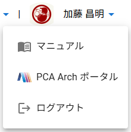
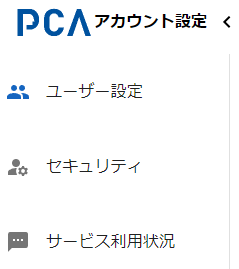

# アカウント設定 - 共通

## 全体動作（機能）

### 対象組織の指定

- URLのクエリーパラメーターとして「サービス区画」を指定することで、そのサービス区画が紐づく組織を対象にする
  - [サービス区画](/docs/common/サービス区画.md)
  - 例：https://{pcaid-domain}/account?service_partition=pca.hub.tenant1
- 隠し機能として、`service_partition` の値に「組織名」を指定することで同様の動作になる
  - [組織名](/docs/common/組織名.md)
  - 暫定機能の扱いで、将来は仕様変更する可能性あり
- 未指定のときは、前回選択していた組織を対象とし、初回であれば一覧で先頭の組織を対象とする
- iPhoneやAndroid等の画面の小さいスマホでの利用を可能とする

## ヘッダー

### 処理名（ページ名）

- 処理名を表示する
  - 「PCA」ロゴ + `アカウント設定`
  - 画面幅が狭いときは処理名を非表示にする（スマホ対応）
- 処理名の右側に、カテゴリを展開・省略するためのアイコンを付加する
- ヘッダー領域において左寄せで表示する

### FAQ

- 「あやめ」ロゴを表示する
  - [ayame_logo.zip](./../orgs/images/ayame_logo.zip)
- ヘッダー領域において右寄せで表示する
  - 他の右寄せ項目の中では一番左とする
- ロゴをクリックすると、PCAサイトのFAQページを別タブとして開く

### 組織情報

- 現在の組織情報を表示する
  - `組織画像` [`組織名`] `組織表示名`
  - 画面幅が狭いときは組織情報を右サイドメニューに組み込む（スマホ対応）
- ヘッダー領域において右寄せで表示する
  - 他の右寄せ項目の中では左から二番目とする
- 組織情報部分をクリックすると、対象組織を切り替えることができる
  - 所属組織を一覧する

### ユーザー情報

- ユーザー情報を表示する
  - `プロフィール画像` `ユーザー名（表示名）`
  - ユーザー名（表示名）の表示幅は全角10文字（半角20文字）程度として、それ以上は後ろ部分を省略する
    - 例１：１２３４５６７８９０１２３４５ → １２３４５６７８９０…
    - 例２：1234567890123456789012345678 → 12345678901234567890…
  - 画面幅が狭いときはユーザー名（表示名）を省略し、右サイドメニューに組み込む（スマホ対応）
- ヘッダー領域において右寄せで表示する
  - 他の右寄せ項目の中では一番右（左から三番目）とする
- ユーザー名（表示名）部分をクリックすると機能を選択できる
  - マニュアルを表示する
  - PCA Arch ポータルへ移動する
    - PCA Arch の契約状態によらず常に表示する
    - 移動先でも現在の組織が選択された状態にする
  - ログアウトする

## 設定カテゴリ

- 以下のカテゴリ種類ごとに画面を切り替える
  - ユーザー設定
  - セキュリティ
  - サービス利用状況
- ヘッダー左端の見出しの右側にある「≡」「<」により展開・省略する
  - 展開時は、アイコン＋カテゴリ名とする
  - 省略時は、アイコンのみとする
- 画面幅が狭いときはカテゴリを非表示にし、「≡」により展開する（スマホ対応）
  - カテゴリが選択されたら自動的に非表示にする

## ユーザー設定

- [アカウント設定 - ユーザー設定](./account-user-settings.md)

## セキュリティ

- [アカウント設定 - セキュリティ](./account-security.md)

## サービス利用状況

- [アカウント設定 - サービス利用状況](./account-service-usages.md)
