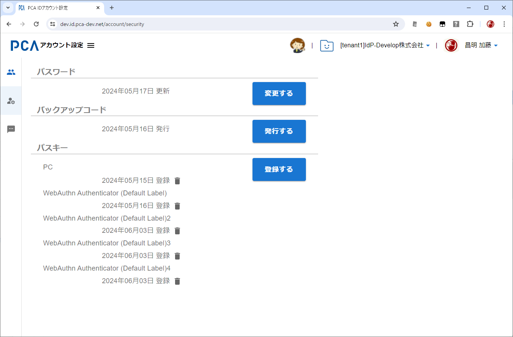
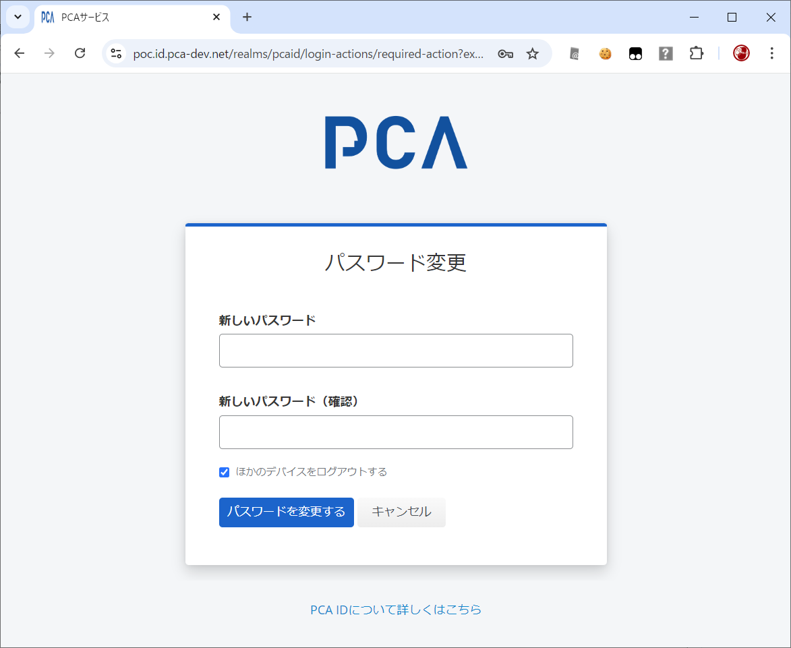
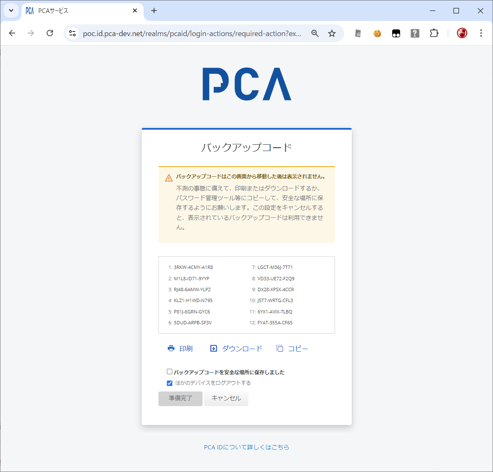
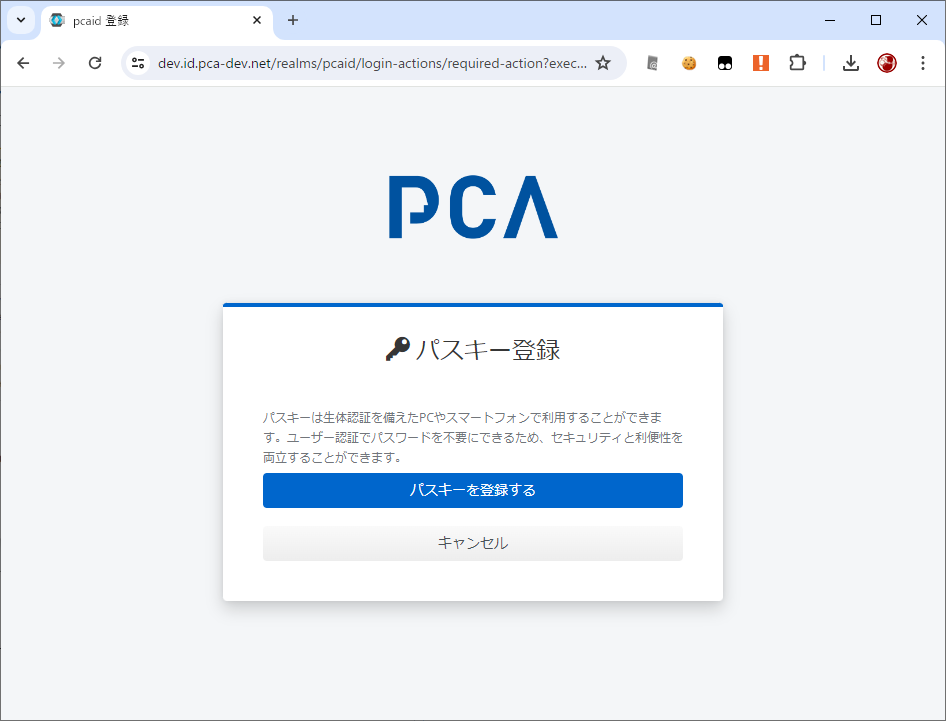

# アカウント設定 - セキュリティ

## セキュリティ

- [アカウント設定 - 共通](./account-common.md)
- [PCAアカウント](/docs/common/PCAアカウント.md)
- [認証セキュリティ](/docs/common/認証セキュリティ.md)

### 画面イメージ

### 動作（機能）

#### パスワード変更

- [認証セキュリティ](/docs/common/認証セキュリティ.md)
- 認証してから5分を経過してたら、利用者へ再認証を求める
- パスワードを変更したら、変更日付を更新する
- PCA Hubで設定したパスワードを引き継ぐ

#### バックアップコード発行

- 認証してから5分を経過してたら、利用者へ再認証を求める
- 新しいバックアップコード（12個）を発行する
  - 印刷、ファイルとしてダウンロード、クリップボードへのコピーが可能
- 新規コードの発行と同時に既存コードは破棄する
- バックアップコードを発行したら、発行日付を更新する
- PCA Hubが発行した利用可能なコードを引き継ぐ

#### パスキー登録

- [認証セキュリティ](/docs/common/認証セキュリティ.md)
- 認証してから5分を経過してたら、利用者へ再認証を求める
- 現在のデバイスにパスキーを登録する
  - １つのデバイスに１つのパスキーのみ登録できる（複数のパスキーを登録できない）
  - リモートデバイスには登録できない（例：PCからスマホへパスキー登録）
  - スマホでアカウント設定画面を表示すればパスキーを登録できる
- パスキーの名前はプラットフォームごとの初期値で登録する
  - Windows系 → `Windows Hello`
  - iOS系 → `iCloudキーチェーン`
  - Android系 → `Androidキーストア`
  - それ以外 → `パスキー_{yy}-{mm}-{dd}`
- パスキーを登録したら、登録済みパスキーとして一覧に追加する
  - 最大10個まで登録可能とする
- パスキーの名前は変更可能とする
- パスキー登録は、個別に削除可能とする
