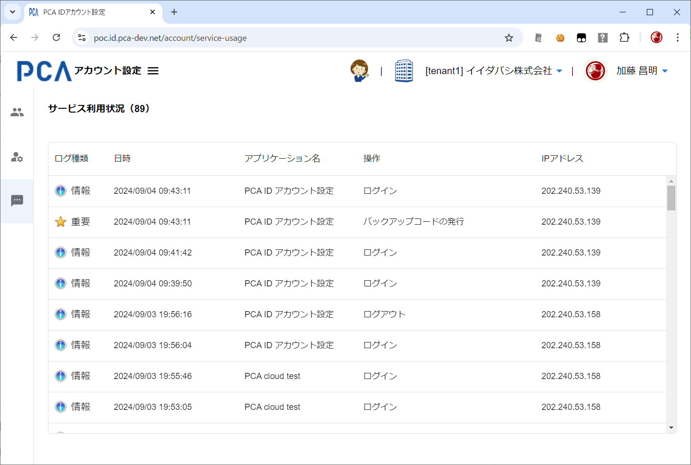

# アカウント設定 - サービス利用状況

## サービス利用状況

- [アカウント設定 - 共通](./account-common.md)
- [操作ログの種類と詳細](/docs/common/操作ログの種類と詳細.md)

### 画面イメージ

### 表示項目

#### ログ種類

- ログの種類として以下のいずれかの値を表示する
  - `Information アイコン`  + "情報"
  - `Exclamation アイコン`  + "警告"
  - `Error アイコン`  + "エラー"
  - `独自アイコン`  + "重要"
- 各種アイコンファイルは、管理コンソールと同様ものを利用する
  - [管理コンソール - サービス利用状況](./../orgs/orgs-service-usages.md)

#### 日時

- 認証操作を記録した日時を表示する
- `yyyy/mm/dd hh:mm:ss` 形式

#### アプリケーション名

- 認証操作を実行したユーザーが利用中のアプリケーションを表示する
- 以下のアプリケーション名があり、順次拡大していく想定とする
  - PCA Hub
  - PCA ID アカウント設定
  - PCA ID 管理コンソール
  - PCA クラウド／PCA サブスク

#### 操作

- 操作の種類として以下のいずれかの値を表示し、結果に従ってログ種類を決定する
  - ログイン
    - 情報：ログインに成功したとき
    - 警告：ログインに（正常に）失敗したとき
  - ログアウト
    - 情報：ログアウトしたとき
  - セッション更新
    - 情報：ユーザーセッションが自動的に更新されたとき
      - ユーザーセッション（＝アクセストークン）の期限は 60分 としている
      - [OIDC/OAuth トークン仕様](/docs/common-dev/oidc-oauth-token-rules.md)
  - パスワードの変更
    - 重要：パスワードを変更したとき
  - メールアドレスの変更
    - 重要：メールアドレスを変更したとき
  - バックアップコードの発行
    - 重要：バックアップコードを発行したとき
  - パスキーの登録
    - 重要：パスキーを登録したとき
  - ~~パスキーの削除~~
    - ~~重要：パスキーを削除したとき~~
- 操作で何らかのエラーが発生したときは、ログ種類を「エラー」とする

#### IPアドレス

- 認証操作を実行したユーザーが利用中の呼び出し元（クライアント）となるIPアドレスを表示する
- ユーザー環境によっては端末IPではなく、ゲートウェイによって変換されたIPの可能性がある

### 動作（機能）

#### 並び順

- 「日時」の新しい順とする

#### 画面出力

- 直近の１週間（7日間＝24×7時間）を表示対象とする
- 列幅は可変とする
