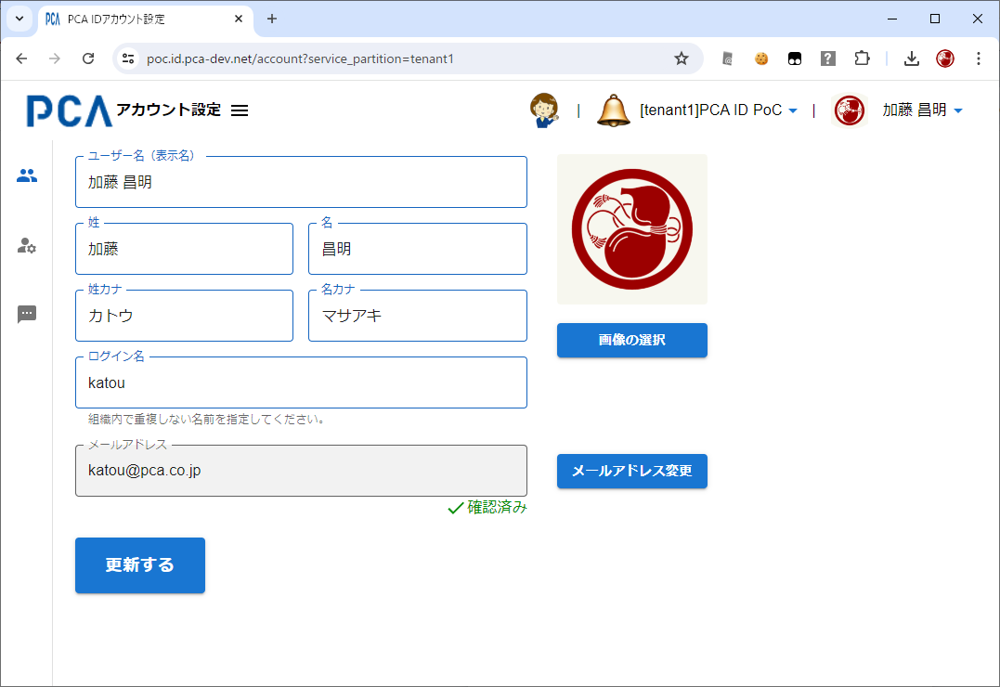

# アカウント設定 - ユーザー設定

## ユーザー設定

- [アカウント設定 - 共通](./account-common.md)
- [PCAアカウント](/docs/common/PCAアカウント.md)

### 画面イメージ

### 入力項目

#### ユーザー名（必須）

#### 姓名とフリガナ

- 姓のみ必須
  - カナも同様

#### ログイン名（必須）

- 現在の組織内でログイン名の重複は不可とする
  - 別の組織で同じあればログイン名が利用されていても問題はない

#### メールアドレス（必須）

- メールアドレスが確認済みのときはテキストボックスの右側下に `✓確認済み` を表示する
  - 文字色は緑色とする
- メールアドレスが未確認のときはテキストボックスの右側下に `✕未確認` を表示する
  - 文字色は黄土色とする
- 未確認の状態とは、メールアドレスを登録・変更してから、本人による利用確認（実在確認）が完了するまでの状態のこと
  - この画面で本人がメールアドレスを変更する場合は、「メールアドレス変更リクエスト」メールのリンクをクリックすることで変更が確定するため、未確認の状態とはならない

### 動作（機能）

#### 画像の選択

- ローカルファイルから画像を選択することでデータベースを更新する

#### メールアドレス変更

- 必ず再認証を求める
  - セキュリティ設定とは異なり再認証までの5分の猶予期間は設けない
  - メールアドレス変更は「なりすまし」に直結する、より重要な操作と見なすため
- 既存の登録済みメールアドレスへの変更は不可とする
- 変更したメールアドレスに対して検証メールを送信する

#### ユーザー更新

- 以下の項目の値を更新する
  - ユーザー名
  - 姓名とフリガナ
  - ログイン名
    - 現在の組織におけるログイン名のみ更新対象とする
    - 組織内ですでに利用されている値には変更できない
