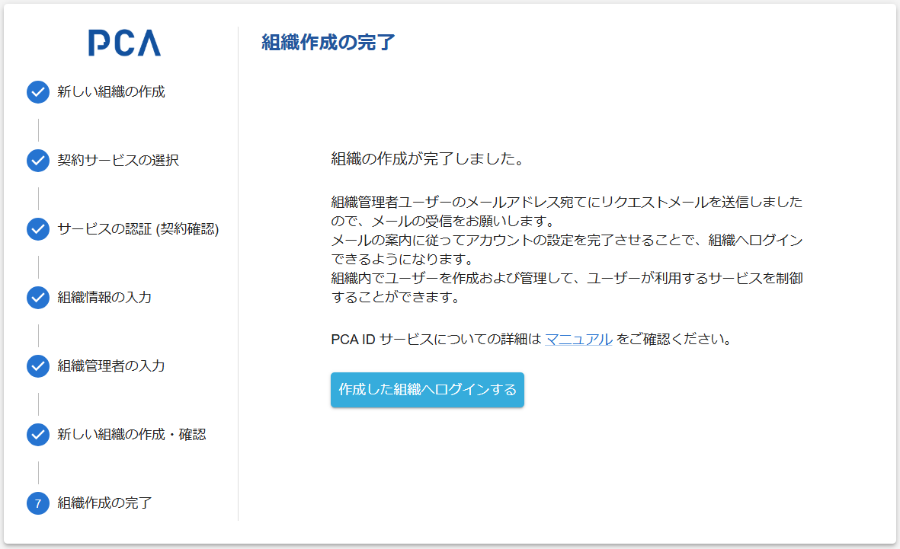

# 組織作成 - ⑦ 組織作成の完了

## 組織作成の完了

### 画面イメージ

### 表示・入力項目

> 組織の作成が完了しました。
>
> 組織管理者ユーザーのメールアドレス宛てにリクエストメールを送信しましたので、メールの受信をお願いします。  
> メールの案内に従ってアカウントの設定を完了させることで、組織へログインできるようになります。  
> 組織内でユーザーを作成および管理して、ユーザーが利用するサービスを制御することができます。  
>
> PCA ID サービスについての詳細は、[マニュアル](https://pca.jp/area_support/manual/pcaid/index.html) をご確認ください。

### 動作（機能）

#### 作成した組織へログインする

- 作成した組織をログイン先として、管理コンソールにアクセスする
- 初回ログインなので、通常であれば必ずログイン画面が表示される
