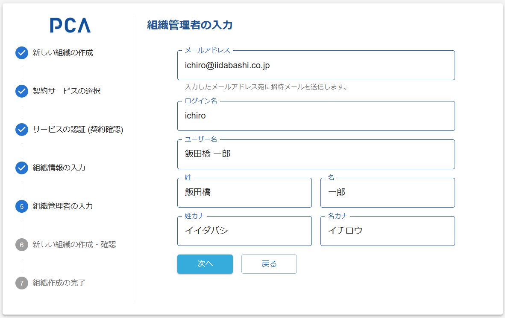

# 組織作成 - ⑤ 組織管理者の入力

- [PCA ID 管理コンソール - ユーザー管理（ユーザーの作成）](../orgs/orgs-user-management.md#ユーザー管理ユーザー作成)

## [組織管理者](/docs//common/ロール（役割）.md#id基盤で定義するロール)の入力

### 画面イメージ

- [共通仕様 - PCAアカウント](/docs/common/PCAアカウント.md)

### 表示・入力項目

#### メールアドレス（必須）

- メールアドレスのユーザー名（@より前の部分）をログイン名にコピーする
  - ログイン名が未入力のときのみ

#### ログイン名（必須）

#### ユーザー名（必須）

#### 姓名とフリガナ

- 姓のみ必須
  - カナも同様

### 動作（機能）

#### 次へ

- 必須項目が入力済みなら、[組織の作成](./orgs-new-organization-creation.md) を表示する

#### 戻る

- [組織情報の入力](./orgs-new-organization-input.md) を表示する
