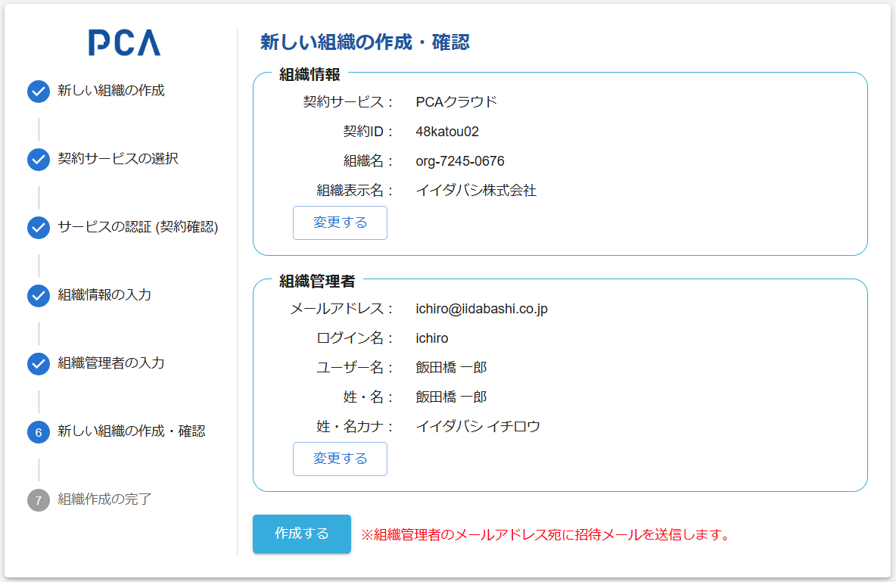

# 組織作成 - ⑥ 組織の作成

## 組織の作成

### 画面イメージ

### 表示・入力項目

#### 組織情報

- 入力済みの情報を表示する
- 後から変更できるようにボタンを配置する

#### 組織管理者

- 入力済みの情報を表示する
- 後から変更できるようにボタンを配置する

### 動作（機能）

#### 変更する

- それぞれの入力画面へ直接戻る
  - 組織情報なら [組織情報の入力](./orgs-new-organization-input.md) を表示する
  - 組織管理者なら [組織管理者の入力](./orgs-new-organization-admin-input.md) を表示する

#### [組織](/docs/common/組織.md)と[サービス区画](/docs//common/サービス区画.md)の作成

- 選択したサービス契約が利用サービスとして追加された[組織](/docs/common/組織.md)を作成する
  - 選択サービスは、内部的に[サービス区画](/docs//common/サービス区画.md)として作成する
  - サービス区画は契約IDを保持する
  - [組織作成の回復措置](./orgs-new-common#%E7%B5%84%E7%B9%94%E4%BD%9C%E6%88%90%E3%81%AE%E5%9B%9E%E5%BE%A9%E6%8E%AA%E7%BD%AE)により、組織が作成済みであればデータを更新する
- 組織に顧客IDを設定する
  - 組織の（主たる）顧客IDと、サービス区画の顧客IDの両方を保持する
    - 画面上で確認できるのは組織の顧客IDのみ（将来改めて検討する）
  - 顧客IDが存在しない場合は未設定とする
    - 体験利用で顧客登録されていない場合
    - テスト用ダミーデータの場合
- 組織内の[各種ロール（役割）](/docs/common/ロール（役割）.md)を作成する
- [組織作成 POST /organizations](/docs/api/organizations/POST%20組織作成.md)

#### [組織管理者](/docs//common/ロール（役割）.md#id基盤で定義するロール)のユーザー作成

- 作成したユーザーは、作成した[組織](/docs/common/組織.md)に所属させる
  - [組織作成の回復措置](./orgs-new-common#%E7%B5%84%E7%B9%94%E4%BD%9C%E6%88%90%E3%81%AE%E5%9B%9E%E5%BE%A9%E6%8E%AA%E7%BD%AE)により、ユーザーが作成済みであればデータを更新する
  - 二人目以降のユーザーである可能性を想定する
- ユーザー権限として、[組織管理者](/docs//common/ロール（役割）.md#id基盤で定義するロール)を付与し、選択したサービス契約の責任者とする
  - 作成済みの一般ユーザーが昇格することがあり得る
- 作成したユーザーに対して、リクエストメールを送信する
  - [組織作成の回復措置](./orgs-new-common#%E7%B5%84%E7%B9%94%E4%BD%9C%E6%88%90%E3%81%AE%E5%9B%9E%E5%BE%A9%E6%8E%AA%E7%BD%AE)として、常にリクエストメールを再送信する
  - 作成する組織にのみ所属するユーザーであれば、アカウント設定リクエストを送る
  - 別組織に所属するユーザーであれば、メールアドレス確認リクエストを送る
- [PCA ID 管理コンソール - ユーザー管理（ユーザーの作成）](../orgs/orgs-user-management.md#ユーザー管理ユーザー作成)

#### 組織作成後

- 組織作成の完了 を表示する
