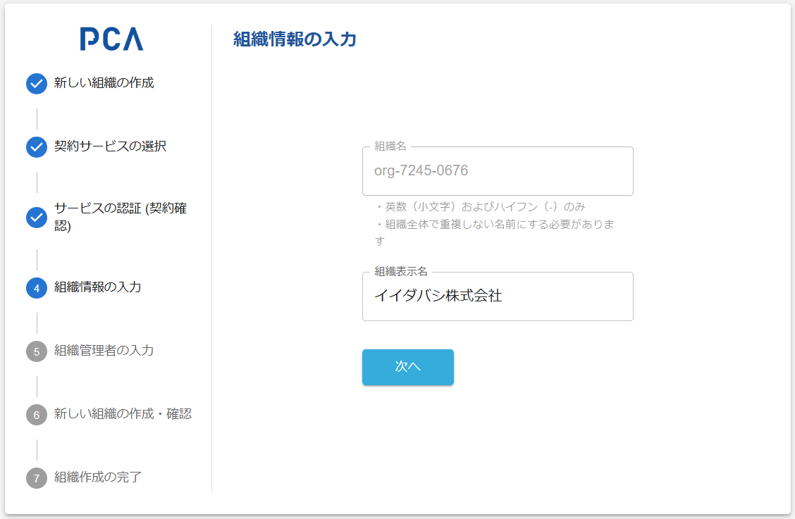

# 組織作成 - ④ 組織情報の入力

## [組織情報](/docs/common/組織.md)の入力

### 画面イメージ

- [共通仕様 - 組織](/docs/common/組織.md)

### 表示・入力項目

#### [組織名](/docs/common/組織名.md)

- 必須、英数（小文字）およびハイフン（-）のみ
- 自動的に名前を生成する
  - [予約済み組織名](/docs/common/予約済みの組織.md) を使い「org-xxxx-xxxx」形式とする
  - [連携コード発行 POST /connect_code](/docs/api/connect_code/POST%20連携コード発行.md) で発行する「連携コード」を組織名としても使用する
  - 初期情報として設定可能にしているが、現時点（2024/12）では無視する
- 読み取り専用で表示する
  - 組織表示名の項目に入力フォーカスを自動設定する

#### 組織表示名

- 必須、50桁までの任意文字
  - 改行文字は不可
- 初期情報として、呼び出し元の会社名が設定されることを想定する
- [組織作成の回復措置](./orgs-new-common#%E7%B5%84%E7%B9%94%E4%BD%9C%E6%88%90%E3%81%AE%E5%9B%9E%E5%BE%A9%E6%8E%AA%E7%BD%AE)により、組織情報が作成済みであれば、その表示名を初期値とする

### 動作（機能）

#### 次へ

- 必須項目が入力済みなら、[組織管理者の入力](./orgs-new-organization-admin-input.md) を表示する
- 前画面には戻れない
