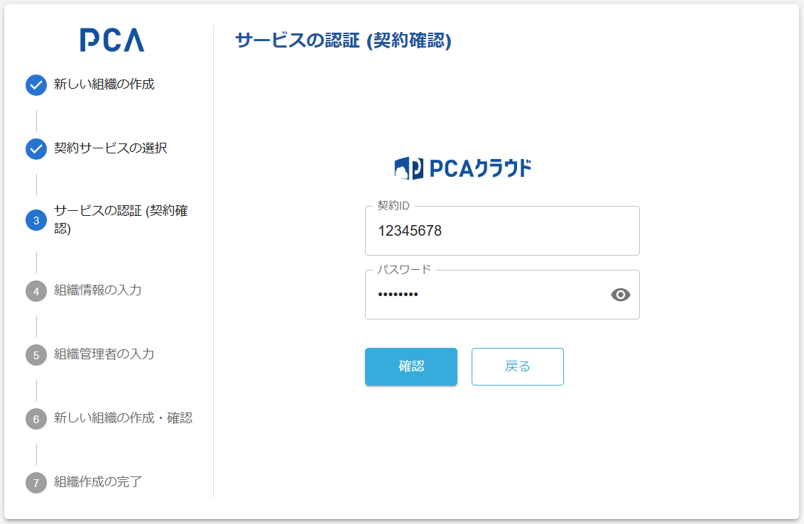

# 組織作成 - ③ 契約確認（サービス認証）

## 契約確認（サービス認証）

### 画面イメージ

### 表示・入力項目

#### 契約サービスの種類

- サービスごとのロゴを表示する

#### 契約ID

- 初期情報として「契約ID」が設定されていたら、その値を読み取り専用で表示する
  - パスワード項目に入力フォーカスを自動設定する
- 初期情報が未設定ならサービスごとの契約IDを受け付ける
  - 契約ID項目に入力フォーカスを自動設定する
- 20桁まで、英数記号（半角文字）を入力可能とする

:::info 契約ID

- PCAクラウドでは、サービスユーザーIDと呼ばれていて、サービス認証で利用する
- PCAサブスクでは、ライセンス管理ページやライセンス管理ツールで利用する

:::

#### パスワード

- 127桁まで、任意文字を入力可能とする
- 入力値はマスクするが、明示的な操作で値を確認可能にする

#### 確認

- 契約IDが入力済みならボタンを有効にし、契約サービスを確認可能にする
- 契約IDが未入力ならボタンを無効にする

#### 戻る

- 初期情報として有効な「サービス種類」の設定があれば、ボタンを無効にする
- 初期情報が未設定なら、ボタンを有効にして、前の画面に戻れるようにする

### 動作（機能）

#### 契約確認

- 対象サービスへ入力値で認証する
- PCA ID における、サービス契約の登録状況を確認する
- 契約確認に成功したら、[組織情報の入力](./orgs-new-organization-input.md) を表示する
  - 指定したサービス契約は、内部的に [サービス区画](/docs/common/サービス区画.md) として扱う
- 契約確認に失敗したら、エラー情報を表示する
  - 有効なサービス契約が必要となる
    - サービス契約状態が「有効」である
    - 1つ以上の「有効」なライセンスがある
  - [組織](/docs/common/組織.md) に追加済のサービス契約は、[回復措置](./orgs-new-common.md#組織作成の回復措置)の条件を満たしていなければ指定不可として扱う
    - 個々の [サービス区画](/docs/common/サービス区画.md) は１つの組織にしか紐づけられない
    - 作成時に指定する利用サービス（サービス区画）だけを持つ組織なら回復措置をとれる

:::tip サービス契約の準備

- PCAクラウドでは、PCA認証サービスで準備する
  - 開発環境（48） → [PCA認証サービス](http://cloud2-dev-alb-auth-2102122029.ap-northeast-1.elb.amazonaws.com:8080/PcaCertManager/view/manager/login.html) を使い各自で対応する
  - 検証環境（19, 29）・本番環境（10, 20） → CBC へ依頼する（[PCAクラウド アカウント管理文書](notes://IBM5580Y.pca.co.jp/49257371003A186A/840CE3A13BC98C8549256A1600245813/CFDC907ED560741149257F7F000EA100)）
  - 検証環境（70）・本番環境（40） → CBC へ依頼する（[PCAクラウド on AWS アカウント管理文書](notes://IBM5580Y.pca.co.jp/49257371003A186A/840CE3A13BC98C8549256A1600245813/42E31EC3CE63072D4925861D003086C2)）
- PCAサブスクでは、[WebOperator（ライセンスサーバーDBデータ変更ツール）](notes://IBM5580Y.pca.co.jp/492570490006EA39/840CE3A13BC98C8549256A1600245813/7C464D39DEB58FDB4925847B0024398E) または ZINNIA で準備する
  - FW開発環境（feature） → [WebOperator（FW開発用）](https://www.ls-feature.pca-dev.net/operator) を使い各自で対応する
  - 開発・検証環境（dev） → [WebOperator（開発・検証用）](https://www.ls-dev.pca-dev.net/operator) を使い各自で対応する
  - 本番環境 → データ戦略Gへ依頼する

:::

#### 戻る

- [契約サービスの選択](./orgs-new-service-selection.md) を表示する
