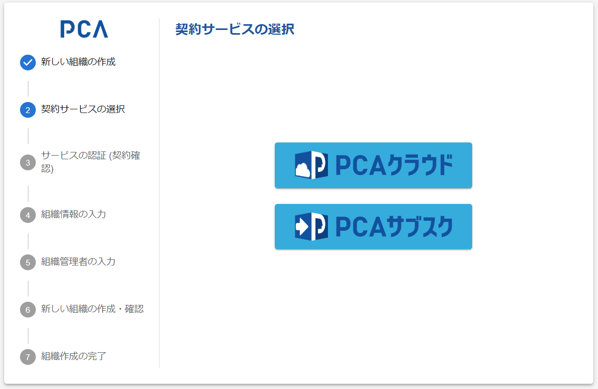

# 組織作成 - ② 契約サービスの選択

## 契約サービスの選択

:::info 画面フロー

初期情報に有効な「サービス種類」の指定があれば、この画面はスキップして、指定サービスを対象とした [契約確認（サービス認証）](./orgs-new-service-certification.md) を表示する

:::

### 画面イメージ

### 表示・入力項目

- 契約サービスの種類として、以下からから選択する
  - PCAクラウド
  - PCAサブスク
- 今後、種類が増える可能性があるが、現時点では予定はない

### 動作（機能）

#### サービス選択

- 選択されたサービスを対象とした [契約確認（サービス認証）](./orgs-new-service-certification.md) を表示する
