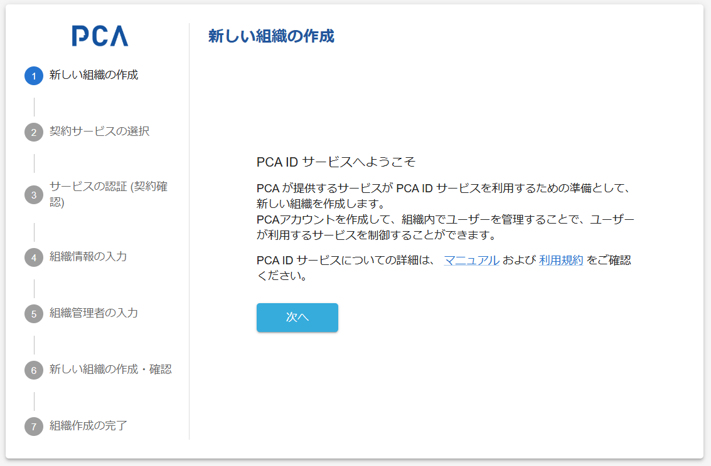

# 組織作成 - ① 組織作成の開始

## 組織作成の開始

### 画面イメージ

### 表示・入力項目

> PCA ID サービスへようこそ
>
> PCA が提供するサービスが PCA ID サービスを利用するための準備として、新しい組織を作成します。  
> PCA アカウントを作成して、組織内でユーザーを管理することで、ユーザーが利用するサービスを制御することができます。  
>
> PCA ID サービスについての詳細は、[マニュアル](https://pca.jp/area_support/manual/pcaid/index.html) および [利用規約](https://pca.jp/area_product/pdf/pcaid_policy.pdf) をご確認ください。

### 動作（機能）

#### 起動

- [準備手順](./orgs-new-common.md) の不備や何らかのエラーがあれば、次の画面へ進めないようにする
  - ガイドメッセージと［次へ］ボタンの間に、赤字でエラー情報を表示する
  - ［次へ］ボタンを無効にする

#### 次へ

- 正常にこの画面を表示できればボタンは有効となる
- クリックされたら、初期情報に従い次画面へ進む
  - 初期情報に有効な「サービス種類」の指定があれば、そのサービスを対象とした [契約確認（サービス認証）](./orgs-new-service-certification.md) を表示する
  - 上記以外なら、[契約サービスの選択](./orgs-new-service-selection.md) を表示する
