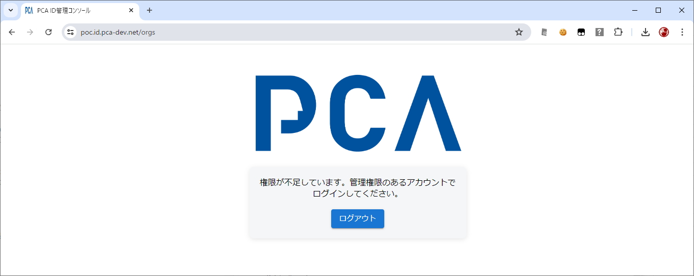
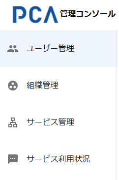

# 管理コンソール - 共通

## 全体動作（機能）

### 対象組織の指定

- URLのクエリーパラメーターとして「サービス区画」を指定することで、そのサービス区画が紐づく組織を対象にする
  - [サービス区画](/docs/common/サービス区画.md)
  - 例：https://{pcaid-domain}/orgs?service_partition=pca.hub.tenant1
- 隠し機能として、`service_partition` の値に「組織名」を指定することで同様の動作になる
  - [組織名](/docs/common/組織名.md)
  - 暫定機能の扱いで、将来は仕様変更する可能性あり
- 未指定のときは、前回選択していた組織を対象とし、初回であれば一覧で先頭の組織を対象とする
- 管理対象のデータを扱うには、基本的に対象組織について「組織管理者」または「サービス責任者」の権限が必要となる

### 管理権限

- 管理コンソールの操作には、基本的に「組織管理者」の権限が必要になる
  - ただし「サービス責任者」の権限があれば、限定的に対象サービスごとに利用許可・解除を管理できる
- 管理権限がなければ、強制的に権限不足エラー画面へ遷移する
  - 対象組織を明示してアクセスした場合、他組織の管理権限があってもエラーとする

### 制限事項

- 組織に所属可能なユーザー数は、10万件を上限とする
- 組織に追加可能な利用サービス数は、100件を上限とする

## ヘッダー

### 処理名（ページ名）

- 処理名を表示する
  - 「PCA」ロゴ + `管理コンソール`
  - 画面幅が狭いときは処理名を非表示にする
- 処理名の右側に、カテゴリを展開・省略するためのアイコンを付加する
- ヘッダー領域において左寄せで表示する

### FAQ

- 「あやめ」ロゴを表示する
  - [ayame_logo.zip](./images/ayame_logo.zip)
- ヘッダー領域において右寄せで表示する
  - 他の右寄せ項目の中では一番左とする
- ロゴをクリックすると、PCAサイトのFAQページを別タブとして開く

### 組織情報

- 現在の組織情報を表示する
  - `組織画像` [`組織名`] `組織表示名`
  - 画面幅に余裕があるときの表示幅は、組織名を自動生成（半角13文字：org-xxxx-xxxx）したときに、組織名の表示幅を全角16文字程度として、それ以上は後ろ部分を省略する
    - 例：[org-xxxx-xxxx] １２３４５６７８９０１２３４５６…
    - 組織名が長いと、その分だけ組織表示名の表示幅が小さくなる
  - 画面幅が狭いときは組織情報を右サイドメニューに組み込む
- ヘッダー領域において右寄せで表示する
  - 他の右寄せ項目の中では左から二番目とする
- 組織情報部分をクリックすると、対象組織を切り替えることができる
  - 管理可能な所属組織を一覧する

### ユーザー情報

- ユーザー情報を表示する
  - `プロフィール画像` `ユーザー名（表示名）`
  - ユーザー名（表示名）の表示幅は全角10文字（半角20文字）程度として、それ以上は後ろ部分を省略する
    - 例１：１２３４５６７８９０１２３４５ → １２３４５６７８９０…
    - 例２：1234567890123456789012345678 → 12345678901234567890…
  - 画面幅が狭いときはユーザー名（表示名）を省略し、右サイドメニューに組み込む
- ヘッダー領域において右寄せで表示する
  - 他の右寄せ項目の中では一番右（左から三番目）とする
- ユーザー名（表示名）部分をクリックすると機能を選択できる
  - マニュアルを表示する
  - ログアウトする

## 管理カテゴリ

- 以下のカテゴリ種類ごとに画面を切り替える
  - ユーザー管理
  - 組織管理
  - サービス管理
    - 組織で利用できるのが PCA Hub サービスのみの場合は非表示とする
  - サービス利用状況
- ヘッダー左端の見出しの右側にある 「≡」 および 「<」 により展開・省略する
  - 展開時は、アイコン＋カテゴリ名とする
  - 省略時は、アイコンのみとする

## ユーザー管理

- [管理コンソール - ユーザー管理](./orgs-user-management.md)

## 組織管理

- [管理コンソール - 組織管理](./orgs-organization-management.md)

## サービス管理

- [管理コンソール - サービス管理](./orgs-service-management.md)

## サービス利用状況

- [管理コンソール - サービス利用状況](./orgs-service-usages.md)
