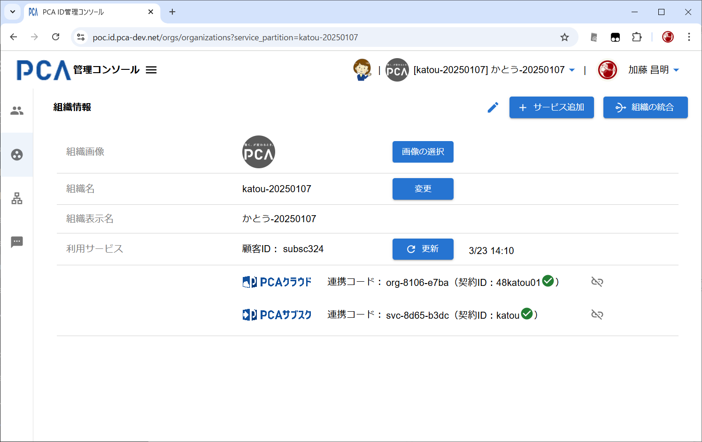
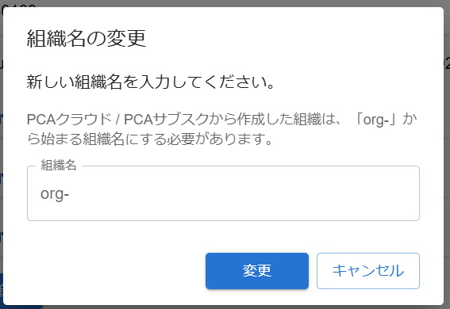

# 管理コンソール - 組織管理

## 組織管理

- [管理コンソール - 共通](./orgs-common.md)
- [組織](/docs/common/組織.md)
- [サービス契約データの扱い](/docs/common-dev/service-contract-info.md)
- [組織取得API GET /organizations](/docs/api/organizations/GET%20組織取得.md)

### 画面イメージ

### 表示・入力項目

#### 組織画像

- 画像は PCA ID 内で独自に管理する
  - PCA Hub のテナント画像とは同期しない
  - PCA Hub において PCA ID へ移行した場合には、テナント画像を初期値として利用する
  - 将来的には、PCAサービスから初期値として参照されることを想定する
- 変更モードに切り替えずに画像を変更できる
  - 変更モードでは画像を変更できない
- [組織画像取得API GET /organizations/images/logo](/docs/api/organizations/images/logo/GET%20組織画像取得.md)
- [組織画像アップロードAPI PUT /organizations/images/logo](/docs/api/organizations/images/logo/PUT%20組織画像アップロード.md)

#### 組織名

- [組織名](/docs/common/組織名.md)
- システム全体で重複不可、再利用も不可
- 組織名の変更は条件付きで可能とする
  - 
  - PCAクラウド／PCAサブスクから作成した組織は、組織名が「org-」から始まるようにする
    - 変更においても「org-」から始まる組織名のみを認めることで、PCA Hub テナント名との衝突を避ける
    - PCA Hub から作成したら組織は、PCA Hub テナント名と一致する
  - 現時点（2025/02）では、PCA Hub を利用サービスに含んでいる組織では変更不可とする
    - PCA ID 組織名と PCA Hub テナント名を一致させておく
    - 組織名の右側の［変更］ボタンを非表示にする
- [組織名変更API PUT /organizations/rename](/docs/api/organizations/rename/PUT%20組織名変更.md)

#### 組織表示名

- PCA Hub においてPCA IDへ移行した場合には、会社名を初期値として利用する
  - PCAクラウドやPCAサブスクから新しい組織を作成した場合も、会社名を初期値にできる仕組みを用意する
- 他組織との重複は認める

#### 利用サービス

- 現在の組織に紐づく利用可能なサービス（[サービス区画](/docs/common/サービス区画.md)）を表示する
  - 対象サービスからのアクセスを許可したことになる
  - 契約状況を表示することを目的とし、顧客IDやテナント名、契約IDの変更はできない
  - PCA Hub を除いて、契約済みサービスの追加や削除ができる
    - Archプランでは、プランに紐づくサービスを自由に追加・削除できない
- 個々の[サービス区画](/docs/common/サービス区画.md)は１つの組織にしか紐づけられない
  - ２つの組織が同じ PCA Hub テナントやPCAクラウド区画を使うことはできない
- すべての顧客IDを表示する
  - `顧客ID：` + `顧客ID(1), 顧客ID(2), 顧客ID(3), ...`
    - 組織に紐づく顧客IDがあれば先頭に表示する
    - 続けて利用サービス（サービス区画）ごとの顧客IDを、新しい順に重複なく表示する
      - サービスごとの顧客IDが組織のものとすべて同じなら、顧客IDは１つだけの表示となる
  - 対象組織に紐づく顧客IDがなければ非表示とする
    - 体験利用において、顧客IDを持たないユーザーが存在することを想定する
    - Archプランでは、体験利用の段階で仮顧客IDを発行する運用となる
  - 組織に対しては、以下の状況で顧客IDを設定することを想定する
    - PCA Hub から「PCA ID への移行」を実行したときに、社内システムが顧客IDを設定する
    - 組織管理において、サービス契約情報を更新したときに、組織の顧客IDが空なら設定する
      - 新規に組織作成したときに、PCA ID が顧客DBから取得できる顧客IDを設定する
      - 組織の顧客IDが設定済みであれば、内部的に更新する状況はない（社内システムが設定したときだけ更新がある）
    - Archプランにおいて、仮顧客IDから正式顧客IDに更新されるとき、社内システムが顧客IDを設定する
  - ~~内部的には、利用サービス（サービス区画）ごと顧客IDを保持し、最新の顧客IDを「主たる顧客ID」として表示する~~
    - ~~PCA Hub が `123` で、PCAクラウドが `234` なら、「主たる顧客ID」として `234` を表示する~~
- サービス区画を認識しやすく表示する
  - サービス区画が `pca.arch.*****` であれば、Arch登録IDと有効状態（「無効」の場合のみ）を表示する
    - Arch登録IDは、組織の項目（カスタム属性）として保持する
      - 顧客IDと同様に、社内システムまたは顧客DBから設定する
      - [サービス契約データの扱い](/docs/common-dev/service-contract-info.md)
    - 「PCA Arch」ロゴ + Arch登録ID
      - ロゴの後ろは全角スペース1文字を挟む
    - 　登録ID：123456
    - PCA Arch サービスが次の有効条件を満たしてなければ、Arch登録IDの後ろにを表示する
      - 同じArchプランの PCAクラウド と PCA Hub が１つずつある（今後、PCA Hub は複数テナントも可能に拡張予定）
        - 従来プランのPCAクラウドやPCAサブスクがあっても構わない
        - Archポータルでは従来プランを無視する
      - 他のArchプランのサービスが混在していない（Arch登録IDの不一致がない）
        - 社内システム側のデータ状態の不具合を想定する
    - 契約プランに連動するサービスなので、サービス区画の取り消しボタンを配置しない
      - 同様に、利用可能なサービス区画がArchプランに紐づいている場合（主にPCAクラウド）も取り消し不可とする
  - サービス区画が `pca.hub.*****` であれば、PCA Hub のテナント名を表示する
    - 「PCA Hub」ロゴ + PCA Hub テナント名
      - ロゴの後ろは全角スペース1文字を挟む
    - 　テナント名：tenant1
  - サービス区画が `pca.cloud.*****` であれば、PCAクラウドの連携コードと契約ID（サービスユーザーID）と契約状態を表示する
    - 「PCAクラウド」ロゴ + 連携コード + （クラウド契約ID＝サービスユーザーID）
      - PCA Hub と同じ（開始位置や余白の体裁をできるだけ揃える）
      - 契約IDと契約状態は全角の括弧内に表示する
        - 契約状態は「有効」と「無効」の画像で表現する
    - 　連携コード：org-xxxx-xxxx（契約ID：12345678 ）
    - PCAクラウドの取り消しボタンを配置する
  - サービス区画が `pca.subsc.*****` であれば、PCAサブスクの連携コードと契約IDと契約状態を表示する
    - 「PCAサブスク」ロゴ + 連携コード + （サブスク契約ID）
      - PCAクラウドと同じ（開始位置や余白の体裁をできるだけ揃える）
    - 　連携コード：org-xxxx-xxxx（契約ID：12345678 ）
    - PCAサブスクの取り消しボタンを配置する
  - [PCA製品ロゴ](/docs/common/materials/pca-product-logos.md)
  - [各種画像](/docs/common/materials/etc.md)

### 動作（機能）

#### サービスの追加

- 顧客が自身で契約したサービスを追加する
  - Ver2.0 では、PCAクラウドとPCAサブスクのみを対象とする
    - PCA Hub は追加できない
  - PCAクラウドやPCAサブスクが、この組織へアクセスできるようになる
  - Ver2.1 では、PCA Arch が増えるがユーザー自身では追加できない（テスト目的なら可能）
- 契約確認のため、契約IDとパスワードの入力を求める
- ~~契約IDの入力を求め、契約対象の顧客IDが組織と一致していることを確認する~~
  - 異なる顧客IDで契約したサービスを追加できるようにする
    - 歴史的な経緯で、PCA HubとPCAクラウドは、同じ顧客なのに、別の顧客IDとなっていることがある
    - 例１）PCAクラウドをFAX注文で契約し、PCA HubをZINNIAで契約
    - 例２）それぞれ別々の販売パートナー経由で契約
  - Archプラン（Arch登録IDを持つ）組織に、Archプランのサービスを追加する場合、Arch登録IDが一致している必要がある
    - Arch登録IDを持たない従来のサービス（PCAクラウド／PCAサブスク）は、これまで通り追加できる
      - Archプランサービスと従来サービスは混在できる
    - 本番環境においては、Arch登録IDが同じであれば、それらのサービスの顧客IDは同じになる
- すでに組織に紐づけられた[サービス区画](/docs/common/サービス区画.md)は追加できない
  - 追加を取り消すことで、別組織へ付け替えられる

#### サービスの取り消し

- Ver2.0 では、PCAクラウドとPCAサブスクのみを対象とする
  - PCA Hub は取り消せない
- PCAクラウドやPCAサブスクが、この組織へアクセスできなくなる
- 別組織へ[サービス区画](/docs/common/サービス区画.md)を付け替えることを想定する
- Ver2.1 から追加となる PCA Arch は、ユーザー自身では取り消せない
  - PCA Arch サービスが有効条件を満たせずに無効になることはある
  - Archプランに紐づいているサービス（主にPCAクラウド）も取り消し不可とする

#### サービス契約情報の更新

- 利用サービスの契約状態や製品ライセンス情報を即時更新する
  - 契約が無効状態のサービスは利用できない
  - 製品ライセンス情報の表示方法は検討中...
- 自動更新の間隔は1時間とする
  - 画面を表示したときにキャッシュデータが古ければ更新する
- サービスごとに更新日時を持つが、表示するのは最も新しい日時のみとする
  - サービスごとの更新日時に差はほとんどない

#### サービス管理への移動

- Ver2.0 では、PCAクラウドとPCAサブスクのみを対象とする
- 利用サービスの表示領域をクリックしたら、[サービス管理](./orgs-service-management.md)へ切り替えて、対象のサービス区画を自動的に選択する

#### 組織の統合

[組織統合の流れ（操作手順Excel資料）](./materials/組織統合フロー20250219.xlsx)

- 現在の組織を、指定した別の組織へ統合する
  - 統合元の組織管理者が、統合したい組織へ統合リクエストを送る（タスクを開始する）
    - リクエスト期限は1週間で、リクエストが処理されなければ自動的に取り消しとなる
    - リクエストが処理されまるでは統合元で取り消せる
  - 統合リクエストを受けた統合先の組織管理者が、リクエストを承諾することで統合を実行する（タスクを処理する）
  - 現在の組織に所属するユーザーは、統合先の組織にも所属する
    - 統合元の組織管理者は、自動で統合先の組織管理者にはならない
    - 統合元のサービス責任者は、自動で統合先のサービス責任者になる
    - ユーザーを移動扱いとするには、統合元のユーザーを削除する
  - 現在の組織のサービス区画は、統合先の組織に移動する
    - 統合元の組織に紐づくサービスはなくなる
  - 統合リクエストの処理タスクは、統合元の組織管理者が確認することで削除となる
    - タスク処理結果として、「統合完了」または「却下」を確認できる
  - イレギュラーなタスク状態として「統合処理中」があり、統合元の組織管理者が確認できる
    - 最終的に統合先の組織管理者により統合処理が取り消される可能性がある
    - 何らかの問題で統合が完了しない場合を想定し、ユーザー運用を止めない仕組みと位置付ける
- 顧客IDが同一の別組織と統合できる
  - 統合元組織におけるいずれかの利用サービスの顧客IDが、統合先組織の「組織の顧客ID」と一致していることを条件とする
    - 歴史的な経緯で、PCA Hub と PCAクラウドは、同じ顧客なのに、別の顧客IDとなっていることがある
  - PCA Hub の組織とPCAクラウドの組織を、１つの組織に統合する運用を想定する
    - 現時点（2025/02）では、PCA Hub を利用サービスに持つ組織からの統合は不可とする
      - PCA Hub において、紐づく組織が変わる状況を想定しきれていない
      - PCA Hub 同士の統合により、意図しないユーザー情報の共有が発生するリスクを避ける
- Arch登録IDを持つ組織は統合不可とする
  - 統合元にも統合先にもなれない
