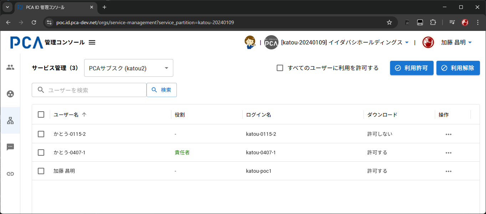
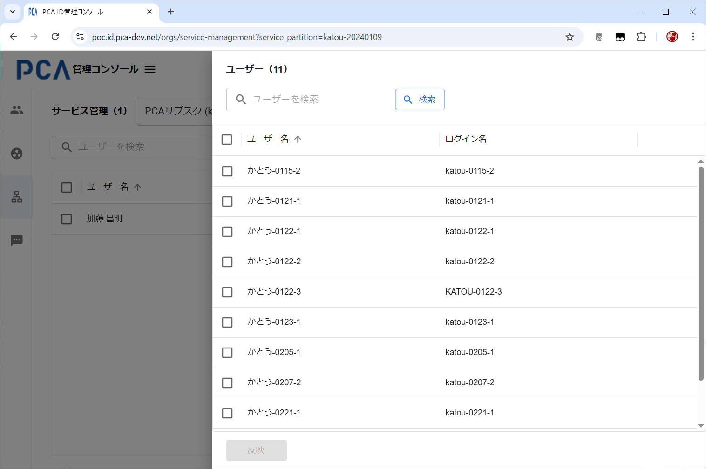

# 管理コンソール - サービス管理

## サービス管理

### 画面イメージ

### 表示・入力項目

#### 利用ユーザー件数

- 対象サービスの利用を許可したユーザー数を表示する
- 検索中は絞り込んだ件数を表示する

#### 対象サービス

- 利用サービスとして追加済みの[サービス区画](/docs/common/サービス区画.md)を一覧する
  - 現在の一覧対象は、PCAクラウドとPCAサブスクのみ
  - ＜例１＞ PCAクラウド（契約ID：20XXXXXX）
  - ＜例２＞ PCAサブスク（契約ID：30XXXXXX）
- 選択されたサービス区画について、利用ユーザーの管理対象とする
- 追加済みのサービス区画が1件のみなら自動選択する
- [組織管理](./orgs-organization-management.md)で利用サービスの表示領域をクリックすることで、画面を切り替えて対象サービスを自動選択する

#### ユーザー名

- 表示領域のクリックにより、選択の ON/OFF を切り替える

#### 役割

- サービス責任者の権限があれば `責任者` と表示する
  - 文字色は緑色とする
- 一般ユーザーは `-` と表示する

#### ログイン名

- 登録された値を表示するだけ

#### ダウンロード

- PCA ID を使用した [PCAソフトダウンロードサービス](https://pca.jp/ap/softdownload) の利用可否を表示する
  - 利用を認めるなら `許可する` と表示する
  - 利用を認めないなら `許可しない` と表示する（デフォルト）

#### 操作

- ユーザーごとに「利用の解除」または「責任者権限の付与/解除」アクションをおこなう
  - 「利用の解除」は、ユーザーを選択して「利用解除」ボタンをクリックするのと同じ動作となる

### 動作（機能）

#### 初期ユーザー

- 組織管理者はすべてのサービスの責任者権限を持つ
  - [ロール（役割）](/docs/common/ロール（役割）.md)
- 対象サービスを追加した組織管理者は許可ユーザー一覧の表示対象となる

#### ページング

- 100行ごとで固定とする
- 100件を超える場合は、表の右上にリンク付きのページ番号を表示する
  - リンクのクリックによりページを移動する

#### 検索（絞り込み）

- 未入力時は「ユーザーを検索」と薄くガイド表示する
- 以下の項目の部分一致で絞り込む
  - ユーザー名
  - 姓・名（カナ）
  - ログイン名
  - メールアドレス
- 大文字・小文字は区別しない
- 入力中はEnterキーで実行する
- 未入力での検索は、絞り込みなしで実行する

#### 並び替え

- 表見出しのクリックで並び替える
  - 「ユーザー名」と「ログイン名」の列で可能とする
    - 「役割」と「操作」列では不可
- クリックを繰り返すことで、昇順（小さい・古い順）・降順（大きい・新しい順）を切り替える

#### 一括選択

- 表見出しの左端チェックから、行チェックを一括選択/解除する
- 一括チェックの範囲は、表示されているページ内（最大100行）とする
  - 最大件数を想定できず処理時間を予測できないため、別ページを対象とすることはできない

#### すべてのユーザーに利用を許可する

- チェックボックスで切り替える
  - デフォルトは OFF とする
- チェック ON なら、ユーザー登録と同時に利用を許可する
- OFF から ON への変更により、すべてのユーザーに一括で利用を許可する
  - OFF への変更なら、それ以降の許可が自動ではなくなる

#### 利用の解除

- 選択したユーザーに対して、サービスの利用を解除する
- 一括選択と組み合わせて、まとめて解除できる

#### 責任者の付与/解除

- 操作したユーザーに対して、選択サービスの責任者権限を付与または解除する
  - 組織管理者のみ操作可能
- サービス責任者の権限により、組織内ユーザーに対して、サービス利用を許可・解除できる
- [ロール（役割）](/docs/common/ロール（役割）.md)

#### ソフトダウンロードの許可／制限

- 操作したユーザーに対して、PCA ID を使用した [PCAソフトダウンロードサービス](https://pca.jp/ap/softdownload) の利用を許可または制限する
- 制限アクションには「利用の解除」と同じ画像を使う

## 利用の許可（利用ユーザーの割り当て）

### 画面イメージ

#### 選択ユーザー件数

- 許可対象として選択可能なユーザー数を表示する
- 検索中は絞り込んだ件数を表示する

#### 一覧項目

- サービス管理と同様
  - 「操作」項目は対象外
- 許可済みユーザーは一覧の対象外とする

### 動作（機能）

- 基本的な動作は、サービス管理と同様

#### 選択状態

- 複数選択を可能とする
- 検索（絞り込み）や並び替えを実行しても選択状態は維持する
- チェックボックスだけでなく、ユーザー名のクリックで選択状態を切り替える

#### 反映

- 選択済みのユーザーに対して、サービスの利用を許可する
  - 利用の許可画面は自動的に閉じる
- サービス管理の一覧画面の対象ユーザーとなる
