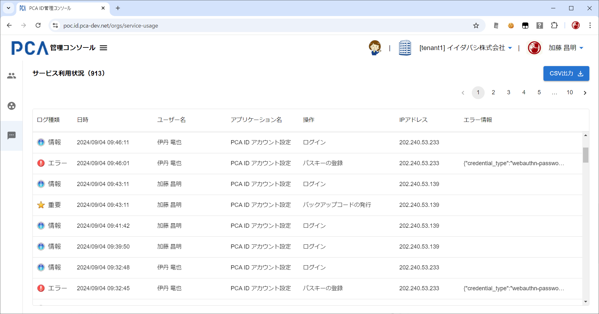

# 管理コンソール - サービス利用状況

## サービス利用状況

- [管理コンソール - 共通](./orgs-common.md)
- [操作ログの種類と詳細](/docs/common/操作ログの種類と詳細.md)

### 画面イメージ

### 表示項目

#### ログ種類

- ログの種類として以下のいずれかの値を表示する
  - `Information アイコン`  + "情報"
  - `Exclamation アイコン`  + "警告"
  - `Error アイコン`  + "エラー"
  - `独自アイコン`  + "重要"
- [サービス利用状況_ログ種類アイコン.zip](./images/service_usage_logtypes.zip)

#### 日時

- 操作を記録した日時を表示する
- `yyyy/mm/dd hh:mm:ss` 形式

#### ユーザー名

- 操作を実行したユーザーを表示する

#### アプリケーション名

- 操作を実行したユーザーが利用中のアプリケーションを表示する
- 以下のアプリケーション名があり、順次拡大していく想定とする
  - PCA Hub
  - PCA ID アカウント設定
  - PCA ID 管理コンソール
  - PCA クラウド／PCA サブスク
  
#### 操作

- [操作ログの種類と詳細](/docs/common/操作ログの種類と詳細.md)
- 操作の種類として以下のいずれかの値を表示し、結果に従ってログ種類を決定する
  - ログイン
    - 情報：ログインに成功したとき
  - ログイン失敗
    - 警告：ログインに（正常に）失敗したとき
  - ログアウト
    - 情報：ログアウトしたとき
  - セッション更新
    - 情報：ユーザーセッションが自動的に更新されたとき
      - ユーザーセッション（＝アクセストークン）の期限は 60分 としている
      - [OIDC/OAuth トークン仕様](/docs/common-dev/oidc-oauth-token-rules.md)
  - パスワードの変更
    - 重要：本人がパスワードを変更したとき
  - ~~パスワードのリセット~~
    - ~~重要：管理者がパスワードをリセットしたとき~~
  - メールアドレスの変更
    - 重要：本人がメールアドレスを変更したとき
    - ~~重要：管理者がメールアドレスを変更したとき~~
  - バックアップコードの発行
    - 重要：本人がバックアップコードを発行したとき
  - ~~バックアップコードのリセット~~
    - ~~重要：管理者がバックアップコードをリセットしたとき~~
  - パスキーの登録
    - 重要：パスキーを登録したとき
  - パスキーの削除
    - 重要：パスキーを削除したとき
- 操作で何らかのエラーが発生したときは、ログ種類を「エラー」とする
- 他のデータ種類もあるが、画面表示の対象外でCSV出力のみ対象となる

#### IPアドレス

- 操作を実行したユーザーが利用中の呼び出し元（クライアント）となるIPアドレスを表示する
- ユーザー環境によっては端末IPではなく、ゲートウェイによって変換されたIPの可能性がある

#### エラー情報

- 操作についてのエラーコードやエラーメッセージが記録されてたら表示する

### 動作（機能）

#### 並び順

- 「日時」の新しい順とする
  - 画面出力とCSV出力のどちらも同様とする

#### 対象ユーザーの指定（絞り込み）

- URLのクエリーパラメーターとして「アカウントID」を指定することで、そのユーザーの利用状況だけを表示する
  - `https://{pcaid-domain}/orgs/service-usage?service_partition=pca.hub.{tenant-name}&account_id=xxxx-xxxx-xxxx`
- PCA Hub テナント管理の「ユーザー詳細（ログ情報）」からの画面遷移を想定する

#### 画面出力

- データ種類のうち「認証」および「ユーザー」の一部（メール送信以外）を対象とする
- 直近の１週間（7日間＝24×7時間）を表示対象とする
- 列幅は可変とする

#### CSV出力

- 組織内のすべてのユーザー、およびすべてのデータ種類を出力対象とする
  - 組織
  - ユーザー
  - 認証
- 直近の２年間を出力対象とする
- 対象データは少し遅れてログとして作成・保存されるため、画面出力とは最新日時が一致しないことがある
- [操作ログの種類と詳細](/docs/common/操作ログの種類と詳細.md)

## 参考情報

- [PCA Hub 監査ログ](https://pca1980.backlog.com/alias/wiki/867610)
