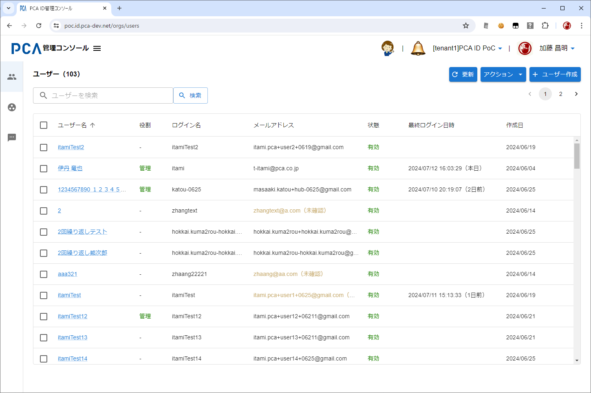
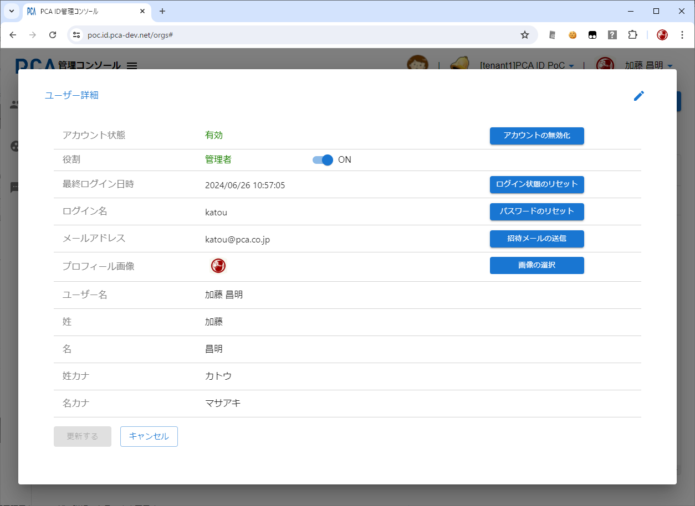
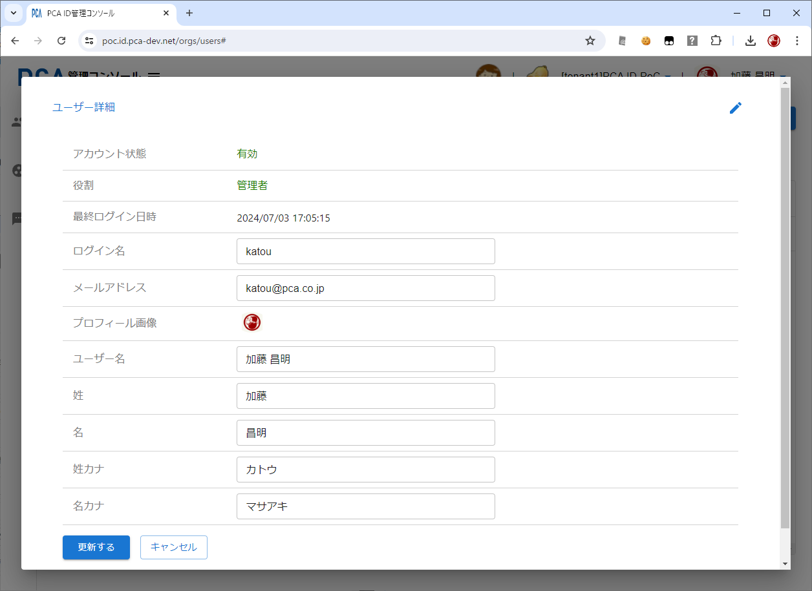

# 管理コンソール - ユーザー管理

## ユーザー管理（ユーザー一覧）

- [管理コンソール - 共通](./orgs-common.md)
- [PCAアカウント](/docs/common/PCAアカウント.md)

### 画面イメージ

### 表示項目

#### ユーザー件数

- 一覧上部にユーザー件数を表示する
- 検索中は絞り込んだ件数を表示する

#### ユーザー名

- ハイパーリンクとする
- リンクのクリックにより、ユーザー詳細画面を表示する

#### 役割

- 組織管理者は `管理` と表示する
  - 文字色は緑色とする
- 一般ユーザーは `-` と表示する

#### ログイン名

- 登録された値を表示するだけ

#### メールアドレス

- RFCに準拠する
  - アルファベットは小文字のみ
- メールアドレスが未確認のときは末尾に `（未確認）` を付加する
  - 文字色は黄土色とする
  - （例）`username@example.com（未確認）`
- 未確認の状態とは、メールアドレスを登録・変更してから、本人による利用確認（実在確認）が完了するまでの状態のこと

#### 状態

- アカウントが有効状態なら `有効` と表示する
  - 文字色は緑色とする
- アカウントが無効状態なら `無効` と表示する
  - 文字色は赤色とする

#### 最終ログイン日時

- 最後にログイン（ユーザー認証）した日時を表示する
  - `yyyy/mm/dd hh:mm:ss` 形式
- 日時の後ろに（◯日前）を付加する
  - 例外として、本日であれば（本日）を付加する
- 一度もログインしていない場合は空欄とする
  - 招待中のユーザーが該当する

#### 作成日

- ユーザーを作成した日を表示する
  - `yyyy/mm/dd` 形式

### 動作（機能）

#### ページング

- 100行ごとで固定とする
- 100件を超える場合は、表の右上にリンク付きのページ番号を表示する
  - リンクのクリックによりページを移動する

#### 検索（絞り込み）

- 未入力時は「ユーザーを検索」と薄くガイド表示する
- 以下の項目の部分一致で絞り込む
  - ユーザー名（表示名）
  - 姓・名
  - 姓・名カナ
  - ログイン名
  - メールアドレス
- 大文字・小文字は区別しない
- 入力中はEnterキーで実行する
- 未入力での検索は、絞り込みなしで実行する

#### 対象ユーザーの指定（絞り込み）

- URLのクエリーパラメーターとして「アカウントID」を指定することで、そのユーザーの詳細画面を表示する
  - `https://{pcaid-domain}/orgs/users?service_partition=pca.hub.{tenant-name}&account_id=xxxx-xxxx-xxxx`
- PCA Hub テナント管理の「ユーザー詳細」からの画面遷移を想定する
  - おもに PCA Hub の管理者が、ユーザーのアカウント情報を管理する（例：メールアドレスを変更する）ケースを想定する

#### 並び替え

- 表見出しのクリックで並び替える
  - 「最終ログイン日時」以外のすべての列で可能とする
    - 最終ログイン日時は非同期で後から取得しているため、ユーザー情報と結合して並び替えることができない
- クリックを繰り返すことで、昇順（小さい・古い順）・降順（大きい・新しい順）を切り替える

#### 一括選択

- 表見出しの左端チェックから、行チェックを一括選択/解除する
- 一括チェックの範囲は、表示されているページ内（最大100行）とする
  - 最大件数を想定できず処理時間を予測できないため、別ページを対象とすることはできない

#### 更新

- データベースに登録された最新のユーザー情報の一覧を表示する

#### ユーザーインポート

- CSVファイルから新規ユーザーを一括登録する
- 登録に成功したユーザーに対して、招待メールもしくはメールアドレス確認リクエストのメールを送信する
- 一括登録が完了したら、ユーザーインポート結果を自動的にダウンロードする
- [ユーザーCSVフォーマット](/docs/common/ユーザーCSVフォーマット.md)
- [ユーザーインポートAPI POST /users/import](/docs/api/users/import/POST%20ユーザーインポート非同期.md)
- [ユーザーインポート状態取得API POST /users/import/tasks/{task_id}](/docs/api/users/import/tasks/task_id/POST%20ユーザーインポート状態取得.md)

#### ユーザーエクスポート

- 一覧から選択したユーザー情報をCSVファイルとして出力する
- [ユーザーCSVフォーマット](/docs/common/ユーザーCSVフォーマット.md)

#### バウンスメールアドレスの確認

- PCA ID と 各種サービスでメール送信に使うAWSサービス（SES）で、バウンス登録されているメールアドレスを確認する
- CSVファイル「`バウンスメールアドレス_{年}-{月}-{日}_{時}-{分}-{秒}.csv`」としてダウンロードする
- バウンスメールアドレスが0件ならその旨をメッセージで表示する（空ファイルは作らない）

| No. | 項目名 | 説明 |
| --: | -- | -- |
| 1 | メールアドレス | バウンスとして登録されたメールアドレス |
| 2 | バウンス日時 | バウンスとして登録された日時 |
| 3 | バウンス種類 | 拒否アドレス（理由不明）   不達アドレス   不達アドレス（宛先不明）   グローバル送信抑制アドレス   送信抑制アドレス   一時拒否アドレス   メールボックスフル   メールサイズ超過   不許可のメール本文   不許可の添付ファイル   苦情アドレス   ※ 両方の発生種類に登録がある場合、「認証」の説明を優先する |
| 4 | 発生種類 | 認証 or サービス（またはその両方） |

発生種類が「認証」の場合、バウンス種類は以下の10種類になる

| bounceType | bounceSubType | バウンス種類 |
| --- | --- | --- |
| Undetermined | Undetermined | 拒否アドレス（理由不明） |
| Permanent | General | 不達アドレス |
| Permanent | NoEmail | 不達アドレス（宛先不明） |
| Permanent | Suppressed | グローバル送信抑制アドレス |
| Permanent | OnAccountSuppressionList | 送信抑制アドレス |
| Transient | General | 一時拒否アドレス |
| Transient | MailboxFull | メールボックスフル |
| Transient | MessageTooLarge | メールサイズ超過 |
| Transient | ContentRejected | 不許可のメール本文 |
| Transient | AttachmentRejected | 不許可の添付ファイル |

- [Amazon SES の Amazon SNS 通知コンテンツ - Amazon Simple Email Service](https://docs.aws.amazon.com/ja_jp/ses/latest/dg/notification-contents.html)

一方で、発生種類が「サービス」の場合、バウンス種類は以下の2種類になる

| bounceType | bounceSubType | バウンス種類 |
| --- | --- | --- |
| BOUNCE | - | 不達アドレス |
| COMPLAINT| - | 苦情アドレス |

- [AWS SDK for JavaScript v3 - ListSuppressedDestinationsCommand](https://docs.aws.amazon.com/AWSJavaScriptSDK/v3/latest/client/sesv2/command/ListSuppressedDestinationsCommand/)

#### 招待メールの送信

- 選択したユーザーに対して、招待メールを送信する
  - 招待期限の切れたユーザーを再び招待する運用を想定する
- [メール送信](/docs/common/メール送信.md)

#### パスワードのリセット

- 選択したユーザーに対して、新しいパスワードへの変更を促すため、パスワードのリセットメールを送信する
- 既存のパスワードは誰も利用できないように、複雑なランダムパスワードで上書きする
  - パスワードの漏洩に対処する運用を想定する
  - ランダムパスワードは20桁とし、暗号用の乱数生成器を利用する
- [メール送信](/docs/common/メール送信.md)

#### バックアップコードのリセット

- 選択したユーザーに対して、臨時のバックアップコード（1件）を発行する
  - メール認証が利用できない（メールを受信できない）状況からの、管理者のサポートによる回復を想定する
    - 本人を認証できたら、自身で利用可能なメールアドレスに変更してメール認証を可能にする
  - 本人がパスワードも忘れている場合は回復不可で、ユーザー作成からやり直すしかない
    - 変更するつもりのメールアドレスを使ってユーザーを作成する
- 既存の発行済みバックアップコードはすべて破棄する
- 臨時コードを使ったら、発行済みコードがなくなるので、バックアップコード（12件）を新たに再発行する

#### アカウントの有効化

- 選択したユーザーのアカウント状態を有効にする
  - すでに有効な状態であれば何もしない（何も起こらない）
- 無効な状態になるケースとして以下がある
  - 「アカウントの無効化」を実行する
  - ログインに繰り返し失敗して一時的なロックアウト状態になる

#### アカウントの無効化

- 選択したユーザーのアカウント状態を無効にする
  - すでに無効な状態であれば何もしない（何も起こらない）
- 無効な状態になとログイン不可となり、アカウント設定もできなくなる
- 組織管理者（役割が「管理」のユーザー）は、自分自身を無効化できない
  - 上記に加えて、組織管理者が一人もいなくなる無効化はできないようにチェックしている

#### ログイン状態のリセット

- 選択したユーザーを強制的にログアウトさせる
  - 強制ログアウトされたユーザーは、明示的な再ログイン（ユーザー認証）が必要となる

#### ユーザー情報の同期

- 選択したユーザーの [更新系イベント](/docs/common-dev/events-notification-design.md) を再通知する
  - ユーザー情報の更新（user.updated）
  - メールアドレスの確認（user.email-verified）
- 主に PCA Hub ユーザー情報との不一致が発生したときの回復措置とする

#### ユーザーの削除

- 選択したユーザーを現在の組織から削除する
- 現在の組織に未所属となるだけで、ユーザーの基本情報は削除されない
- ユーザーの組織別情報である「ログイン名」は削除される
  - 同じ組織内の別ユーザーによってログイン名を再利用できるようになる
- 組織管理者（役割が「管理」のユーザー）は、自分自身を削除できない
  - 上記に加えて、組織管理者が一人もいなくなる削除はできないようにチェックしている
- [ユーザー削除API POST /users/{account_id}/remove](/docs/api/users/account_id/remove/POST%20ユーザー削除.md)

## ユーザー管理（ユーザー作成）

- [PCAアカウント](/docs/common/PCAアカウント.md)

### 画面イメージ

### 入力項目

#### メールアドレス（必須）

- メールアドレスのユーザー名（@より前の部分）をログイン名にコピーする
  - ログイン名が未入力のときのみ

#### ログイン名（必須）

#### ユーザー名（必須）

#### 姓名とフリガナ

- 姓のみ必須
  - カナも同様

### 動作（機能）

#### ユーザー作成

- 入力されたメールアドレスのユーザーがデータベースに登録済みかどうかで動作を変える
  - ユーザーが未登録の場合
    - データベースへのユーザー作成と同時に、現在の組織から、入力されたメールアドレスに招待メールを送信する
  - 現在の組織内でユーザーが登録済みの場合
    - ユーザーは登録済みとして失敗とする
  - 別の組織でユーザーが登録済みの場合
    - 現在の組織からのメールアドレス検証のリクエストメールを送信する
    - ただし、アカウント設定が未完了（パスワードが未設定）であれば、アカウント設定リクエストメールを送信する
      - 以前のアカウント設定リクエストを忘れている可能性が高く、無用な混乱を避けるための措置とする
    - ユーザーは招待フローを完了済み（パスワード設定済み）で、複数の組織に所属するユーザーとなる
- 入力されたログイン名が、現在の組織内ですでに利用されていたら、ユーザー作成は失敗とする
  - 別の組織であれば、同じログイン名が利用されていても問題はない
- ユーザー本人によるメールアドレス検証が完了することで、メールアドレスは「未確認」から「確認済み」状態となる
- [ユーザー作成API POST /users](/docs/api/users/POST%20ユーザー作成.md)
- [メール送信](/docs/common/メール送信.md)

## ユーザー管理（ユーザー詳細）

### 画面イメージ

### 表示・入力項目

#### 表示項目

- ユーザー一覧での表示項目を、ユーザー詳細でもそのまま表示する
- 項目の並び順は、ユーザー詳細の都合にあわせて最適化する（右側に関連機能を配置する）
  - アカウント状態
    - 一時ロックアウト状態のときは、アカウント状態の右側に（一時ロックアウト）と表示する
      - 表示色を黄土色とする
    - 複数組織に所属しているユーザーは、アカウント状態の右側に「複数組織に所属済み」と表示する
      - 表示色を水色（ボタン背景色と同じ）とする
      - 管理者によるメールアドレス変更が不可であることのヒントとする
    - アカウント状態を変更（有効化/無効化）する機能を配置する
  - 役割
    - 権限を変更（付与/取り消し）する機能を配置する
  - 最終ログイン日時
    - ログイン状態をリセットする機能を配置する
  - ログイン名
    - パスワードをリセットする機能を配置する
  - メールアドレス
    - 招待メールを送信する機能を配置する
  - プロフィール画像
    - 画像を選択する機能を配置する
  - ユーザー名
  - 姓
  - 名
  - 姓カナ
  - 名カナ

### 動作（機能）

#### ユーザー一覧との共通機能

- 以下はユーザー一覧での機能と同じ
  - アカウントの有効化/無効化
  - ログイン状態のリセット
  - 招待メールの送信
  - パスワードのリセット

#### 権限の変更

- 「組織管理者」の権限を付与または取り消す
- チェック付きの権限一覧を表示して、チェックのON/OFFで、権限の付与/取り消しを選択する
  - 初版では一覧できる権限は「組織管理者」のみ
- 組織管理者（役割が「管理」のユーザー）は、自分自身の権限の取り消しができない
  - 上記に加えて、組織管理者が一人もいなくなる権限の取り消しができないようにチェックしている
- 変更モードに切り替える必要はない

#### 画像の選択

- ローカルファイルから画像を選択することでデータベースを更新する
- 変更モードに切り替える必要はない

#### 変更モードへの切り替え

- 右上の鉛筆アイコンのクリックにより変更モードに切り替わる
  - 変更モードでクリックすると、変更の取り消しとなる
- 変更モードに切り替わると更新ボタンは有効となる

## ユーザー管理（ユーザー詳細の更新）

### 画面イメージ

### 表示・入力項目

#### 入力項目

- ユーザー詳細の並び順のまま、変更モードに切り替わることで以下の項目が入力可能となる
  - ログイン名（必須）
  - メールアドレス（必須）
  - ユーザー名（必須）
  - 姓（必須）
  - 名
  - 姓カナ（必須）
  - 名カナ
- 項目ごとの入力制限は、ユーザー作成時と同様とする

### 動作（機能）

#### メールアドレス変更

- 既存の登録済みメールアドレスへの変更は不可とする
- 複数組織に所属するユーザーに対するメールアドレス変更は不可とする
  - 組織管理者が別組織のユーザーになり済ますことを防止するセキュリティ対策とする
- ユーザーのパスワードが未設定のうちは、メールアドレス変更を不可とする
- 変更したメールアドレスに対して検証メールを送信する
- メールアドレス検証のリクエストをメール送信することをガイドメッセージ（赤文字）として表示する
  - 「※変更したメールアドレス宛に確認メールを送信します。」
  - 更新・キャンセルボタンの右側に表示する

#### ユーザー詳細の更新

- メールアドレスとログイン名の重複制限は、ユーザー作成時と同様とする
