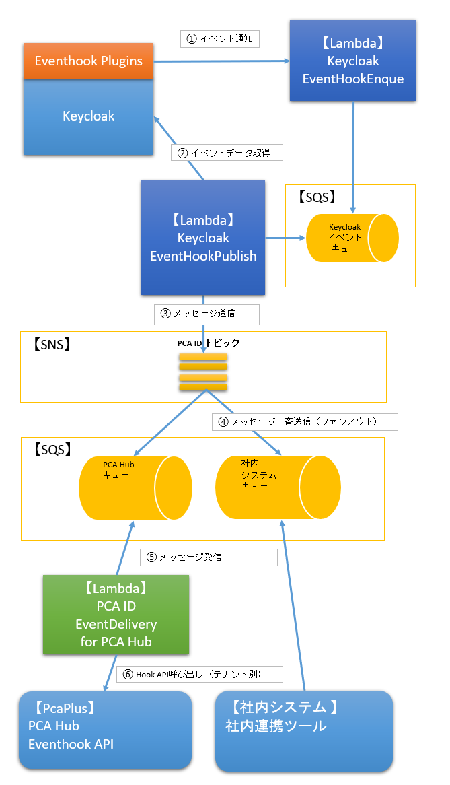

# 8. イベント通知

## イベント種類

### ユーザーイベント

| イベント名 | 種類 | 発生条件 | 発生元 |
| -- | -- | -- | -- |
| ユーザーの作成 | user.created | ユーザーが作成されたとき | [POST /users](/docs/api/users/POST%20ユーザー作成.md) <br/> [POST /users/import](/docs/api/users/import/POST%20ユーザーインポート非同期.md) |
| ユーザー情報の変更 | user.updated | ログイン名や表示名、氏名等のプロフィール情報が変更されたとき | `access.UPDATE_PROFILE` <br/> `access.UPDATE_EMAIL` <br/> `access.CUSTOM_REQUIRED_ACTION (UPDATE_EMAIL)` <br/> [PUT /users/{account_id}](/docs/api/users/account_id/PUT%20ユーザー更新.md) |
| 招待メールの送信 | user.email-invited | 招待メールを送信したとき | [POST /users/import](/docs/api/users/import/POST%20ユーザーインポート非同期.md) <br/> [POST /users/{account_id}/invite](/docs/api/users/account_id/invite/POST%20招待メール送信.md) |
| メールアドレスの確認 | user.email-verified | 本人によるメールアドレス利用を確認できたとき | `access.VERIFY_EMAIL` <br/> `access.CUSTOM_REQUIRED_ACTION (VERIFY_EMAIL)` |
| ユーザー認証エラー | user.login-failed | ユーザー認証に失敗したとき | `access.LOGIN_ERROR` |
| ユーザーログアウト | user.logged-out | ユーザーがログアウトしたとき | `access.LOGOUT` |
| ユーザー状態の停止（無効化） | user.disabled | 組織管理者がユーザー状態を一時的に無効にしたとき | [POST /users/{account_id}/lifecycle/suspend](/docs/api/users/account_id/lifecycle/suspend/POST%20ユーザー無効化.md) |
| ユーザー状態の再開（有効化） | user.enabled | 組織管理者がユーザー状態を有効に戻したとき | [POST /users/{account_id}/lifecycle/unsuspend](/docs/api/users/account_id/lifecycle/unsuspend/POST%20ユーザー無効化解除.md) |
| ユーザーの削除 | user.deleted | ユーザーが削除されたとき | [POST /users/{account_id}/remove](/docs/api/users/account_id/remove/POST%20ユーザー削除.md) |

```json
{
    "account_id": "xxxx-xx-xx-xxxx",
    "login_name": "yamada",
    "email": "yamada@email.com",
    "preferred_username": "総務部_山田太郎",
    "family_name": "山田",
    "given_name": "太郎",
    "family_kana": "ヤマダ",
    "given_kana": "タロウ",
    "account_status": "enable",
    "email_status": "active",
    "organization_id": "xxxx-xx-xx-xxxx",
    "service_partition": "pca.hub.tdi1"
}
```

- 所属組織ごとに異なるイベントとして通知する
  - ２つの組織に所属するユーザーの情報が変更されたら、`organization_id` のみが異なる２件のイベントメッセージを作成して発行する
- サービス区画ごとに異なるイベントとして通知する
  - ２つのサービス区画を利用できるユーザーの情報が変更されたら、`service_partition` のみが異なる２件のイベントメッセージを作成して発行する

### 組織イベント

| イベント名 | 種類 | 発生条件 | 発生元 |
| -- | -- | -- | -- |
| 組織の作成 | organization.created | PCA Hubテナントの作成・移行等によって組織が作成されたとき | `admin.GROUP-CREATE` |

```json
{
    "organization_id": "xxxx-xx-xx-xxxx",
    "organization_name": "tdi",
    "organization_display_name": "TOKYO DIGITAL IDEAS",
    "service_partition": "pca.hub.tdi1"
}
```

- サービス区画ごとに異なるイベントとして通知する

### 内部処理イベント

| イベント名 | 種類 | 発生条件 | 発生元 | 内部処理 |
| -- | -- | -- | -- | -- |
| パスキー登録 | 非公開 | パスキーを登録したとき | `access.CUSTOM_REQUIRED_ACTION` <br/> `(webauthn-register-passwordless)` | パスキーを優先する認証方法となるように順序を更新する |

## システム設計

### システム構成



1. Keycloakイベントの通知を受け取る
    - Keycloak Eventhook Plugins を介して、Lambda に Keycloakイベントが届く
    - 受け取ったイベントはSQSにバッファリングして、スロットリングエラーによるイベントロストを回避する
2. Keycloakからイベントデータを取得する
3. イベント情報をSNSメッセージとして送信する
4. イベント情報をSQSメッセージとして、イベントを購読している複数の送信先へキューイング（バッファリング）する
     - ファンアウト構成とし、将来、送信先をいくつでも増やせる構成としている
5. イベントを購読するシステムは、各自の方法でSQSメッセージを受け取る
    - Lambdaを利用してイベント情報を格納したメッセージを受け取る
    - 定期的にSQSをポーリングしてメッセージを受け取る
6. 【SQS-Lambda連携時】システム固有のイベント通知先APIエンドポイントを呼び出す

[pcaid-webhook-eventType_20250217](./materials/pcaid-webhook-eventType_20250217.zip)

### Keycloak Eventhook 認証

- Keycloakとの共有鍵を使った署名チェックをおこなうことで認証とする
- Eventhook エンドポイントはパブリックアクセス可能なので、認証が必須となる

### イベント情報

| | Message<br/>（SNS、SQS） |  HTTP<br/>（Lambda） | データ例 | 備考 |
| -- | -- | -- | -- | -- |
| イベント用APIキー | eventAPIKey | X-PCA-Event-APIKey | xxxx-xx-xx-xxxx |  ハンドル側では最低２世代分のAPIキーを受け入れ可能にする |
| イベント種類 | eventType | X-PCA-Event-Type | user.create <br/> organization.created | 値は単一指定とする |
| イベント種類バージョン | eventTypeVersion | X-PCA-Event-Type-Version | 1 | |
| イベント送信者 | eventSender | X-PCA-Event-Sender | user <br/> admin <br/> service | 値は単一指定とする |
| イベント元クライアント | eventSourceClient | X-PCA-Event-SourceClient | PCAHub-PcaPlus <br/> PCAID-management | 値は単一指定とする |
| イベント元組織ID | eventSourceOrganizationId | X-PCA-Event-SourceOrganizationId | xxxx-xxx-xxx-xxxx | イベント元を特定可能なら設定する |
| イベント元サービス区画 | eventSourceServicePartition | X-PCA-Event-SourceServicePartition | pca.hub.tenant1 | イベント元を特定可能なら設定する |
| 対象サービス区画 | service_partition | X-PCA-service-partition | pca.hub.tdi1 | |
| イベントデータ | body | Body | { "account_id": "xxxx-xx-xx-xxxx", ... } | |

### PCA Hub Webhook API

- [PCA Hub Webhook 呼び出し仕様](./hub-webhook-integration.md)
