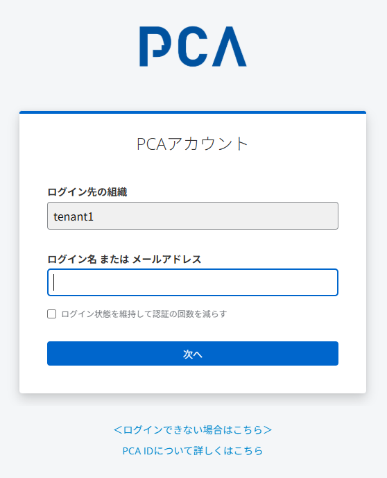
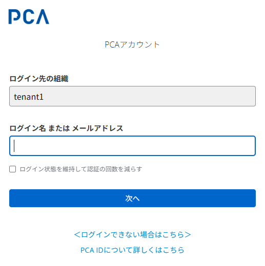

# 21. ユーザー認証

## ユーザー識別方法

1. メールアドレス
   - 例：`katou@pca.co.jp`
2. ログインID
   - 例１：`PCA\katou`（組織付きログイン名）
   - 例２：`katou`（ログイン名）
     - アプリからのサービス区画パラメーターから[組織名](./組織名.md)を補完する

## 認証方法

1. パスキー
   - FIDO2 (WebAuthn+CTAP)
   - 本人が自身のデバイスでパスキー登録することで利用可能となる
2. パスワード＋Eメールによる確認コード
3. パスワード＋バックアップコード

※番号順に優先動作とし、最新のセキュリティ動向に追随するため、ユーザー操作による順番変更は認めない

## 認証フロー

### 1. ユーザー入力

#### PC用

#### スマホ用

- ログインIDとして、「メールアドレス」または「（組織付き）ログイン名」を入力する
- ユーザーを一意に特定したらアカウント設定によって、「2FAのパスワード入力」または「パスキー認証」に進む
  - パスキーがセットアップ済みであればパスキー認証を優先する
- **以前のユーザー認証の成功を示す認証セッションがあれば、ユーザー認証は成功とする**

### 2-1. パスワード入力

- 2FAの第一フェーズとしてパスワードを入力する
- パスワードを忘れたときのリセットフローを用意する
- パスキーがセットアップ済みであれば、パスキー認証へ切り替える手段を用意する

### 2-1-1. メール認証

- ユーザーのメールアドレス宛に認証コードを発行して、メール認証をおこなう
- 認証コードを再発行できるようにする
- バックアップコード認証へ切り替える手段を用意する
- パスキーがセットアップ済みであれば、パスキー認証へ切り替える手段を用意する
- **メール認証に成功したら、ユーザー認証は成功とする**

### 2-1-2. バックアップコード認証

- バックアップコード認証をおこなう
  - 前提として、バックアップコードの発行をアカウント登録時の必須アクションとする
- メール認証へ切り替える手段を用意する
- パスキーがセットアップ済みであれば、パスキー認証へ切り替える手段を用意する
- **バックアップコード認証に成功したら、ユーザー認証は成功とする**
- バックアップコードを使い切っていたら、新たなバックアップコードを自動的に発行する

### 2-2. パスキー認証

- デバイスで可能な手段によりパスキーで認証する
- 基本的には顔認証と指紋認証を想定する
- **パスキー認証に成功したら、ユーザー認証は成功とする**

## 認証動作

- ログインIDの大文字・小文字違いは無視する
  - `PCA\katou` でも `PCA\KATOU` でも `pca\katou` でもOKとする
- ログイン中の認証済みユーザーは継続利用により期限を延長
- ユーザー識別情報（メールアドレス or ログインID）はブラウザーの自動入力機能との親和性を重視する
- ログイン失敗により一時ロックアウトとなった場合、画面上ではロックアウト状態となっていることだけを伝える
  - [認証セキュリティ - ログインポリシー](./認証セキュリティ.md#ログインポリシー)

## 認証セッション設定

| 設定項目 | Keycloak設定名 | 値 | PCA Hub の既存仕様 |
| --- | --- | --- | --- |
| アイドル許容期間 （オンメモリ） | SSO Session Idle | 12時間 | 未対応 |
| 最大期間 （オンメモリ） | SSO Session Max | 12時間 | ブラウザーセッションを利用 |
| アイドル許容期間 （永続化） | SSO Session Idle   (Remember Me) | 40日 | 14日を最短期限とし、残り7日以内で7日分延長 |
| 最大期間 （永続化） | SSO Session Max   (Remember Me) | 無期限相当   (2000日) | 無期限に延長する |
| 認証フロータイムアウト | Login timeout | 30分 | なし |
| 認証操作タイムアウト | Login action timeout | 10分 | なし |

- Keycloak v23 には2038年問題により、v25+ とするまで SSO Session Max (Remember Me) を 2000日より大きくできない
  - <https://github.com/pca-idp/pcaid/discussions/298#discussioncomment-9601404>

## その他のリンク

- ＜ログインできない場合はこちら＞
  - <https://faq.pca.jp/faq/show/10272>
- PCA IDについて詳しくはこちら
  - <https://pca.jp/area_support/manual/pcaid/index.html>

### 文字配置

- フッターの中央に配置
- 行間は 0.5 程度（行高は文字に対して 1.25 程度）とする

## OIDC 認可エンドポイント

- GET `/auth/v1/auth`
- OIDCクライアント（RP）
  - シークレットを持たないパブリッククライアント（Public Client）としてアクセスする
  - 認可コードフロー（Authorization Code Grant）を利用する
  - 可能な状況では、呼び出し元の[サービス区画](./サービス区画.md)を指定する
    - クエリーパラメーターとして `service_partition` を追加する
    - 例：`service_partition=pca.hub.tenant1`
  - 認証結果として受け取ったIDトークンを必ず検証する
  - バックグラウンド（非対面）でのアクセスが必要なときのみ `scope` に `offline_access` を指定する
- 認証サーバー
  - 認証処理において、ログイン先の[組織名](./組織名.md)を特定する
- セキュリティ対応
  - 認証シーケンスを保護するセキュリティ系パラメーターを必ず利用する
    - state
    - nonce
    - PKCE

## 関連情報

- [PCAアカウント](./PCAアカウント.md)
- [認証セキュリティ](./認証セキュリティ.md)
- [PCA ID ドメイン＆ベースURL定義](/docs/common-dev/pcaid-domain-and-baseurl.md)
