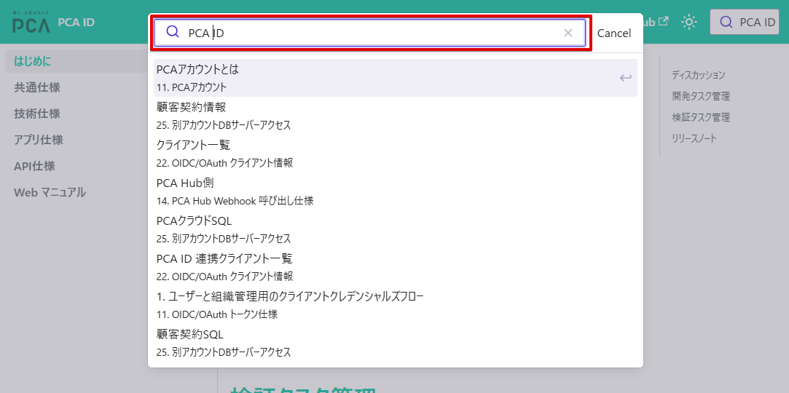
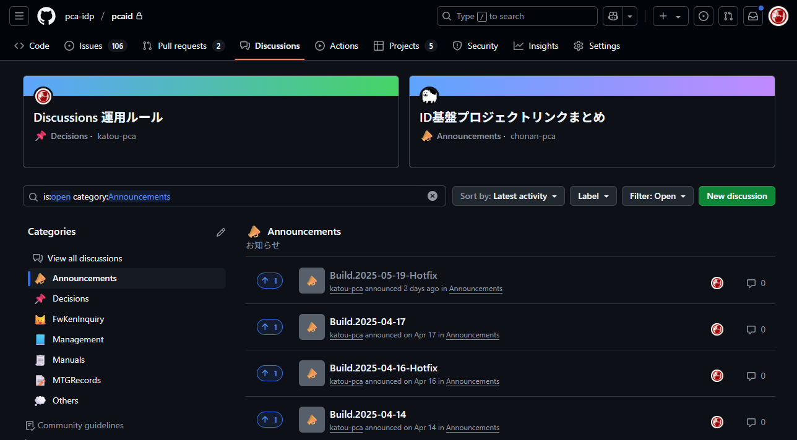
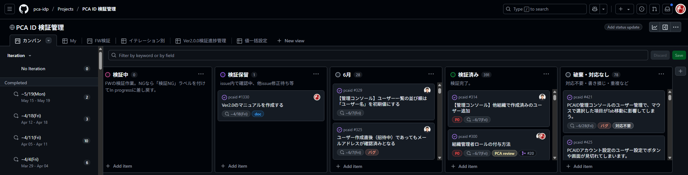
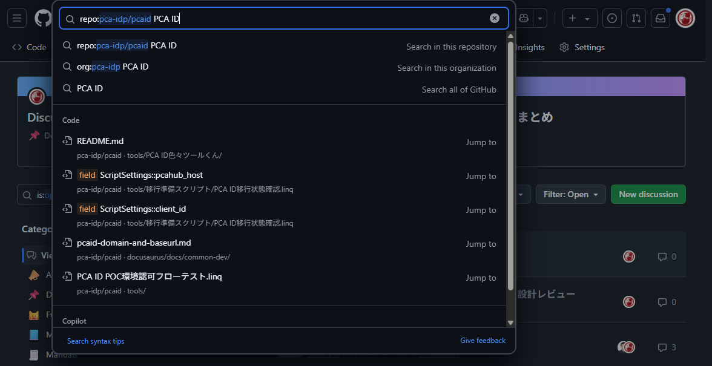
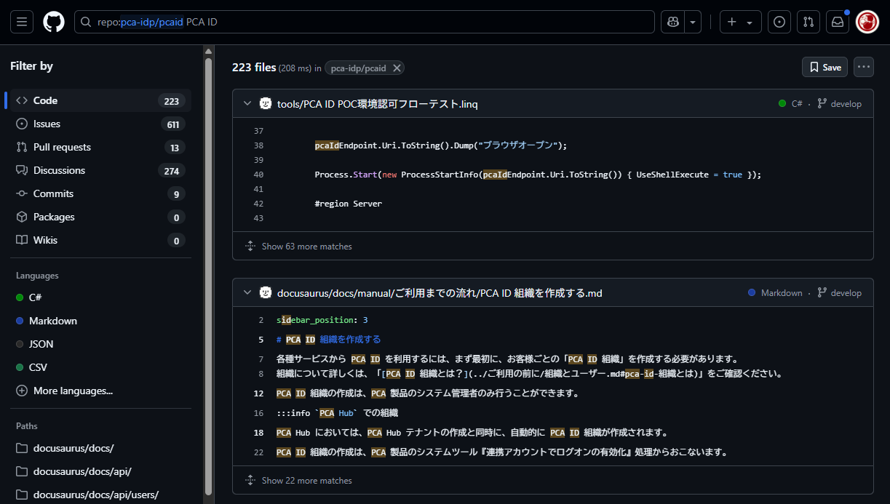
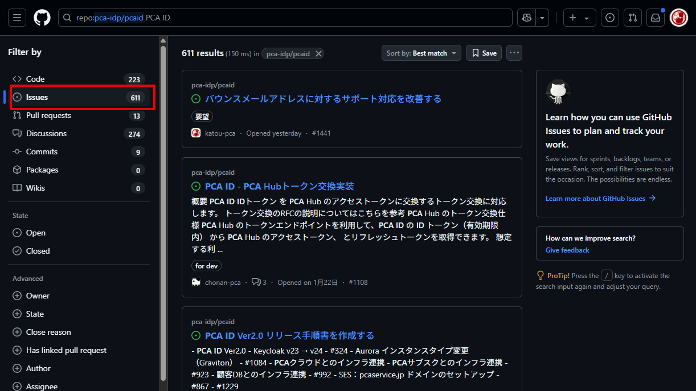

# はじめに

## [ディスカッション](https://github.com/pca-idp/pcaid/discussions)

GitHub Discussions で、仕様書（ドラフト）や議事録を記録します。  
リリースアナウンスもおこないます。

## [開発タスク管理](https://github.com/orgs/pca-idp/projects/10)

GitHub Projects の「[利用者ポータル等](https://github.com/orgs/pca-idp/projects/7)」プロジェクトで開発タスクを管理します。  
[Issues](https://github.com/pca-idp/pcaid/issues) や、リポジトリごとの Pull Requests を使い、一定期間のイテレーションで回します。

## [検証タスク管理](https://github.com/orgs/pca-idp/projects/4)

GitHub Projects の「[PCA ID 検証管理](https://github.com/orgs/pca-idp/projects/4)」プロジェクトで検証タスクを管理します。  
検証期間中は [Issues](https://github.com/pca-idp/pcaid/issues) を使い、1週間ごとのイテレーションで回します。

## [リリースノート](https://github.com/pca-idp/pcaid/releases)

イテレーションごとに検証用ビルドをリリースします。  
同様の内容は、GitHub Discussions の [Announcements](https://github.com/pca-idp/pcaid/discussions/categories/announcements) にも発行します。

## 他部署向け案内

### 1. PCA ID 仕様書サイト（このサイト）

- <https://docs.id.pca-dev.net>
- 各種仕様書
  - 共通仕様、アプリ仕様・・・他部署の方々も含め、誰でも参照することを想定している
  - 技術仕様、API仕様・・・基本的に開発者が参照することを想定している
- マニュアル原稿
  - マニュアル担当者へ渡して、そのまま「[Webマニュアル](https://pca.jp/area_support/manual/pcaid/index.html)」に使ってもらうことを想定している

#### 1-1. 仕様書サイト 参照依頼

開発からの連絡先となる上長（チームリーダー以上）が、[PCA ID 仕様書サイト アクセス権](https://github.com/pca-idp/pcaid/discussions/810) から依頼をお願いします。  
コメント欄を使い、アクセス権を付与・変更・取り消したいメンバーの「メールアドレス」を明記して依頼します。

- 【注意事項】
  1. EntraID によるSSOログインは、`pca.co.jp` のメールアドレスをもつ ADユーザーのみ可能です。
     - EntraID との紐づけ作業は情シスへの依頼が必要となるため、時間がかかる場合があります。
  2. `pca.co.jp` のメールアドレスを持っていないユーザーは、ログイン画面からアカウントを作成して独自認証を利用してください。
  3. ライセンスの制限はありません。上長が認めたメンバーであれば何人でも追加は可能です。

#### 1-2. 仕様書サイト 検索方法

1. ヘッダーの右端の検索ボックス（赤枠）をクリックします
   - 
2. キーワードを入力すると、インクリメンタル検索して一覧します
   - 
3. 一覧された文書をクリックして移動します

### 2. PCA ID 用 GitHub

- <https://github.com/pca-idp/pcaid>
  - スクショの背景色が黒いのは、Windowsのダークテーマを選択している影響です
- [ビルドやリリースのお知らせ](https://github.com/pca-idp/pcaid/discussions/categories/announcements)
  - ビルドごとのリリースノートが含まれている
  - 
- [レポート管理（Issue管理のカンバン）](https://github.com/orgs/pca-idp/projects/4)
  - ユーザー向けの仕様変更やバグ修正のレポートが含まれている
  - 検証できない技術系タスク（例：インフラ設定変更など）は含まれておらず、別のカンバンで管理している
  - 

#### 2-1. GitHub 参加依頼

各自で GitHub アカウントを作成して、開発からの連絡先となる上長（チームリーダー以上）が、[「PCA ID基盤」GitHub Organization アクセス権](https://github.com/pca-idp/pcaid/discussions/349) から依頼をお願いします。  
リンク先のコメント欄を使い、アクセス権を付与・変更・取り消したいメンバーを明記して依頼します。  
開発側では [GitHub運用ルール](https://github.com/pca-developers/docs/blob/main/Github/Github%E9%81%8B%E7%94%A8%E3%83%AB%E3%83%BC%E3%83%AB.md) に従い、最小権限でアクセス権を付与します。

- 【注意事項】
  1. 事前に各自で GitHub アカウントを作成しておく必要があります。
  2. この依頼で参加できるのは PCA ID 関連のみです。
     - フレームワークや他プロダクトの GitHub は別区画となるので、個々に参加依頼をお願いします。
  3. GitHub からの招待メールには期限（1週間程度）がありますので、すみやかに承諾をお願いします。
     - 期限が切れたら再依頼となります。
  4. GitHub への新規参加の場合、有償の GitHub ライセンスを消費するため、参加依頼を断る可能性があります。
     - すでに別区画で参加済みであれば、追加分のライセンス消費はありません。

#### 2-2. GitHub 検索方法

1. ヘッダー部の検索ボックス（赤枠）をクリックします
   - 
2. キーワードを入力すると、インクリメンタル検索します
   - 
3. そのまま Enter キーを押すと、検索結果ページへ移動します
   - 
4. 左ペインの Issues を選択して、検索対象をレポートのみに絞り込みます
   - 
