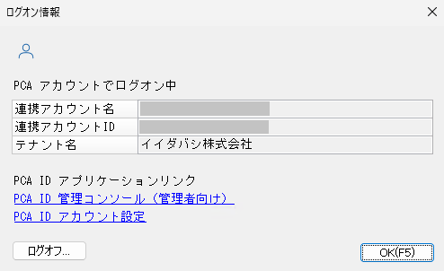

# PCAクラウド／PCAサブスクから利用を始める

## PCAクラウド／PCAサブスクにおける PCA ID とは？

「PCAクラウド」および「PCAサブスク」サービスで提供する PCA 製品から利用を始める場合、製品内に独自の認証機能を搭載しているため、PCA ID は必須の機能ではありません。  
しかしながら、PCA 製品に PCA ID を組み合わせて利用することで、PCAサービスを、より安全で、より便利にお使い頂くことが可能になります。

PCA 製品内のユーザーを PCA アカウントと紐づけると、従来の認証方式に加えて、PCA ID でも認証できるようになります。  
詳しくは「ログインの流れ」メニューから、利用可能なログイン方法をご確認ください。

- [パスキーを使用した簡単なログイン方法](../ログインの流れ/パスキーを使用した簡単なログイン方法.md)
- [パスワードと認証コードを使用した２段階ログイン方法](../ログインの流れ/パスワードと認証コードを使用した２段階ログイン方法.md)
- [パスワードとバックアップコードを使用した２段階ログイン方法](../ログインの流れ/パスワードとバックアップコードを使用した２段階ログイン方法.md)

すでに PCA 製品を導入済みであれば、ご利用中のシステムユーザーを、PCA ID の PCA アカウントと紐づけることが可能です。  
PCA Hub と同時に PCA 製品を導入する場合には、PCA Hub を通じて作成した PCA アカウントから、一括でシステムユーザーを作成することが可能です。  

パスキーやパスワード、バックアップコード等の認証情報は、PCA ID が管理し、PCA アカウントが保持します（PCA 製品においても従来の認証情報を保持します）。  
PCA 製品と PCA Hub の両方を利用する場合、１つの PCA アカウントを使い、一度のログイン操作でどちらも利用することができます。

## PCAクラウド／PCAサブスク から PCA ID 機能を利用する

### 一般ユーザーが PCA ID 機能を利用する

Webブラウザーを起動して、PCA ID アカウント設定へ移動します。  
PCA ID アカウント設定の URL は、「[アプリケーションURL](../ご利用の前に/アプリケーションURL.md)」をご確認ください。  
PCA 製品からは、処理メニュー画面のログオン情報から、PCA ID アカウント設定へ移動することができます。

#### セキュリティを設定する

PCA ID アカウント設定の「セキュリティ」メニューで、ご自身の認証情報を設定できます。  
PCA ID では、お客様のセキュリティが最重要と考えているため、パスワードのみのログイン方法は用意していません。  
従来のパスワード方式に組み合わせる形で、２段階認証のためのバックアップコードや、最新方式のパスキーを利用することができます。  

パスワードについて詳しくは、「[パスワードの作り方](../ご利用の前に/パスワードの作り方.md)」、「[パスワードを変更する](../一般ユーザー向け/パスワードを変更する.md)」をご確認ください。  
バックアップコードについて詳しくは、「[バックアップコードを発行する](../一般ユーザー向け/バックアップコードを発行する.md)」をご確認ください。  
パスワードを使った２段階ログイン方法は、「[パスワードと認証コードを使用した２段階ログイン方法](../ログインの流れ/パスワードと認証コードを使用した２段階ログイン方法.md)」、または「[パスワードとバックアップコードを使用した２段階ログイン方法](../ログインの流れ/パスワードとバックアップコードを使用した２段階ログイン方法.md)」をご確認ください。  

最新方式となるパスキーについて詳しくは、「[パスキーとは](../ご利用の前に/パスキーとは（パスキーの有効化）.md)」、「[パスキーを登録する](../一般ユーザー向け/パスキーを登録する.md)」をご確認ください。  
パスキーを使ったログイン方法は、「[パスキーを使用した簡単なログイン方法](../ログインの流れ/パスキーを使用した簡単なログイン方法.md)」をご確認ください。

#### サービス利用状況を確認する

PCA ID アカウント設定の「サービス利用状況」メニューで、ご自身の利用状況を確認できます。  
詳しくは「[自身のサービス利用状況を確認する](../一般ユーザー向け/自身のサービス利用状況を確認する.md)」をご確認ください。

### システム管理者が PCA ID 機能を利用する

Webブラウザーを起動して、PCA ID 管理コンソールへ移動します。  
PCA ID 管理コンソールの URL は、「[アプリケーションURL](../ご利用の前に/アプリケーションURL.md)」をご確認ください。  
PCA 製品からは、処理メニュー画面のログオン情報から、PCA ID 管理コンソールへ移動することができます。

:::info PCA ID 組織作成

PCA ID 管理コンソールを利用するには、事前に PCA ID 組織を作成する必要があります。  
詳しくは、「[PCA ID 組織を作成する](./PCA%20ID%20組織を作成する.md)」をご確認ください。

:::

#### ユーザーを作成する

PCA ID 管理コンソールの「ユーザー管理」メニューにおいて、PCA 製品を利用するユーザーを作成することができます。  
詳しくは「[ユーザーのアカウントを作成する](../組織管理者向け/ユーザーを管理する/ユーザーのアカウントを作成する.md)」、「[ユーザーのアカウントを一括で作成する](../組織管理者向け/ユーザーを管理する/ユーザーのアカウントを一括で作成する.md)」をご確認ください。

#### 利用サービスを追加する

PCA ID 管理コンソールの「組織管理」メニューにおいて、PCA ID を利用するサービスを追加することができます。  
詳しくは「[組織で利用するサービスを追加する](../組織管理者向け/組織を管理する/組織で利用するサービスを追加する.md)」をご確認ください。

#### ユーザーにサービス利用を許可する

PCA ID 管理コンソールの「サービス管理」メニューにおいて、作成済みのユーザーに対して、PCA 製品の利用を許可することができます。  
詳しくは「[ユーザーのサービス利用を許可する](../組織管理者向け/サービスを管理する/ユーザーのサービス利用を許可する.md)」をご確認ください。

#### ログイン状況を確認する

PCA ID 管理コンソールの「サービス利用状況」メニューにおいて、PCA ID 組織内ユーザーのサービス利用状況を確認できます。  
詳しくは「[ユーザーのサービス利用状況を確認する](../組織管理者向け/利用状況を確認する/ユーザーのサービス利用状況を確認する.md)」をご確認ください。

:::info 必要となる権限

ユーザーや組織の管理には「組織管理者」の権限が必要です。  
組織管理者は、ユーザーに対してサービス利用を許可する役割のユーザーに、「サービス責任者」の権限を付与することが可能です。  
詳しくは「[権限と役割](../ご利用の前に/権限と役割.md)」をご確認ください。

PCA 製品のシステムツールから開いた「[PCA ID 組織作成](../ご利用までの流れ/PCA%20ID%20組織を作成する.md)」において、最初に作成するユーザーが PCA ID 組織管理者となります。  
2人目以降の PCA ID 組織管理者は、明示的に権限を付与する必要があります。

:::
