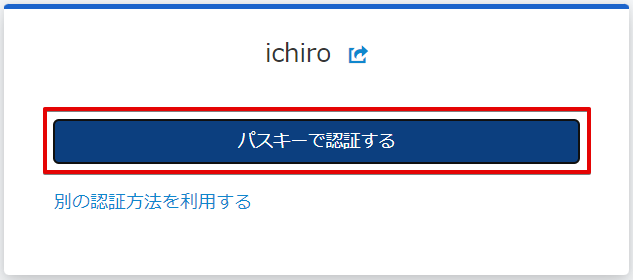
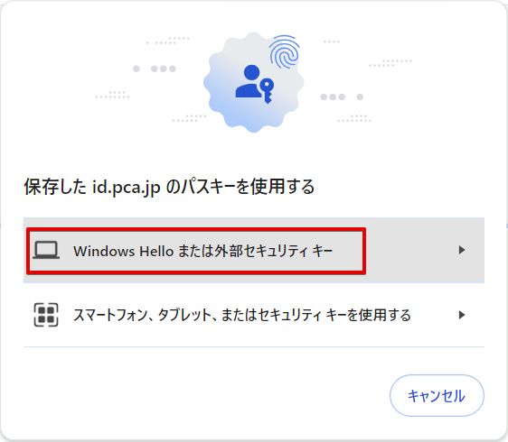

# パスキーを使用した簡単なログイン方法

パスキーを使用するには、前提として OS（オペレーティングシステム）でパスキーが有効化されている必要があります。

:::info パスキーの有効化

パスキーを有効化する手順については、「[パスキーとは（パスキーの有効化）](./../ご利用の前に/パスキーとは（パスキーの有効化）.md)」をご確認ください。

:::

また、パスキーを使用して認証するには、事前にアカウント設定でパスキーを登録しておく必要があります。  
詳しくは、「[パスキーを登録する](./../一般ユーザー向け/パスキーを登録する.md)」をご確認ください。

:::info パスキー優先の認証

アカウントにパスキーが登録されていると、ログインにおいて、パスキーを使用した認証方法を優先します。  
これは、パスワードを使用した２段階認証よりも、パスキーを使用した認証の方が、簡単で安全であるためです。

:::

## (1) ログイン画面の表示

PCA Hub などのサービスにアクセスすると、PCA ID のログイン画面が表示されます。

ログイン画面を表示するのは、以下のケースになります。

- 新しいデバイスやブラウザーで、PCA サービスにアクセスしたとき
- ログイン画面で認証してから12時間が経過したとき
  - PCA サービスへのアクセスを継続しても、ログイン状態の期限は延長されません。

:::tip ログイン状態を維持して認証の回数を減らす

「ログイン状態を維持して認証の回数を減らす」チェックをオンにして認証した場合、ログイン状態を40日間維持します。この有効期間は、PCA サービスへの最終アクセスを起点として、自動的に延長されます。

:::

ログイン画面に「ログイン先の組織」が表示されていないときは、明示的に組織名を付けてログイン名を入力してください。  
詳しくは、「[組織付きログイン名の入力](./組織付きログイン名の入力.md)」をご確認ください。

:::tip メールアドレスの入力

ログイン画面にメールアドレスを入力する場合は、「ログイン先の組織」を意識する必要はなく、組織名を入力する必要はありません。

:::

## (2) ログイン名またはメールアドレスの入力

ログイン名、またはメールアドレスのいずれかを入力して、［次へ］をクリックします。

ログイン画面においては、ログイン名またはメールアドレスから、対象とするアカウントを識別します。  
ログイン名は組織内で他ユーザーと重複しない固有の名前で、組織名とログイン名を組み合わせてアカウントを特定します。  
一方でメールアドレスは、それだけでアカウントを特定します。

## (3) パスキー認証の選択

［パスキーで認証する］ボタンをクリックします。

パスワードを使用した２段階認証によるログインを利用する場合は、［別の認証方法を利用する］リンクをクリックします。  
詳しくは、「[パスワードと認証コードを使用した二段階ログイン方法](./パスワードと認証コードを使用した２段階ログイン方法.md)」をご確認ください。

## (4) パスキー使用方法の選択

デバイスやブラウザーごとに異なる方法で、パスキーを使用します。

Windows で保存したパスキーを、Google Chrome で使用する場合は、以下の画面となります。  
デバイスやブラウザーが異なっても画面に大きな違いはなく、PCA ID ドメイン `id.pca.jp` のパスキーを使用することが確認できます。

## (5) パスキー使用ユーザーの確認

パスキーの使用ユーザーを確認して、［OK］ボタンをクリックします。

ユーザーの確認方法は、顔認証や指紋認証、暗証番号（PIN）がありますが、いずれの方法を使っても構いません。

## (6) ログイン完了

ユーザーの認証が完了し、サービスへアクセスすることができます。  
無事に目的のサービスへアクセスできると、一定期間はログイン画面による明示的な認証をスキップすることができます。

:::caution メールアドレス確認

本人確認のため、メールアドレス確認が必要な場合があります。  
下記の画面が表示された場合、「メールアドレス確認リクエスト」メールの案内に従って確認操作をしてください。  
詳しい操作手順については、「[メールでメールアドレス確認リクエストが届いたら](./../一般ユーザー向け/メールでメールアドレス確認リクエストが届いたら.md)」をご確認ください。

:::
