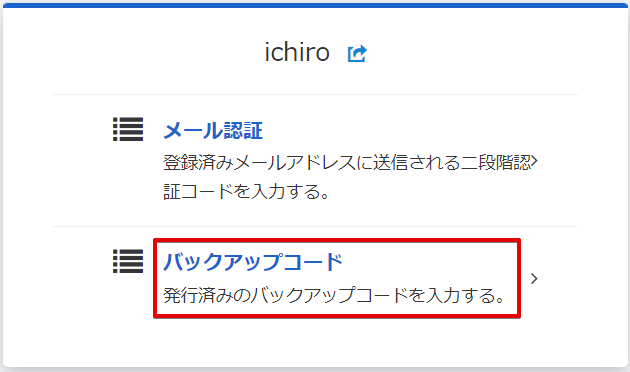

# パスワードとバックアップコードを使用した２段階ログイン方法

## (1) パスワード確認完了

「[パスワードと認証コードを使用した２段階ログイン方法](./パスワードと認証コードを使用した２段階ログイン方法.md)」の [手順 (3) ](./パスワードと認証コードを使用した２段階ログイン方法.md#3-パスワードの入力) まで進みます。  
パスワード確認まで完了している状態で、続きの手順を進めます。

## (2) 認証方法の選択

［別の認証方法を利用する］ボタンをクリックします。

## (3) バックアップコード認証の選択

［バックアップコード］リンクをクリックします。

## (4) バックアップコードの入力

バックアップコードを入力して、［ログイン］ボタンをクリックします。

:::info バックアップコードの扱い

このときの認証フローで使用できるバックアップコードは、画面で指示されたインデックス番号（1～12）のコードだけです。  
他の番号のコードを入力しても無効として扱われることにご注意ください。  
また、一度使用したバックアップコードを繰り返し使用することはできません（使用済みの番号は指示されません）。

:::

別の認証方法を選び直す場合は、［別の認証方法を利用する］リンクをクリックしてください。

## (5) ログイン完了

ユーザーの認証が完了し、サービスへアクセスすることができます。  
無事に目的のサービスへアクセスできると、一定期間はログイン画面による明示的な認証をスキップすることができます。
