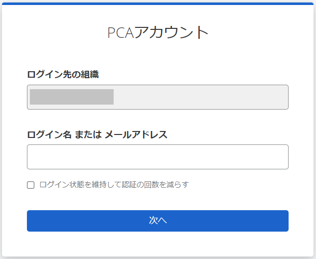

# パスワードと認証コードを使用した２段階ログイン方法

## (1) ログイン画面の表示

PCA Hub などのサービスにアクセスすると、PCA ID のログイン画面が表示されます。

ログイン画面を表示するのは、以下のケースになります。

- 新しいデバイスやブラウザーで、PCA サービスにアクセスしたとき
- ログイン画面で認証してから12時間が経過したとき
  - PCA サービスへのアクセスを継続しても、ログイン状態の期限は延長されません。

:::tip ログイン状態を維持して認証の回数を減らす

「ログイン状態を維持して認証の回数を減らす」チェックをオンにして認証した場合、ログイン状態を40日間維持します。この有効期間は、PCA サービスへの最終アクセスを起点として、自動的に延長されます。

:::

ログイン画面に「ログイン先の組織」が表示されていないときは、明示的に組織名を付けてログイン名を入力してください。  
詳しくは、「[組織付きログイン名の入力](./組織付きログイン名の入力.md)」をご確認ください。

:::tip メールアドレスの入力

ログイン画面にメールアドレスを入力する場合は、「ログイン先の組織」を意識する必要はなく、組織名を入力する必要はありません。

:::

## (2) ログイン名またはメールアドレスの入力

ログイン名、またはメールアドレスのいずれかを入力して、［次へ］をクリックします。

ログイン画面においては、ログイン名またはメールアドレスから、対象とするアカウントを識別します。  
ログイン名は組織内で他ユーザーと重複しない固有の名前で、組織名とログイン名を組み合わせてアカウントを特定します。  
一方でメールアドレスは、それだけでアカウントを特定します。

## (3) パスワードの入力

パスワードを入力して、［ログイン］ボタンをクリックします。

目のアイコンをクリックすると、マスク処理された入力パスワードを表示して確認することができます。

パスワードを忘れてしまった場合、［パスワードを忘れた場合はこちら］リンクをクリックしてください。  
詳しくは、「[パスワードを忘れた場合](./パスワードを忘れた場合.md)」をご確認ください。

:::tip パスキーを登録済みの場合

パスキーで認証する画面に移動するので、［別の認証方法を利用する］リンクから［パスワード］を選択することで、上記の画面に移動できます。

:::

## (4) ２段階認証コードの入力

２段階認証コードを入力して、［認証］ボタンをクリックします。

タイトルが「 【PCAサービス】2段階認証コード」のメールが、アカウントに登録されたメールアドレスに送信されます。  
メールのタイトル末尾や、本文に記載されている認証コードを使用します。

:::tip ２段階認証メールの再送信

２段階認証コードのメールが届かない場合は、［再送信］ボタンをクリックして、繰り返しメールの送信を試すことができます。

:::

２段階認証コードによる認証を利用できない場合、［別の認証方法を利用する］リンクをクリックして、バックアップコードによる認証を利用することができます。
詳しくは、「[パスワードとバックアップコードを使用した２段階ログイン方法](./パスワードとバックアップコードを使用した２段階ログイン方法.md)」をご確認ください。

## (5) ログイン完了

ユーザーの認証が完了し、サービスへアクセスすることができます。  
無事に目的のサービスへアクセスできると、一定期間はログイン画面による明示的な認証をスキップすることができます。

:::caution メールアドレス確認

本人確認のため、メールアドレス確認が必要な場合があります。  
下記の画面が表示された場合、「メールアドレス確認リクエスト」メールの案内に従って確認操作をしてください。  
詳しい操作手順については、「[メールでメールアドレス確認リクエストが届いたら](./../一般ユーザー向け/メールでメールアドレス確認リクエストが届いたら.md)」をご確認ください。

:::
