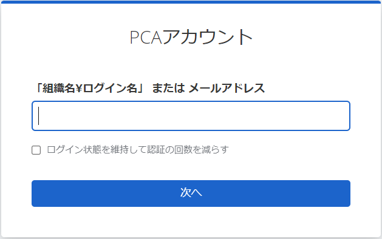
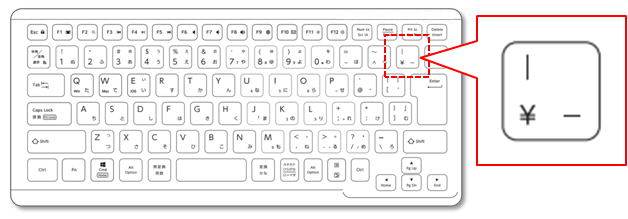

# 組織付きログイン名の入力

PCA ID 認証において、「ログイン先の組織」が表示されていない、以下のログイン画面が表示されることがあります。



このときにログイン名を使用する場合には、明示的に組織名を付ける「組織付きログイン名」を入力してください。  

「組織付きログイン名」は以下の形式となります。

```text
{組織名}¥{ログイン名}
```

例えば、組織名が `iidabashi-company` で、ログイン名が `ichiro` であれば、「組織付きログイン名」は以下のようになります。

（例）`iidabashi-company¥ichiro`

メールアドレスを入力する場合は、「ログイン先の組織」が表示されているときと変わりはなく、組織名の入力は必要ありません。

:::caution 円記号 (`¥`) とバックスラッシュ (`\`)

1つの同じ意味の文字 (`¥`) が、OS（オペレーティングシステム）ごとに異なる表示 ( `¥` と `\` ) で扱われることがあります。  
具体的には、Windows 日本語版では `¥` となりますが、それ以外の OS では `\` になることがあります。

「組織付きログイン名」の組織名とログイン名の区切りには、以下のキーを入力してください。



:::
