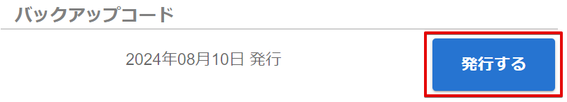

# バックアップコードを発行する

## (1) アカウント設定へのアクセス

PCA ID アカウント設定にアクセスするため、ブラウザーで <https://id.pca.jp/account> にアクセスします。  

:::tip `PCA Hub` からの移動

PCA Hub から移動する場合、PCA Hub ユーザー情報におけるログイン方法の［設定］ボタンから、PCA ID アカウント設定へ移動することができます。

:::

## (2) 組織の選択

現在の組織を確認し、必要があれば組織を選択します。

複数の組織に所属している場合、処理を実行したい組織を選択します。  
アクセス直後は、前回の組織が選択されています。

## (3) カテゴリの選択

［セキュリティ］カテゴリを選択します。

## (4) バックアップコード発行の開始

バックアップコード欄の［発行する］ボタンをクリックします。

## (5) バックアップコードの発行

バックアップコードを保存し、［バックアップコードを安全な場所に保存しました］のチェックをオンにして、［準備完了］ボタンをクリックします。  
２段階認証メールを受信できない状況に備えて、画面の案内に従い、バックアップコードをできるだけ安全な場所に保存してください。

:::info 重要操作の再認証

バックアップコードの発行はセキュリティにおいて重要な操作のため、上記の画面に移動する時に、再認証を求められることがあります。

:::

:::info ほかのデバイスをログアウトする

チェックをオンの状態で処理すると、他のデバイスで再ログインが必要となります。

:::

## (6) バックアップコード発行の完了

セキュリティ画面に戻ります。  
バックアップコードを発行した日付が更新されます。

:::caution 以前のバックアップコード

新しいバックアップコードを発行すると、以前のバックアップコードは使用できなくなりますので、ご注意ください。

:::
