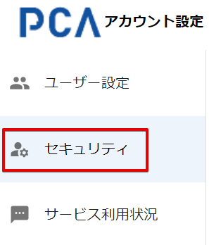
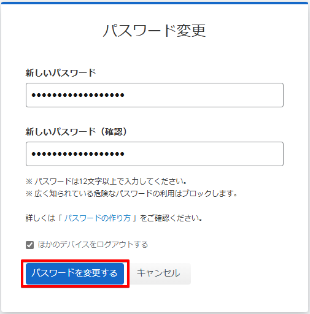

# パスワードを変更する

## (1) アカウント設定へのアクセス

PCA ID アカウント設定にアクセスするため、ブラウザーで <https://id.pca.jp/account> にアクセスします。  

:::tip `PCA Hub` からの移動

PCA Hub から移動する場合、PCA Hub ユーザー情報におけるログイン方法の［設定］ボタンから、PCA ID アカウント設定へ移動することができます。

:::

## (2) 組織の選択

現在の組織を確認し、必要があれば組織を選択します。

複数の組織に所属している場合、処理を実行したい組織を選択します。  
アクセス直後は、前回の組織が選択されています。

## (3) カテゴリの選択

［セキュリティ］カテゴリを選択します。

## (4) パスワード変更の開始

パスワード欄の［変更する］ボタンをクリックします。

## (5) 新しいパスワードの入力

新しいパスワードを入力して、［パスワードを変更する］ボタンをクリックします。

パスワードの決め方に悩まれている方は、パスワードについてのガイドラインとして、「[パスワードの作り方](./../ご利用の前に/パスワードの作り方.md)」をご確認ください。

:::info 重要操作の再認証

パスワードの変更はセキュリティにおいて重要な操作のため、上記の画面に移動する時に、再認証を求められることがあります。

:::

:::info ほかのデバイスをログアウトする

チェックをオンの状態で処理すると、他のデバイスで再ログインが必要となります。

:::

## (6) パスワード変更の完了

セキュリティ画面に戻ります。  
パスワードを変更した日付が更新されます。

同時に、パスワード変更が完了したことをお知らせするメールが届きます。

