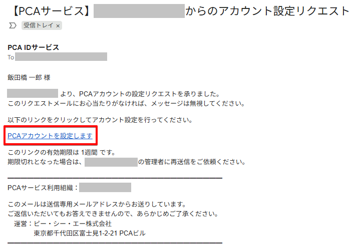
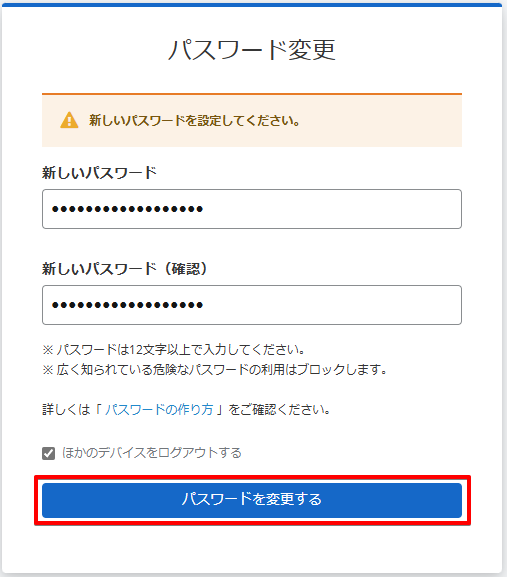
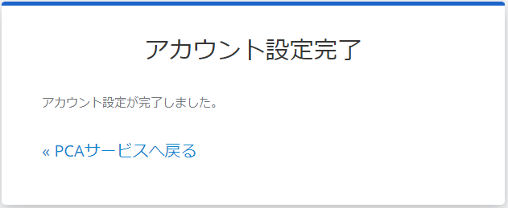

# メールでアカウント設定リクエストが届いたら

組織管理者がユーザーを作成したとき、どの組織にも未所属の新規アカウントであれば、対象ユーザーへアカウント設定リクエストがメール送信されます。  
詳しくは、「[ユーザーのアカウントを作成する](./../組織管理者向け/ユーザーを管理する/ユーザーのアカウントを作成する.md)」をご確認ください。

## (1) アカウント設定リクエストによる設定

アカウント設定リクエストの案内に従って、アカウント設定操作をおこないます。

受信した「 【PCAサービス】アカウント設定リクエスト」メールの案内に従い、組織管理者がアカウント設定要求してから1週間以内に［PCAアカウントを設定します］リンクをクリックします。

:::caution 組織管理者からのリクエスト期限

組織管理者からのリクエスト期限の1週間を過ぎると、再送信が必要となるのでご注意ください。

:::

## (2) アカウント設定の開始

アカウント設定の操作要求に応じて、［このリンクをクリックして実行する］リンクをクリックします。

## (3) 利用規約等への同意

[利用規約](https://pca.jp/area_support/manual/)および[プライバシーポリシー](https://corp.pca.jp/privacypolicy.html)について、それぞれのリンク先文書を確認します。  
文書内容に同意可能であれば、確認チェックをオンにして、［同意する］ボタンをクリックしてください。

## (4) 新しいパスワードの入力

新しいパスワードを入力して、［パスワードを変更する］ボタンをクリックします。

パスワードの決め方に悩まれている方は、パスワードについてのガイドラインとして、「[パスワードの作り方](./../ご利用の前に/パスワードの作り方.md)」をご確認ください。

:::info ほかのデバイスをログアウトする

チェックをオンの状態で処理すると、他のデバイスで再ログインが必要となります。

:::

## (5) バックアップコードの発行

バックアップコードを保存し、［バックアップコードを安全な場所に保存しました］のチェックをオンにして、［準備完了］ボタンをクリックします。  
２段階認証メールを受信できない状況に備えて、画面の案内に従い、バックアップコードをできるだけ安全な場所に保存してください。

:::info ほかのデバイスをログアウトする

チェックをオンの状態で処理すると、他のデバイスで再ログインが必要となります。

:::

## (6) アカウント設定の完了

アカウント設定が完了となります。

［PCAサービスへ戻る］リンクをクリックすると、PCA ID アカウント設定へアクセスするために、ログイン画面へ移動します。  
同時に、メールアドレス確認が完了したことをお知らせするメールが届きます。

:::info パスワード変更のお知らせメール

メールアドレス確認完了と同時に、初期パスワード設定に伴うパスワード変更のお知らせのメールも届きます。

:::

これで PCA ID で認証するサービスを利用するための準備が整いました。  
サービスごとの管理者からの案内をお待ちください。
