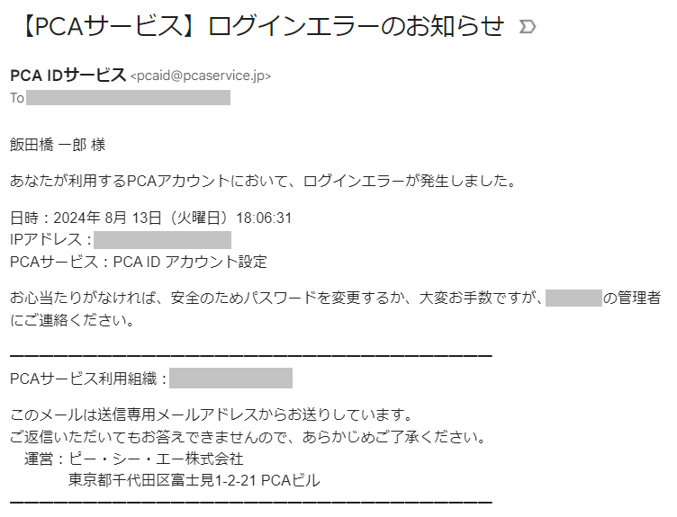

# メールでログインエラー通知が届いたら

PCA ID では、ログイン操作でエラーが発生すると、対象アカウントのメールアドレスに対して通知メールを送信します。

まずは、今回のログインエラーにお心当たりがあるかご確認ください。  

## 1. ログインエラーにお心当たりがある場合

今回のログインエラーにお心当たりがあれば問題ありませんので、今回の通知への対処は完了となります。

## 2. ログインエラーにお心当たりがない場合

今回のログインエラーにお心当たりがない場合には、いくつかの可能性が想定されますので、以下に当てはまることがないかご確認ください。

- ログイン操作でエラーがあったことを覚えていない
- 他人とアカウントを共有している
- 最近、社外の人や、いつもと違うWebサイトに、アカウント情報（組織名やログイン名など）を伝えた
- 最近、パブリックな場所にメールアドレスを公開した

アカウント設定の「サービス利用状況」から、直近7日間の状況を確認することができます。  
詳しくは、「[自身のサービス利用状況を確認する](./自身のサービス利用状況を確認する.md)」をご確認ください。

ログインエラーの記録を含め、その前後の状況も分かりますので、不審な点がないか確認してください。  
もし不正ログインやなりすましが疑われる場合は、速やかにお客様社内のシステム管理者や、PCA ID 組織管理者へ報告することをお勧めします。

組織管理者に実施できる対処としては、ログイン状態やパスワードのリセットがありますが、それでも対処が難しい場合は、アカウントを無効にする対応も必要になる可能性があります。  
詳しくは、「[ユーザーのパスワードをリセットする](./../組織管理者向け/ユーザーを管理する/ユーザーのパスワードをリセットする.md)」や「[ユーザーのアカウントを管理する](./../組織管理者向け/ユーザーを管理する/ユーザーのアカウントを管理する.md)」をご確認ください。

ご自身でできる対処としては、パスワード変更があります。  
詳しくは、「[パスワードを変更する](./パスワードを変更する.md)」をご確認ください。
