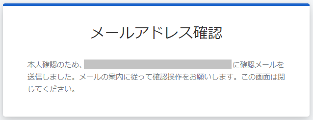

# メールアドレスを変更する

## (1) アカウント設定へのアクセス

PCA ID アカウント設定にアクセスするため、ブラウザーで <https://id.pca.jp/account> にアクセスします。  

:::tip `PCA Hub` からの移動

PCA Hub から移動する場合、PCA Hub ユーザー情報におけるログイン方法の［設定］ボタンから、PCA ID アカウント設定へ移動することができます。

:::

## (2) 組織の選択

現在の組織を確認し、必要があれば組織を選択します。

複数の組織に所属している場合、処理を実行したい組織を選択します。  
アクセス直後は、前回の組織が選択されています。

## (3) カテゴリの選択

［ユーザー設定］カテゴリを選択します。

## (4) メールアドレス変更の開始

［メールアドレス変更］ボタンをクリックします。

## (5) 新しいメールアドレスの入力

新しいメールアドレスを入力して、［送信］ボタンをクリックします。

本人が受信可能な新しいメールアドレスを128文字以内で入力します。  
使用できる文字は、半角英数字・ハイフン（`-`）・ピリオド（`.`）・アンダーバー（`_`）・プラス（`+`）・パーセント（`%`）です。  
英字は小文字に変換して扱います。  
特殊な形式のメールアドレス（RFC違反アドレス）は使用できません。

:::info 重要操作の再認証

メールアドレスの変更はセキュリティにおいて重要な操作のため、上記の画面に移動する時に再認証を求められます。

:::

:::caution 特殊な形式のメールアドレス（RFC違反アドレス）

- 特殊な形式のメールアドレス（RFC違反アドレス）とは、標準仕様であるRFCで定められている仕様・要件に準拠しないアドレスです。
- アットマーク（`@`）より前で、ピリオド (`.`) を先頭や末尾に使っていたり、記号が連続しているとRFC違反アドレスとみなされ、正常にメールが送信できない場合があります。
  - （例1）先頭ドット：<.abcd@sample.jp>
  - （例2）＠直前ドット：<abcd.@sample.jp>
  - （例3）ドット等の連続記号：<ab..cd@sample.jp>
- キャリアのメールアドレス（@docomo.ne.jp、＠ezweb.ne.jp、@i.softbank.jp等のキャリアメール）が多く該当する場合があります。

:::

以下の画面が表示され、本人確認のための操作を求められます。

## (6) メールアドレス変更リクエストの確認

本人確認のため、メールアドレス変更リクエストのメール案内に従い確認操作を実施します。  

新しいメールアドレス宛に、以下のメールアドレス変更リクエストが届きます。  
メール本文に記載されている、［PCAアカウントのメールアドレスを変更します］リンクをクリックします。

手順 (5) の［送信］ボタンをクリックしてから10分以内に変更操作を完了してください。

## (7) メールアドレス変更完了

［PCAサービスへ戻る］リンクをクリックして、ユーザー設定画面へ戻ります。

メールアドレス確認の完了と同時に、メールアドレス変更が完了したことをお知らせするメールが届きます。

ユーザー設定で、メールアドレス状態が「確認済み」であることを確認します。

:::info メールアドレス状態

メールアドレスが「未確認」の状態では、PCA ID でログインできません。  
ログインの際には、あらかじめメールアドレスの本人確認を実施しておく必要があります。

:::
