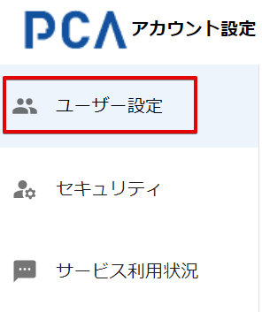

# 自身のユーザー情報を変更する

## (1) アカウント設定へのアクセス

PCA ID アカウント設定にアクセスするため、ブラウザーで <https://id.pca.jp/account> にアクセスします。  

:::tip `PCA Hub` からの移動

PCA Hub から移動する場合、PCA Hub ユーザー情報におけるログイン方法の［設定］ボタンから、PCA ID アカウント設定へ移動することができます。

:::

## (2) 組織の選択

現在の組織を確認し、必要があれば組織を選択します。

複数の組織に所属している場合、処理を実行したい組織を選択します。  
アクセス直後は、前回の組織が選択されています。

## (3) カテゴリの選択

［ユーザー設定］カテゴリを選択します。

## (4) ユーザー情報の更新

ユーザー情報を変更して、［更新する］ボタンをクリックします。

| 項目 | 必須 | 制限事項 |
| --- | :---: | --- |
| メールアドレス | ◯ | 128文字  ※ 以下の文字を使用できます。  　・ 半角英数字（英字は小文字で扱います）  　・ ハイフン（`-`） 　・ ピリオド（`.`） 　・ アンダーバー（`_`） 　・ プラス（`+`） 　・ パーセント（`%`）  ※ 特殊な形式のメールアドレス（RFC違反アドレス）は使用できません。 |
| ログイン名 | ◯ | 128文字  ※ 以下の文字を使用できます。  　・ 半角英数字  　・ ハイフン（`-`） 　・ ピリオド（`.`） 　・ アンダーバー（`_`） 　・ アットマーク（`@`）  ※ 組織内で重複するログイン名は使用できません。 ※ 大文字・小文字の違いは無視します。 |
| ユーザー名 | ◯ | 160文字 |
| 姓 | ◯ | 20文字 |
| 名 | | 20文字 |
| 姓カナ | ◯ | 20文字 |
| 名カナ | | 20文字 |

メールアドレス変更の操作については、「[メールアドレスを変更する](./メールアドレスを変更する.md)」をご確認ください。

:::info 使用不可文字

すべての項目で、コロン（:）、ダブルクォート（"）、改行文字は使用できません。

:::

:::tip ログイン名

- ログイン名は、組織ごとに保持する値です。事前に現在の組織をご確認ください。
- 組織内で重複しない名前を入力する必要があります。

:::

:::tip プロフィール画像の変更

- プロフィール画像は［更新する］ボタンをクリックすることなく画像を変更できます。
- ［画像の選択］ボタンから画像ファイル（1MB未満）を選択してください。
- 選択可能な画像の種類は、`.png`、`.jpg`、`.bmp`、`.svg` です。

:::
