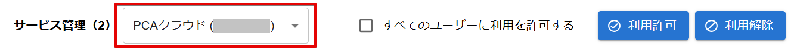

# ユーザーのサービス利用を解除する

:::info 権限による制限

ユーザーに対するサービス利用の解除は、組織管理者とサービス責任者が行うことができます。  
サービス責任者は、利用サービスごとの権限となります。  
詳しくは「[サービス責任者の役割を与える](./サービス責任者の役割を与える.md)」をご確認ください。

:::

## (1) 管理コンソールへのアクセス

PCA ID 管理コンソールにアクセスするため、ブラウザーで、<https://id.pca.jp/orgs> にアクセスします。  
管理コンソールの画面を表示するには、組織管理者の権限が必要となります。

## (2) 組織の選択

現在の組織を確認し、必要があれば組織を選択します。

組織管理者の権限をもつ複数の組織に所属している場合、処理を実行したい組織を選択します。  
アクセス直後は、前回の組織が選択されています。

## (3) カテゴリの選択

［サービス管理］カテゴリを選択します。

## (4) サービスの選択

管理するサービスを選択します。  
選択可能なサービスが１つの場合は、自動的に選択されます。

## (5) ユーザー利用解除

選択したユーザーのサービス利用を解除します。  

利用を許可したユーザー一覧から、解除するユーザーを探して、左端のチェックをオンにします。  
ユーザー件数が多い場合、検索機能でユーザーを絞り込んだり、一覧を並び替えてから選択します。  
ユーザー一覧ページ内の選択ユーザーに対して、最大で100人まで、まとめて処理を実行することができます。  

ユーザーを選択したら、画面右上の［利用解除］ボタンをクリックして、ユーザーのサービス利用を解除します。

:::tip ユーザー選択

ユーザー名をクリックすることで、ユーザー選択のチェック状態を切り替えることができます。

:::

１件ずつ利用を解除する場合、ユーザー行の「操作」列のアクション一覧で［利用の解除］をクリックして、サービス利用を解除することも可能です。

