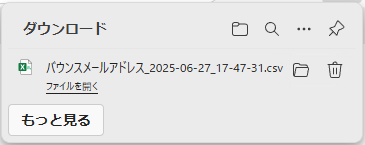

# バウンスメールアドレスを確認する

:::info 権限による制限

バウンスメールアドレスの確認は、組織管理者のみ行うことができます。

:::

:::info バウンスメールアドレスとは

バウンスメールアドレスとは、宛先の相手やサーバーから、メールの受け取りを拒否されたメールアドレスのことです。  
このようなメールアドレスに対しては、繰り返し受け取りを拒否されないように、送信元がメール送信を抑制します。  

:::

:::caution 注意事項

バウンスメールアドレスに登録された後、メール送信できるようにするには、以下の方法があります。

- メールアドレスの有効状態を確認してから、PCAサポートに問い合わせて解除を依頼する
- 一定時間の経過を待つ（PCA ID からのメール送信で発生した場合のみ）

:::

## (1) 管理コンソールへのアクセス

PCA ID 管理コンソールにアクセスするため、ブラウザーで、<https://id.pca.jp/orgs> にアクセスします。  
管理コンソールの画面を表示するには、組織管理者の権限が必要となります。

## (2) 組織の選択

現在の組織を確認し、必要があれば組織を選択します。

組織管理者の権限をもつ複数の組織に所属している場合、処理を実行したい組織を選択します。  
アクセス直後は、前回の組織が選択されています。


## (3) カテゴリの選択

［ユーザー管理］カテゴリを選択します。


## (4) バウンスメールアドレスの確認開始

［アクション］メニューから、［バウンスメールアドレスの確認］をクリックします。


## (5) バウンスメールアドレスの実行確認

確認画面で［OK］ボタンをクリックし、バウンスメールアドレスの登録状況を CSV ファイルとしてダウンロードします。


バウンスメールアドレス CSV ファイルは、［ダウンロード］フォルダーを保存先として、ファイル名「`バウンスメールアドレス_{年}-{月}-{日}_{時}-{分}-{秒}.csv`」で保存します。  



ユーザー件数に応じてダウンロードに時間がかかります。  
バウンスメールアドレスが１件もない場合、CSV ファイルは作成せず「バウンスメールアドレスはありません。」と表示します。

バウンスメールアドレス CSV ファイルの内容については次の通りです。

| No. | 項目名 | 説明 |
| --: | -- | -- |
| 1 | メールアドレス | バウンスとして登録されたメールアドレス |
| 2 | バウンス日時 | バウンスとして登録された日時 |
| 3 | バウンス種類 | 拒否アドレス（理由不明）：宛先の相手またはサーバーから拒否されています <br/> 不達アドレス：宛先に届かないメールアドレスを指定しています <br/> 不達アドレス（宛先不明）：宛先不明なメールアドレスを指定しています <br/> グローバル送信抑制アドレス：クラウド基盤で送信が抑制されています <br/> 送信抑制アドレス：PCA ID で送信が抑制されています <br/> 一時拒否アドレス：宛先が一時的に受取不可となっています <br/> メールボックスフル：宛先の受信箱が満杯となっています <br/> メールサイズ超過：メールサイズが大きすぎて拒否されています <br/> 不許可のメール本文：許可しないメール本文が含まれるため拒否されています <br/> 不許可の添付ファイル：許可しないファイル添付により拒否されています <br/> 苦情アドレス：宛先の相手またはサーバーからの苦情等により拒否されています |
| 4 | 発生種類 | 認証：PCA ID からのメール送信で発生しました <br/> サービス：PCAサービス（PCAクラウド、PCA Hub 等）からのメール送信で発生しました |

```csv
メールアドレス,バウンス日時,バウンス種類,発生種類
dummy@company.com,2025/06/20 14:38,送信抑制アドレス,認証
unknown@company.com,2025/06/20 14:40,不達アドレス,サービス
traveling@company.com,2025/06/20 15:21,一時拒否アドレス,認証、サービス
```
