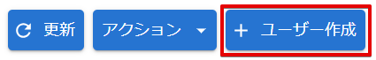

# ユーザーのアカウントを作成する

PCA ID を認証に利用して PCA サービスをご利用頂くには、PCA アカウントが必要です。  
PCA アカウントは、個別または一括で作成することができます。  

:::info 権限による制限

PCA アカウントの作成は、組織管理者のみ行うことができます。

:::

:::info 本人へのメール送信

- PCA アカウントを作成すると、本人に対して、パスワード等の初期設定、またはメールアドレスの受信確認を行うためのメールを送信します。
- 本人が組織管理者からのリクエストメールを処理することで、PCA アカウントを利用できるようになります。

:::

ユーザーを作成するには、手動で1件ずつユーザーを作成する方法と、ユーザー CSV ファイルから一括でユーザーを作成する方法があります。  
ユーザー CSV ファイルから一括でユーザーを作成する方法については、「[ユーザーのアカウントを一括で作成する](./ユーザーのアカウントを一括で作成する.md)」をご確認ください。

PCA Hub をご利用の場合には、PCA Hub テナント管理サイトからユーザーを作成する方法もあります。  
詳しくは PCA Hub のマニュアルをご確認ください。

:::info `PCA Hub` ユーザーの作成

現在の組織が PCA Hub テナントと紐づいている場合、PCA アカウントのユーザーを作成することで、PCA Hub ユーザーとしても自動的に作成します。

:::

## (1) 管理コンソールへのアクセス

PCA ID 管理コンソールにアクセスするため、ブラウザーで、<https://id.pca.jp/orgs> にアクセスします。  
管理コンソールの画面を表示するには、組織管理者の権限が必要となります。

## (2) 組織の選択

現在の組織を確認し、必要があれば組織を選択します。

組織管理者の権限をもつ複数の組織に所属している場合、処理を実行したい組織を選択します。  
アクセス直後は、前回の組織が選択されています。

## (3) カテゴリの選択

［ユーザー管理］カテゴリを選択します。

## (4) ユーザー作成の開始

［ユーザー作成］ボタンをクリックして、ユーザー作成画面を表示します。

## (5) ユーザーの作成

ユーザー情報を入力後、［作成］ボタンをクリックして内容を保存します。

ログイン名は、メールアドレスのユーザー名（`@`より前）の部分を自動的にコピーします。  
ユーザーを作成すると、入力したメールアドレスへメールを送信します。

| 項目 | 必須 | 制限事項 |
| --- | :---: | --- |
| メールアドレス | ◯ | 128文字  ※ 以下の文字を使用できます。  　・ 半角英数字（英字は小文字で扱います）  　・ ハイフン（`-`） 　・ ピリオド（`.`） 　・ アンダーバー（`_`） 　・ プラス（`+`） 　・ パーセント（`%`）  ※ 特殊な形式のメールアドレス（RFC 違反アドレス）は使用できません。 |
| ログイン名 | ◯ | 128文字  ※ 以下の文字を使用できます。  　・ 半角英数字  　・ ハイフン（`-`） 　・ ピリオド（`.`） 　・ アンダーバー（`_`） 　・ アットマーク（`@`）  ※ 組織内で重複するログイン名は使用できません。 ※ 大文字・小文字の違いは無視します。 |
| ユーザー名 | ◯ | 160文字 |
| 姓 | ◯ | 20文字 |
| 名 | | 20文字 |
| 姓カナ | ◯ | 20文字 |
| 名カナ | | 20文字 |

:::info 使用不可文字

すべての項目で、コロン（`:`）、ダブルクォート（`"`）、改行文字は使用できません。

:::

:::caution 特殊な形式のメールアドレス（RFC 違反アドレス）

- 特殊な形式のメールアドレス（RFC 違反アドレス）とは、標準仕様である RFC で定められている仕様・要件に準拠しないアドレスです。
- アットマーク（`@`）より前で、ピリオド (`.`) を先頭や末尾に使っていたり、記号が連続していると RFC 違反アドレスとみなされ、正常にメールが送信できない場合があります。
  - （例1）先頭ドット：<.abcd@sample.jp>
  - （例2）＠直前ドット：<abcd.@sample.jp>
  - （例3）ドット等の連続記号：<ab..cd@sample.jp>
- キャリアのメールアドレス（@docomo.ne.jp、＠ezweb.ne.jp、@i.softbank.jp等のキャリアメール）が多く該当する場合があります。

:::

## (6) リクエストメールの送信

作成したユーザーに対して、 【PCA サービス】≪組織表示名≫ からの2種類のリクエストメールのうち、状況に応じて、以下のいずれかが届けられます。

作成したユーザーが、新規アカウントであれば、アカウント設定リクエストを送信します。  

:::info リクエストの有効期限

アカウント設定リクエストの有効期限は1週間です。  
期限切れとなった場合は、組織管理者によるリクエストメールの再送信が必要となります。  
再送信の手順については、「[ユーザーのアカウントを管理する](./ユーザーのアカウントを管理する.md)」の「1. ユーザーに招待メールを送信する」をご確認ください。

:::

すでに別の組織に所属している、既存の設定済みアカウントであれば、メールアドレス確認リクエストを送信します。

