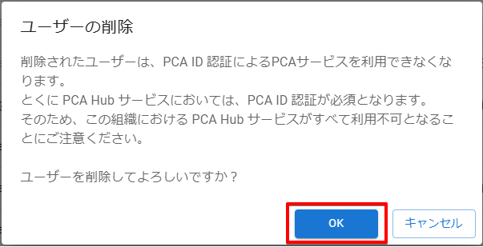

# ユーザーのアカウントを削除する

:::info 権限による制限

ユーザーの削除は、ユーザーの所属先である組織管理者のみ行うことができます。  

:::

## (1) 管理コンソールへのアクセス

PCA ID 管理コンソールにアクセスするため、ブラウザーで、<https://id.pca.jp/orgs> にアクセスします。  
管理コンソールの画面を表示するには、組織管理者の権限が必要となります。

## (2) 組織の選択

現在の組織を確認し、必要があれば組織を選択します。

組織管理者の権限をもつ複数の組織に所属している場合、処理を実行したい組織を選択します。  
アクセス直後は、前回の組織が選択されています。

## (3) カテゴリの選択

［ユーザー管理］カテゴリを選択します。

## (4) ユーザーの選択

ユーザー一覧から変更するユーザーを探して、左端のチェックをオンにします。

ユーザー件数が多い場合、検索機能を利用してユーザーを絞り込んでから探します。  
複数のユーザーをまとめて選択して処理することが可能です。

:::tip ユーザーの検索

検索対象となるユーザー情報は次のとおりです。大文字・小文字は区別しません。

- ユーザー名
- 姓・名
- 姓・名カナ
- ログイン名
- メールアドレス

:::

:::tip ユーザーの一括選択と解除

見出しの左端にあるチェックをオン／オフにすることで、ページ内のユーザー選択をまとめてオン／オフすることができます。

:::

## (5) ユーザー削除の開始

［アクション］メニューから、［ユーザーの削除］をクリックします。

## (6) ユーザー削除の実行

ユーザー削除の確認画面で［OK］ボタンをクリックします。

削除確認の内容をお読み頂き、注意事項をよく理解してから実行してください。  
再び使用するには、ユーザーを再作成する必要があります。

:::caution PCA アカウントの削除

ユーザーを削除して所属先となる組織がすべて無くなると、PCA アカウントは完全に削除されます。  
これにより、アカウントに登録したメールアドレスや姓名、パスワード等の情報は失われます。  
削除したアカウントを復元することはできず、再び使用するにはアカウントを再作成する必要があります。
