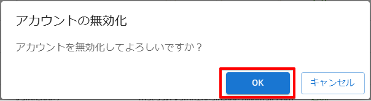
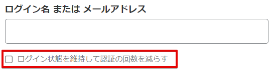

# ユーザーのアカウントを管理する

:::info 権限による制限

ユーザー情報の変更は、ユーザーの所属先である組織管理者のみ行うことができます。

:::

## 【事前操作】管理するユーザーを選択する

### (1) 管理コンソールへのアクセス

PCA ID 管理コンソールにアクセスするため、ブラウザーで、<https://id.pca.jp/orgs> にアクセスします。  
管理コンソールの画面を表示するには、組織管理者の権限が必要となります。

### (2) 組織の選択

現在の組織を確認し、必要があれば組織を選択します。

組織管理者の権限をもつ複数の組織に所属している場合、処理を実行したい組織を選択します。  
アクセス直後は、前回の組織が選択されています。

### (3) カテゴリの選択

［ユーザー管理］カテゴリを選択します。

### (4) ユーザーの選択

ユーザー一覧から変更するユーザーを探して、左端のチェックをオンにします。

ユーザー件数が多い場合、検索機能を利用してユーザーを絞り込んでから探します。  
ユーザー一覧ページ内の選択ユーザーに対して、最大で100人まで、まとめて処理を実行することができます。  
未選択であれば、対象ユーザーを選択するように案内を表示します。

:::tip ユーザーの検索

検索対象となるユーザー情報は次のとおりです。大文字・小文字は区別しません。

- ユーザー名
- 姓・名
- 姓・名カナ
- ログイン名
- メールアドレス

:::

:::tip ユーザーの一括選択と解除

見出しの左端にあるチェックをオン／オフにすることで、ページ内のユーザー選択をまとめてオン／オフすることができます。

:::

### (5) 処理の開始

［アクション］メニューから、目的の処理をクリックします。

以降で、目的の処理に応じて操作します。

## 1. ユーザーに招待メールを送信する

［アクション］メニューから、［招待メールの送信］をクリックし、確認画面で［OK］ボタンをクリックします。

選択したユーザーに対して、招待メールとして「アカウント設定リクエスト」をメール送信します。

招待メールの期限は1週間となっています。  
招待したユーザーがアカウント設定リクエストを処理することなく期限を過ぎた場合は、この処理から招待メールを再送信してください。

招待メールは、対象ユーザーのアカウント設定状態に関係なく送信することができます。  
リクエストメールを受信したユーザーがアカウント設定済みであれば、無視しても問題ありません。

## 2. ユーザーのパスワードをリセットする

ユーザーのパスワードをリセットする方法については、「[ユーザーのパスワードをリセットする](./ユーザーのパスワードをリセットする.md)」をご確認ください。

## 3. ユーザーのバックアップコードをリセットする

［アクション］メニューから、［バックアップコードのリセット］をクリックし、確認画面で［OK］ボタンをクリックします。

選択したユーザーに対して臨時のバックアップコードを発行しますので、この臨時コードを案内してください。  
臨時コードは、右側のボタンをクリックして、クリップボードにコピーすることができます。  

このユーザーの既存の発行済みバックアップコードは破棄しますが、臨時コードが利用されると、新しいバックアップコード（12回分）を再発行します。  
バックアップコードを保存せずに画面を閉じてしまった場合には、バックアップコードのリセット操作をやり直してください。

## 4. ユーザーのアカウントを有効化（一時ロックアウトを解除）する

［アクション］メニューから、［アカウントの有効化］をクリックし、確認画面で［OK］ボタンをクリックします。

アカウントの状態が、無効や一時ロックアウトになっているユーザーを、有効な状態に戻します。  
すでに有効状態であれば何も変わりません。

別の方法として、無効状態のユーザーに対して、ユーザー詳細画面の［アカウントを有効化］ボタンも利用できます。

:::info アカウントの一時ロックアウト

PCA ID でのログイン操作を繰り返し失敗すると、対象のアカウントが一時ロックアウトの状態になり、一定の時間はログインできなくなります。  
一時ロックアウトの状態は、ユーザー詳細画面の「アカウント状態」項目で確認することができます。

:::

## 5. ユーザーのアカウントを無効化する

［アクション］メニューから、［アカウントの無効化］をクリックし、確認画面で［OK］ボタンをクリックします。

アカウントを無効状態にすると、対象のユーザーは PCA ID でログインできなくなります。  
その結果、PCA ID を利用するすべてのサービスを使用できなくなります。

再びアカウントを有効状態に戻すには、「アカウントの有効化」を実施します。

:::info 無効アカウント

- アカウントが無効状態となるのは、組織管理者が「アカウントの無効化」を実施したときだけです。
- アカウントの無効化によってサービスが使用できなくなるタイミングは、それぞれのサービスごとに異なります。

:::

## 6. ユーザーのログイン状態をリセットする

［アクション］メニューから、［ログイン状態のリセット］をクリックし、確認画面で［OK］ボタンをクリックします。

ログイン状態をリセットすると、対象ユーザーは PCA ID の再ログインが必要となります。

:::info ログイン状態の期限

- ログイン状態（ユーザーセッション）の有効期間は12時間で、延長はありません。
- ログイン画面で「ログイン状態を維持して認証の回数を減らす」のチェックをオンにしてログインした場合の有効期間は40日で、PCA ID を利用するサービスへのアクセスにより無期限に延長します。  
  

:::

## 7. ユーザー情報を同期する

［アクション］メニューから、［ユーザー情報の同期］をクリックし、確認画面で［OK］ボタンをクリックします。

ユーザー情報の同期は、システム間でユーザー状態の不一致が発生したときに利用する保守機能です。  
ユーザー情報を同期することで、PCA Hub のユーザー状態に不一致がある場合に回復させることができます。
