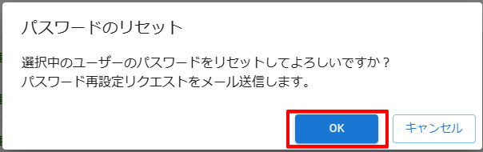

# ユーザーのパスワードをリセットする

:::info 権限による制限

ユーザー情報の変更は、ユーザーの所属先である組織管理者のみ行うことができます。

:::

:::info 本人へのメール送信

- ユーザーのパスワードをリセットすると、本人に対してパスワードの再設定をリクエストするメールを送信します。
- 本人が組織管理者からのリクエストメールを処理することで、再び PCA アカウントを利用できるようになります。

:::

## (1) 管理コンソールへのアクセス

PCA ID 管理コンソールにアクセスするため、ブラウザーで、<https://id.pca.jp/orgs> にアクセスします。  
管理コンソールの画面を表示するには、組織管理者の権限が必要となります。

## (2) 組織の選択

現在の組織を確認し、必要があれば組織を選択します。

組織管理者の権限をもつ複数の組織に所属している場合、処理を実行したい組織を選択します。  
アクセス直後は、前回の組織が選択されています。

## (3) カテゴリの選択

［ユーザー管理］カテゴリを選択します。

## (4) ユーザーの選択

ユーザー一覧から変更するユーザーを探して、左端のチェックをオンにします。

ユーザー件数が多い場合、検索機能を利用してユーザーを絞り込んでから探します。

:::tip ユーザーの検索

検索対象となるユーザー情報は次のとおりです。大文字・小文字は区別しません。

- ユーザー名
- 姓・名
- 姓・名カナ
- ログイン名
- メールアドレス

:::

:::tip ユーザーの一括選択と解除

見出しの左端にあるチェックをオン／オフにすることで、ページ内のユーザー選択をまとめてオン／オフすることができます。

:::

## (5) パスワードリセットの開始

［アクション］メニューから、［パスワードのリセット］をクリックします。

別の方法として、ユーザー詳細画面の［パスワードのリセット］ボタンも利用できます。

## (6) パスワードリセットの実行

パスワードのリセット確認画面で［OK］ボタンをクリックします。

パスワードをリセットすると、ユーザーに 【PCA サービス】≪組織表示名≫ からのパスワード変更リクエストをメール送信します。

