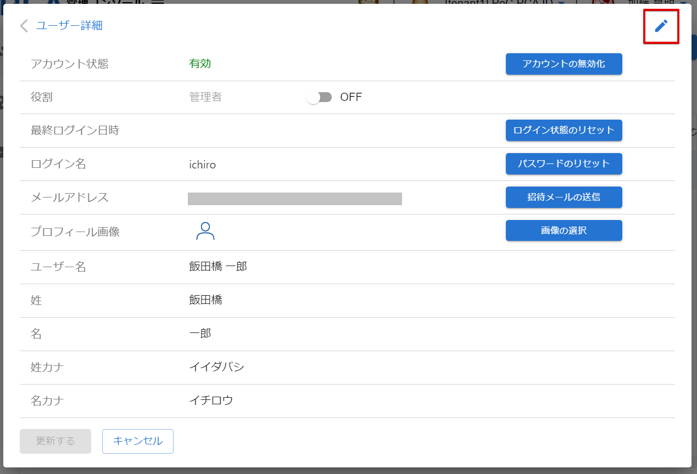

# ユーザー情報を変更する

:::info 権限による制限

ユーザー情報の変更は、ユーザーの所属先である組織管理者のみ行うことができます。

:::

:::info 本人へのメール送信

- ユーザーのメールアドレスを変更すると、本人に対して確認をリクエストするメールを送信します。
- 本人が組織管理者からのリクエストメールを処理することで、再び PCA アカウントを利用できるようになります。

:::

## (1) 管理コンソールへのアクセス

PCA ID 管理コンソールにアクセスするため、ブラウザーで、<https://id.pca.jp/orgs> にアクセスします。  
管理コンソールの画面を表示するには、組織管理者の権限が必要となります。

## (2) 組織の選択

現在の組織を確認し、必要があれば組織を選択します。

組織管理者の権限をもつ複数の組織に所属している場合、処理を実行したい組織を選択します。  
アクセス直後は、前回の組織が選択されています。

## (3) カテゴリの選択

［ユーザー管理］カテゴリを選択します。

## (4) ユーザーの選択

ユーザー一覧から変更するユーザーを探して、ユーザー名をクリックします。  
ユーザー件数が多い場合、検索機能を利用してユーザーを絞り込んでから探します。

:::tip ユーザーの検索

検索対象となるユーザー情報は次のとおりです。大文字・小文字は区別しません。

- ユーザー名
- 姓・名
- 姓・名カナ
- ログイン名
- メールアドレス

:::

## (5) ユーザー情報の変更開始

ユーザー詳細画面の鉛筆アイコン  をクリックします。

## (6) ユーザー情報の変更

ユーザー情報を変更して、［更新する］ボタンをクリックします。

メールアドレスを変更した場合、ユーザーに 【PCA サービス】≪組織表示名≫ からのメールアドレス確認リクエストをメール送信します。

:::caution メールアドレスの変更制限

メールアドレスを変更したいユーザーが複数の組織に所属している場合、組織管理者によるメールアドレスの変更ができません。  
この場合には、ユーザー自身でメールアドレスを変更する必要があります。  
対象ユーザーが複数組織に所属している状態であるかは、ユーザー詳細画面のアカウント状態で確認することができます。

:::
