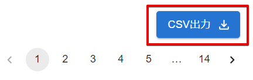

# ユーザーの操作ログをファイル保存する

:::info 権限による制限

操作ログのファイル保存は、組織管理者のみ行うことができます。

:::

## (1) 管理コンソールへのアクセス

PCA ID 管理コンソールにアクセスするため、ブラウザーで、<https://id.pca.jp/orgs> にアクセスします。  
管理コンソールの画面を表示するには、組織管理者の権限が必要となります。

## (2) 組織の選択

現在の組織を確認し、必要があれば組織を選択します。

組織管理者の権限をもつ複数の組織に所属している場合、処理を実行したい組織を選択します。  
アクセス直後は、前回の組織が選択されています。

## (3) カテゴリの選択

［サービス利用状況］カテゴリを選択します。

## (4) 操作ログのファイル保存

サービス利用状況の［CSV出力］をクリックして、操作ログ CSV ファイルをダウンロードします。

組織に所属するすべてのユーザーについて、直近2年間における、利用サービスについての操作ログを出力できます。  
操作ログには、認証、ユーザー、組織に関する操作の詳細が含まれています。

操作ログ CSV ファイルは、［ダウンロード］フォルダーを保存先として、ファイル名「`操作ログ_{年}-{月}-{日}_{時}-{分}-{秒}.csv`」で保存します。

ログ件数に応じてダウンロードに時間がかかります。  
操作ログ CSV ファイルの内容について、詳しくは「[操作ログの種類と詳細](./操作ログの種類と詳細.md)」をご確認ください。
