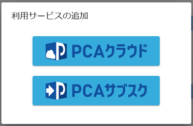

# 組織で利用するサービスを追加する

:::info 権限による制限

利用サービスの追加は、組織管理者のみ行うことができます。

:::

## (1) 管理コンソールへのアクセス

PCA ID 管理コンソールにアクセスするため、ブラウザーで、<https://id.pca.jp/orgs> にアクセスします。  
管理コンソールの画面を表示するには、組織管理者の権限が必要となります。

## (2) 組織の選択

現在の組織を確認し、必要があれば組織を選択します。

組織管理者の権限をもつ複数の組織に所属している場合、処理を実行したい組織を選択します。  
アクセス直後は、前回の組織が選択されています。

## (3) カテゴリの選択

［組織管理］カテゴリを選択します。

## (4) 利用サービスの追加開始

現在の組織に対して、利用サービスの追加を開始します。  
右上の［サービス追加］ボタンをクリックして、追加操作を開始します。  

## (5) 利用サービスの選択

現在の組織で利用するサービスを選択します。  

現在は、利用サービスとして「PCAクラウド」または「PCAサブスク」を選択することができます。  
お客様が契約されているサービスを選択します。

## (6) サービスの認証（契約確認）

サービス認証をおこない、お客様がご利用中のサービス契約であることを確認します。  

サービス契約時に発行された、契約IDとパスワードを入力します。  
サービスごとの契約IDについては、「[組織の利用サービスを確認する](./組織の利用サービスを確認する.md)」をご確認ください。

## (7) 利用サービスの追加完了

現在の組織に選択したサービスが追加され、対象サービスと連携できる状態になります。  
組織情報には、お客様の顧客IDと利用可能サービス一覧を表示します。

:::tip サービス契約情報の更新

利用サービスの契約情報は、一定時間ごとに最新の情報に更新されます。  
［更新］ボタンをクリックすると、即時に最新の情報に更新することができます。

:::

:::info 利用サービスの扱い

利用サービスは、追加と取り消しを何度でも繰り返すことができます。  
また、ある組織から利用サービスを取り消して、別の組織へ追加することも可能です。  
ただし、契約IDが同じ利用サービスを、複数の組織に追加することはできません。

:::

## (8) サービス管理へ移動

次の手順として、追加したサービスに対して、ユーザー利用を許可する必要があります。  
詳しくは「[ユーザーのサービス利用を許可する](../サービスを管理する/ユーザーのサービス利用を許可する.md)」をご確認ください。

:::tip サービス管理への移動方法

利用サービスをクリックすると、サービス管理の画面へ移動して、対象サービスを選択します。  
すぐにユーザー利用を許可する手順をおこなうことが可能です。

:::
