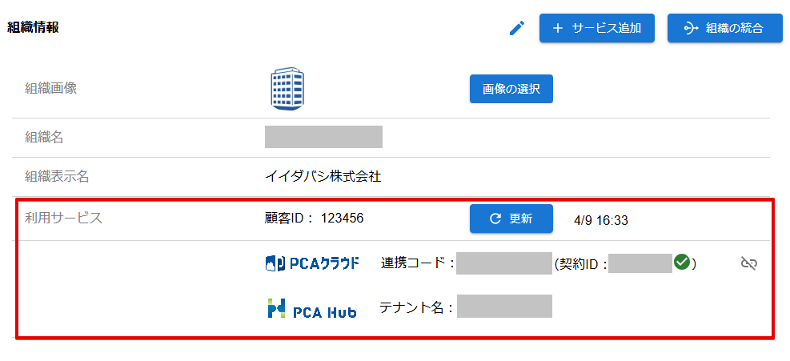

# 組織の利用サービスを確認する

:::info 権限による制限

利用サービスの確認は、組織管理者のみ行うことができます。

:::

## (1) 管理コンソールへのアクセス

PCA ID 管理コンソールにアクセスするため、ブラウザーで、<https://id.pca.jp/orgs> にアクセスします。  
管理コンソールの画面を表示するには、組織管理者の権限が必要となります。

## (2) 組織の選択

現在の組織を確認し、必要があれば組織を選択します。

組織管理者の権限をもつ複数の組織に所属している場合、処理を実行したい組織を選択します。  
アクセス直後は、前回の組織が選択されています。

## (3) カテゴリの選択

［組織管理］カテゴリを選択します。

## (4) 利用サービスの確認

組織情報の利用サービスを確認します。

お客様の顧客ID、および利用可能なサービス一覧を表示します。  
PCA Hub サービスの場合、組織に紐づいている「テナント名」を確認できます。  
PCAクラウド／PCAサブスクの場合、組織に紐づいているサービス契約をあらわす「契約ID」と、その契約を使って連携するための「連携コード」を確認できます。

連携コードは、PCA ID を利用可能なサービスが、お客様が許可した PCA ID 組織やユーザーの情報にアクセスするときに必要となります。  
詳しくは、「[PCAクラウド／PCAサブスクから利用を始める](../../ご利用までの流れ/PCAクラウド／PCAサブスクから利用を始める.md)」をご確認ください。

:::tip 契約IDとは

PCAクラウドにおける 契約ID とは、初回起動時に［PCA サービス認証］で入力する ID のことです。

PCAサブスクにおける 契約ID とは、初回起動時に［Web認証］で入力する 契約ID のことです。

:::
