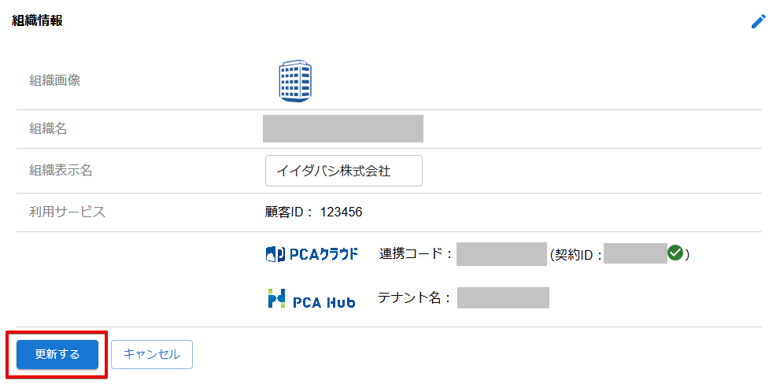

# 組織情報を変更する

:::info 権限による制限

組織情報の変更は、組織管理者のみ行うことができます。

:::

## (1) 管理コンソールへのアクセス

PCA ID 管理コンソールにアクセスするため、ブラウザーで、<https://id.pca.jp/orgs> にアクセスします。  
管理コンソールの画面を表示するには、組織管理者の権限が必要となります。

## (2) 組織の選択

現在の組織を確認し、必要があれば組織を選択します。

組織管理者の権限をもつ複数の組織に所属している場合、処理を実行したい組織を選択します。  
アクセス直後は、前回の組織が選択されています。

## (3) カテゴリの選択

［組織管理］カテゴリを選択します。

## (4) 組織情報の変更開始

組織情報の画面右上にある鉛筆アイコン  をクリックします。

:::tip 組織画像の変更

- 組織画像は変更モードに切り替えることなく画像を変更できます。  
- ［画像の選択］ボタンから画像ファイル（1MB未満）を選択してください。
- 選択可能な画像の種類は、`.png`、`.jpg`、`.bmp`、`.svg` です。

:::

## (5) 組織情報の変更

組織情報を変更して、［更新する］ボタンをクリックします。

