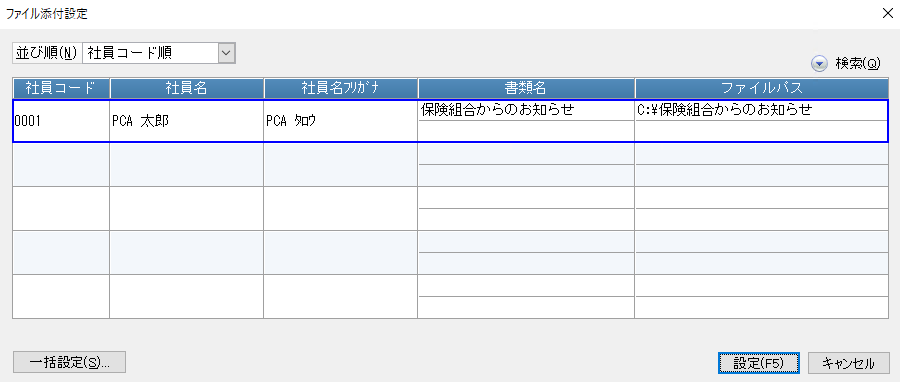

# 明細を配信する<!-- omit in toc -->

PCA給与シリーズで出力した明細を PCA Hub 給与明細サービスを通じて社員に対して配信するための方法です。

## 目次<!-- omit in toc -->

- [制限](#制限)
- [明細をアップロードする](#明細をアップロードする)
  - [アップロードできる明細の種類](#アップロードできる明細の種類)
  - [アップロードできるファイルに関する制限](#アップロードできるファイルに関する制限)
  - [公開日時に関する注意事項](#公開日時に関する注意事項)
- [明細の配信状況を確認する](#明細の配信状況を確認する)
- [明細の閲覧状況を確認する](#明細の閲覧状況を確認する)
- [明細の配信設定を変更する](#明細の配信設定を変更する)
- [配信した明細を削除する](#配信した明細を削除する)

## 制限

- 明細の配信や管理は PCA Hub 給与明細のシステム管理者のみが行うことができます。
- 明細が公開されると社員に公開メールが配信されます。 
サーバーの状況により、指定された日時よりも遅れてメールが配信される場合があります。 

## 明細をアップロードする

1. PCA給与シリーズの「給与」-「給与明細書」を起動します。
2. 「出力の種類」で「印刷等」を選択し、配信を行いたい社員を指定して [印刷指示] ボタンをクリックします。 
 

3. 「出力先の選択」で「明細配信」を選択して [実行] ボタンをクリックします。 
「PDFファイル名の設定」にてアップロードされるファイル名を変更することができます。 
 

4. 明細の配信設定を行います。
   1. PCA Hub 給与明細上で明細を公開およびメール配信したい日時を設定します。
   2. 配信時に送信されるメールの件名と本文を設定します。
   3. 明細以外に同時に配信したいファイルがあれば「添付ファイル」を社員ごとまたは一括で指定します。 
    
    

5. アップロード処理が正常に完了したことを確認します。 

### アップロードできる明細の種類

- 給与明細書
- 賞与明細書
- 源泉徴収票
- 給与改定通知書
- 標準報酬決定通知書
- 標準報酬改定通知書
- 年末調整通知書
- 還付金明細書
- [個人住民税特別徴収税額通知書（納税義務者用）](system_admin4.md)
- その他（任意のファイル）

### アップロードできるファイルに関する制限

|項目名|上限値|制限|備考|
|--|--|--|--|
|ファイル名|250文字|下記の記号を禁止 ・円マーク（&yen;） ・スラッシュ（/） ・コロン（:） ・アスタリスク（*） ・クエスチョンマーク（?） ・ダブルクォート（"） ・小なり（<） ・大なり（>） ・パイプライン（&#124;）|大文字と小文字や全角と半角を区別しません。|
|書類名|30文字||明細を受信した社員がクライアントサイト上で目視するファイル名となります。|
|サイズ|5MB|||
|ファイルの種類||・.pdf ・.xlsx ・.xls ・.docx ・.doc ・.txt ・.jpg ・.jpeg ・.png||
|ファイル数|3||社員1人あたりの1回の配信でアップロード可能なファイル数です。 1件の明細出力時に最大2件の任意のファイルを同時に配信することができます。|

### ポイント<!-- omit in toc -->

- 明細をアップロードして配信するためには、配信対象の社員が明細配布の同意案内に対して事前に同意している必要があります。
- 給与明細などの明細とは別に、任意のファイルを同梱して同時に配信することが可能です。
- 明細の配信設定は、一度にアップロードされるすべての明細に対して同一の設定が反映されます。
- PCA Hub 給与明細にアップロードされる実ファイルの名前（**ファイル名**）と、PCA Hub 給与明細の画面上で確認できるファイルの名前（**書類名**）は異なります。

### 公開日時に関する注意事項

- 明細をアップロードする際は、公開日時をPCA Hub 給与明細の契約期間内に設定してください。 
  - PCA Hub 給与明細の契約期間内のみ、クライアントサイトおよび管理サイトを閲覧することができます。 
契約終了後は、明細の閲覧およびダウンロード等、全ての操作が行えません。 
- サーバーの状況により、指定された日時よりも遅れてメールが配信される場合があります。 

## 明細の配信状況を確認する

1. PCA給与シリーズの「給与」-「給与明細書」を起動します。
2. 「配信状況」メニューを実行します。 
 

3. 年間の配信状況を確認したい場合には「年間表示」メニューを実行します。 
 

## 明細の閲覧状況を確認する

明細を受け取った社員が、明細を閲覧したかどうかを確認することができます。 
 

1. PCA Hub 給与明細の管理サイトにアクセスします。
2. 「社員一覧」ページにて閲覧状況を確認したい任意の社員をクリックします。
3. アップロード済みの明細一覧が表示されます。 
既読の場合は細字で、未読の場合は太字で表示されます。 

## 明細の配信設定を変更する

配信済みのデータを直接編集することはできません。 
[明細をアップロードする](#明細をアップロードする) の手順で同じ明細を再度アップロードすることにより、既存の配信設定を上書きすることができます。

## 配信した明細を削除する

1. PCA給与シリーズの「給与」-「給与明細書」を起動します。
2. 「配信状況」メニューを実行します。
3. 明細を削除したい社員を選択して「削除」メニューを実行します。 
 
