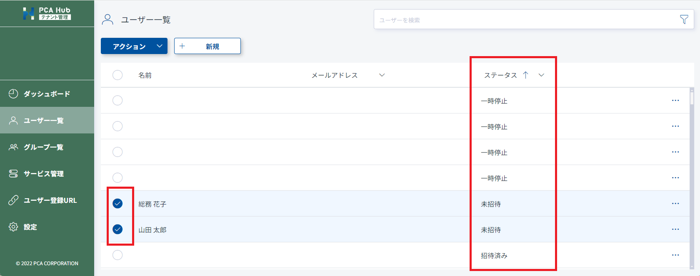
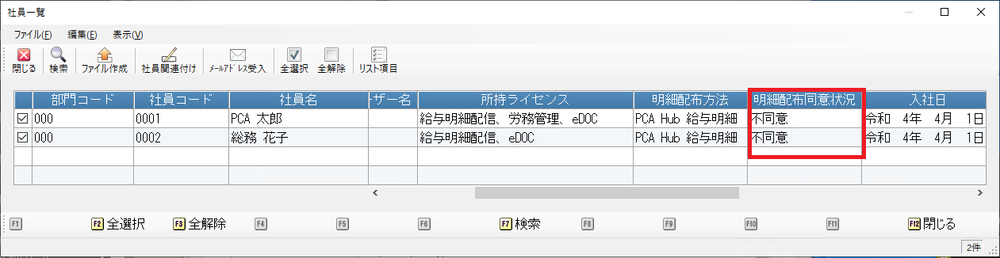
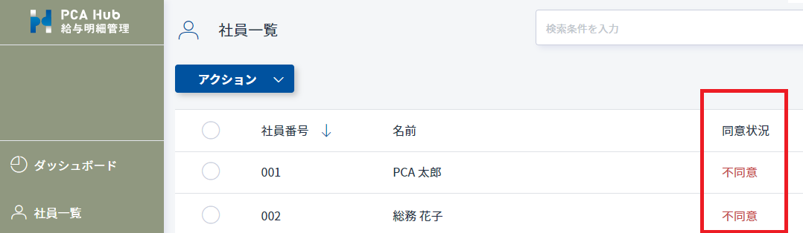
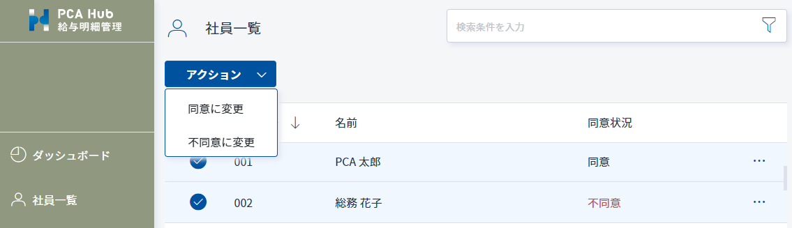

# 給与明細配信のための設定を行う<!-- omit in toc -->

PCA Hub 給与明細を利用するための設定方法です。 
PCA給与シリーズ にてあらかじめ連動設定を行う必要があります。 
 
PCA給与シリーズの「随時」-「PCA Hub連動設定」から連動設定を行います。 

## 目次<!-- omit in toc -->

- [制限](#制限)
- [サービスの URL を設定する](#サービスの-url-を設定する)
- [明細の公開期間を設定する](#明細の公開期間を設定する)
- [同意案内を作成する](#同意案内を作成する)
- [社員と PCA Hub のアカウントを紐づける](#社員と-pca-hub-のアカウントを紐づける)
  - [社員自身にPCA Hub アカウントを登録してもらい、メールアドレスを受け入れる](#社員自身にpca-hub-アカウントを登録してもらいメールアドレスを受け入れる)
  - [社員と PCA Hub のアカウントの関連付けを行う](#社員と-pca-hub-のアカウントの関連付けを行う)
- [同意状況を確認する](#同意状況を確認する)
  - [PCA給与シリーズから確認する](#pca給与シリーズから確認する)
  - [PCA Hub 給与明細から確認する](#pca-hub-給与明細から確認する)
- [同意状況を変更する](#同意状況を変更する)
- [インポート用の CSV ファイルを作成する](#インポート用の-csv-ファイルを作成する)

## 制限

- PCA Hub との連動設定は PCA Hub 給与明細のシステム管理者のみが行うことができます。

## サービスの URL を設定する

1. 「有効サービス」のチェックをONにして「URL」欄にご契約されている PCA Hub のURLを入力します。 
さらに [移動] ボタンを実行します。 
 

2. 「移動」ボタンを実行して「ブラウザからのログイン」を実行します。 
 

3. 表示されたブラウザページにて PCA Hub へのログインを行います。 
 

4. PCA Hub の認可画面にて、要求内容を確認して「同意する」を実行します。 
 

## 明細の公開期間を設定する

PCA Hub 給与明細上に明細を保存する期間を 1～10年 の間で設定します。 
ファイルの公開期間は、アップロード時に指定した公開開始日時 ～ 公開期間の年数となります。 
また、ファイル公開期間の変更は、設定の変更後にアップロードしたファイルにのみ適用されます。 
既にアップロード済みのファイルに対しては適用されません。 
 

## 同意案内を作成する

社員に向けた同意案内の文章を設定します。 
明細を配信するためには、配信対象の社員が同意案内に対して事前に承諾している必要があります。 
 
設定可能な文字数は下記のとおりです。 

|項目|上限文字数|
|-|-|
|同意案内|100文字|
|同意事項|500文字|

## 社員と PCA Hub のアカウントを紐づける

テナント管理者が操作する場合は [PCA給与シリーズから社員のアカウントを作成する](../tenant_admin/tenant_admin1.md#pca給与シリーズから社員のアカウントを作成する) をご確認ください。 
テナント管理者が [PCA給与シリーズから社員のアカウントを作成する](../tenant_admin/tenant_admin1.md#pca給与シリーズから社員のアカウントを作成する) を「ユーザー登録とライセンス付与を行う」を選択して実行した場合、こちらの操作は必要ありません。 
画面イメージは、テナント管理者とPCA Hub 給与明細システム管理者が別の場合のイメージになります。 

### 社員自身にPCA Hub アカウントを登録してもらい、メールアドレスを受け入れる
PCA Hub アカウントの操作は、テナント管理者が行うことができます。 
給与明細システム管理者は、社員と PCA Hub のアカウントの紐づけ操作を行います。 

1. テナント管理者による操作を行います。 
   1. テナント管理サイトのユーザー登録URLにアクセスします。 
操作方法は[テナント管理サイトのユーザー登録URL:TODO](https://pca.jp/area_support/manual/hubedoc/03_manager/manager_03.html)をご確認ください。 
対象社員に自身のアカウントを登録していただきます。 
   2. テナント管理サイトからの招待メール送信します。 
      1. テナント管理サイトのユーザー一覧にアクセスします。 
      2. ステータスで並び替えを行い、「未招待」のユーザーを選択して招待メールを送信します。 
       

2. 給与明細システム管理者による操作を行います。 
    1. PCA給与シリーズの「PCA Hub 連動設定」-「社員一覧」メニューを実行します。 
     
    2. 「メールアドレス受入」メニューを実行します。 
    Hub ユーザー名「未設定」で社員を絞り込み、メールアドレスの受入を行います。 
     - PCA給与シリーズの社員マスターにメールアドレスが設定されます。 
     - 社員とPCA Hub アカウントの関連付けも同時に処理されます。 
      
    3. [インポート用の CSV ファイルを作成する](#インポート用の-csv-ファイルを作成する)を行います。 

### ポイント<!-- omit in toc -->

- 手順1-2の招待メール送信は手順1-1の後、いつ行っていただいても問題ありません。 
- 手順2-3ではライセンス付与メールだけが送信されます。 

### 社員と PCA Hub のアカウントの関連付けを行う
メールアドレスの受入を行った場合、こちらの操作は不要です。 

1. 「社員一覧」メニューを実行します。 
 

2. 社員一覧画面にて「社員関連付け」メニューを実行します。 
 

3. 正常に紐づけができたことを確認します。 
 

### ポイント<!-- omit in toc -->

- チェックがONになっている社員を対象に、メールアドレスにて関連付けを行います。
- PCA給与シリーズの社員マスターにメールアドレスが設定されている必要があります。
- 社員マスターに登録されているメールアドレスは、PCA Hub アカウントに登録されているメールアドレスと一致している必要があります。
- PCA給与シリーズの「社員」-「社員登録」-「社員情報の登録」にて社員個別に関連付けを行うことも可能です。 
 
- 社員一覧で、PCA Hub ユーザー名が「不明」の場合、アカウントの再登録を行う必要があります。 
 
  [社員のアカウントを作成する](../tenant_admin/tenant_admin1.html#社員のアカウントを作成する) を参考に、PCA Hub ユーザー名が「不明」の社員のアカウント作成を行います。 

## 同意状況を確認する

### PCA給与シリーズから確認する

1. 「社員一覧」メニューを実行します。 
 

2. 社員一覧画面にて「明細配布同意状況」列の内容を確認します。 
 

### PCA Hub 給与明細から確認する

1. PCA Hub 給与明細の管理サイトにアクセスします。
2. 「社員一覧」ページにて「同意状況」列の内容を確認します。 
 

### ポイント<!-- omit in toc -->

- 明細を配信するためには、配信対象の社員が同意案内に対して事前に同意している必要があります。

## 同意状況を変更する

1. PCA Hub 給与明細の管理サイトにアクセスします。
2. 「社員一覧」ページにて任意の社員を選択して同意状況を変更します。 
 

### ポイント<!-- omit in toc -->

- 下記のような場合に同意状況を強制的に変更することができます。
  - 既に社員から同意を得られているので同意確認を行う必要がない。
  - 同意事項の内容を変更したので、社員にあらためて同意確認を行いたい。

## インポート用の CSV ファイルを作成する

既に PCA Hub アカウントが作成されている場合、ライセンスが付与されている場合は、操作は必要ありません。 
PCA Hub 給与明細システム管理者は、CSVファイルを作成し、テナント管理者に社員アカウントの作成およびライセンス付与を依頼します。 

1. 「社員一覧」メニューを実行します。 
 

2. 社員一覧画面にて「ファイル作成」メニューを実行します。 
 

3. ユーザー登録とライセンス付与を同時に行うか選択して実行します。 
 

### ポイント<!-- omit in toc -->

- CSV ファイルは対象の社員100名ごとに分割して出力されます。
- CSV ファイルのフォーマットについては [PCA Hub ユーザー CSV ファイルフォーマット](https://pca.jp/area_support/manual/hubedoc/03_manager/manager_12.html) をご覧ください。
- ユーザーインポートについては [CSV ファイルからアカウントを作成する](../tenant_admin/tenant_admin1.md#csv-ファイルからアカウントを作成する) をご覧ください。
- ユーザーインポート後の操作については、[社員と PCA Hub のアカウントを紐づける](#社員と-pca-hub-のアカウントを紐づける) をご覧ください。

