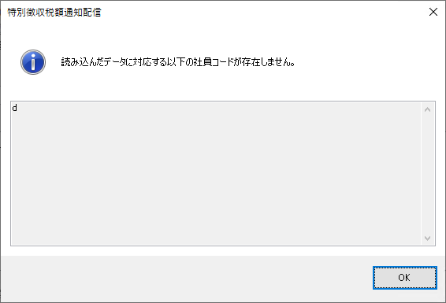
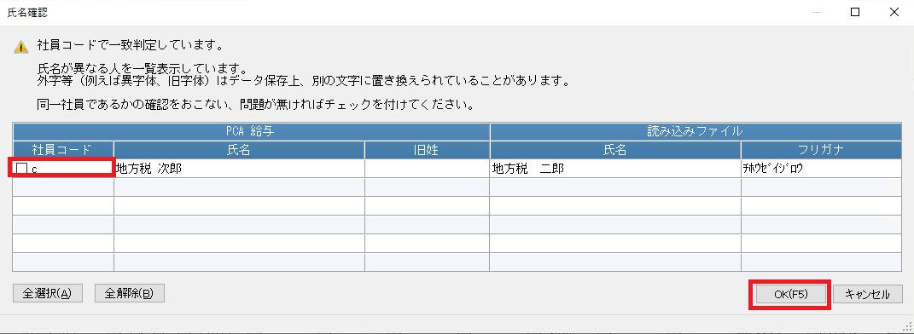
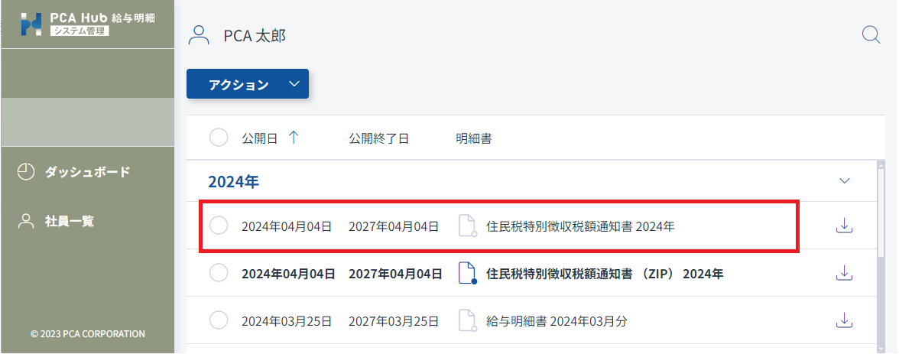

# 住民税特別徴収税額通知書を配信する<!-- omit in toc -->

PCA給与シリーズから住民税特別徴収税額通知書を PCA Hub 給与明細サービスを通じて社員に対して配信するための方法です。

## 目次<!-- omit in toc -->

- [制限](#制限)
- [住民税特別徴収税額通知書をアップロードする](#住民税特別徴収税額通知書をアップロードする)
  - [アップロードできるファイルに関する制限](#アップロードできるファイルに関する制限)
  - [公開日時に関する注意事項](#公開日時に関する注意事項)
- [住民税特別徴収税額通知書の配信状況を確認する](#住民税特別徴収税額通知書の配信状況を確認する)
- [住民税特別徴収税額通知書の閲覧状況を確認する](#住民税特別徴収税額通知書の閲覧状況を確認する)
- [住民税特別徴収税額通知書の配信設定を変更する](#住民税特別徴収税額通知書の配信設定を変更する)
- [配信した住民税特別徴収税額通知書を削除する](#配信した住民税特別徴収税額通知書を削除する)

## 制限

- 住民税特別徴収税額通知書の配信や管理は PCA Hub 給与明細のシステム管理者のみが行うことができます。
- 明細が公開されると社員に公開メールが配信されます。 
サーバーの状況により、指定された日時よりも遅れてメールが配信される場合があります。 

## 住民税特別徴収税額通知書をアップロードする

配信に必要な住民税特別徴収税額通知書データはeLTAXからダウンロードする必要があります。 
ダウンロード方法についてはPCA給与シリーズのマニュアルをご確認ください。 

1. PCA給与シリーズの「社員」-「特別徴収」-「特別徴収税額通知配信」を起動します。
2. 配信データを選択し、[読込] ボタンをクリックします。 

 

3. 自動で社員とデータの一致判定が行われます。 
社員コードが一致しない場合、こちらのダイアログが表示されます。 
社員コードが一致しないデータは配布することができません。 
 
 
社員コードが一致したものの、氏名が一致しないなど自動判定できないデータがある場合、一致状態を確認する必要があります。 
組み合わせに問題なければチェックを付け、[OK]ボタンをクリックしてください。 
 

4. 配信したい社員にチェックを付け、 [実行] ボタンをクリックします。 
    

5. 住民税特別徴収税額通知書の配信設定を行います。
   1. PCA Hub 給与明細上で住民税特別徴収税額通知書を公開およびメール配信したい日時を設定します。
   2. 配信時に送信されるメールの件名と本文を設定します。
   3. 住民税特別徴収税額通知書以外に同時に配信したいファイルがあれば「添付ファイル」を社員ごとまたは一括で指定します。 
    

6. アップロード処理が正常に完了したことを確認します。 

### アップロードできるファイルに関する制限

「明細を配信する」の [アップロードできるファイルに関する制限](system_admin2.md#アップロードできるファイルに関する制限) をご確認ください。

### ポイント<!-- omit in toc -->

- 住民税特別徴収税額通知書は、社員が展開することで明細一覧に展開したファイルが追加されます。 
システム管理者は全ての明細を閲覧できるため、住民税特別徴収税額通知書も閲覧することができます。 
- その他「明細を配信する」の [ポイント](system_admin2.md#ポイント) もご確認ください。

### 公開日時に関する注意事項

- 住民税特別徴収税額通知書をアップロードする際は、公開日時をPCA Hub 給与明細の契約期間内に設定してください。 
  - PCA Hub 給与明細の契約期間内のみ、クライアントサイトおよび管理サイトを閲覧することができます。 
契約終了後は、住民税特別徴収税額通知書の閲覧およびダウンロード等、全ての操作が行えません。 
- サーバーの状況により、指定された日時よりも遅れてメールが配信される場合があります。 

## 住民税特別徴収税額通知書の配信状況を確認する

1. PCA給与シリーズの「社員」-「特別徴収」-「特別徴収税額通知配信」を起動します。
2. 「配信状況」メニューを実行します。 
 

## 住民税特別徴収税額通知書の閲覧状況を確認する

住民税特別徴収税額通知書はZIPファイルで配布されるため、受け取った社員は閲覧のために展開を行う必要があります。 
明細一覧に「住民税特別徴収税額通知書 XXXX年」が追加されていた場合、社員によって展開が行われた状態となります。 

1. PCA Hub 給与明細の管理サイトにアクセスします。 
2. 「社員一覧」ページにて閲覧状況を確認したい任意の社員をクリックします。 

## 住民税特別徴収税額通知書の配信設定を変更する

配信済みのデータを直接編集することはできません。 
[住民税特別徴収税額通知書をアップロードする](#住民税特別徴収税額通知書をアップロードする) の手順で同じ住民税特別徴収税額通知書を再度アップロードすることにより、既存の配信設定を上書きすることができます。 
この操作を行うと、既に展開されていた住民税特別徴収税額通知書も削除されるため、社員が再度展開を行う必要があることにご注意ください。 

## 配信した住民税特別徴収税額通知書を削除する

1. PCA給与シリーズの「社員」-「特別徴収」-「特別徴収税額通知配信」を起動します。
2. 「配信状況」メニューを実行します。
3. 住民税特別徴収税額通知書を削除したい社員を選択して「削除」メニューを実行します。 
 
