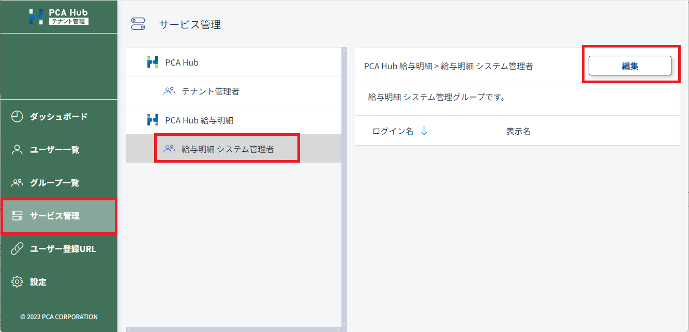

# システム管理者を設定する<!-- omit in toc -->

PCA Hub 給与明細のシステム管理者を設定します。 
システム管理者は給与実務を担当する方を必ず1名以上を設定してください。 

## 目次<!-- omit in toc -->

- [制限](#制限)
- [システム管理者の役割](#システム管理者の役割)
- [システム管理者の設定方法](#システム管理者の設定方法)

## 制限

- システム管理者の設定は、テナント管理者のみが行うことができます。 
- システム管理者とテナント管理者を兼務することも可能です。 

## システム管理者の役割

システム管理者は、主に明細の配信と管理を行います。 
システム管理者が実行する権限を持つ機能は下記のとおりです。 
**全明細を閲覧できるため、設定は慎重に行ってください。** 

- [給与明細配信のための設定を行う](../system_admin/system_admin1.md)
  - [サービスの URL を設定する](../system_admin/system_admin1.md#サービスの-url-を設定する)
  - [明細の公開期間を設定する](../system_admin/system_admin1.md#明細の公開期間を設定する)
  - [同意案内を作成する](../system_admin/system_admin1.md#同意案内を作成する)
- [明細を配信する](../system_admin/system_admin2.md)
  - [明細をアップロードする](../system_admin/system_admin2.md#明細をアップロードする)
  - [明細の配信設定を確認する](../system_admin/system_admin2.md#明細の配信設定を確認する) 
  - [明細の閲覧状況を確認する](../system_admin/system_admin2.md#明細の閲覧状況を確認する)
- [ダッシュボードを確認する](../system_admin/system_admin3.md)
  - [ライセンスの使用状況を確認する](../system_admin/system_admin3.md#ライセンスの使用状況を確認する)
  - [監査ログを確認する](../system_admin/system_admin3.md#監査ログを確認する)

## システム管理者の設定方法

1. テナント管理サイトのサービス一覧にアクセスします。
2. 「給与明細 システム管理者」を選択します。
3. [編集] ボタンをクリックして任意のアカウントを追加します。
4. [保存] ボタンをクリックして設定内容を保存します。

