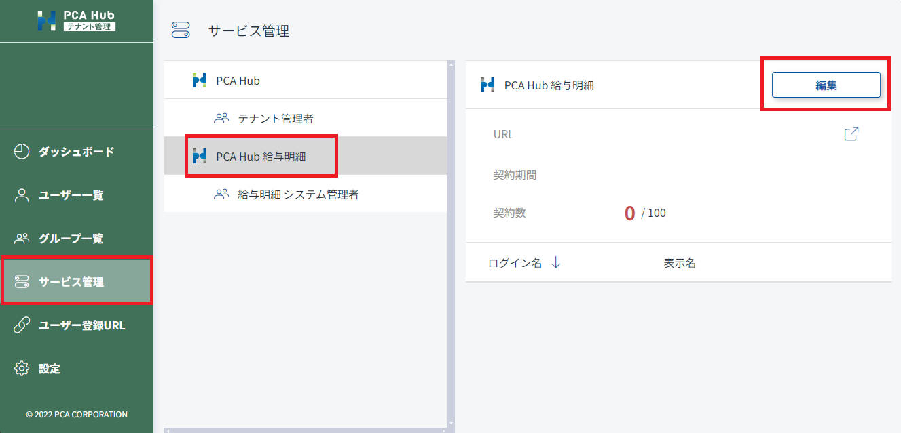
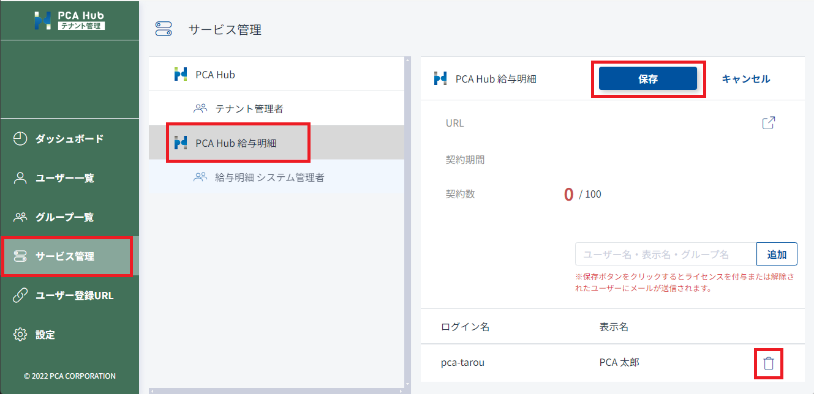

# ライセンスを付与する<!-- omit in toc -->

給与明細を配信するには、明細を受け取る社員に対してライセンスを付与する必要があります。 
ライセンスが付与された社員1名あたり1つのライセンスが消費されます。

## 目次<!-- omit in toc -->

- [制限](#制限)
- [社員にライセンスを付与する](#社員にライセンスを付与する)
  - [PCA給与シリーズから付与する](#pca給与シリーズから付与する)
  - [テナント管理サイトから付与する](#テナント管理サイトから付与する)
- [社員のライセンスを解除する](#社員のライセンスを解除する)
  - [PCA給与シリーズから解除する](#pca給与シリーズから解除する)
  - [テナント管理サイトから解除する](#テナント管理サイトから解除する)

## 制限

- ライセンスの付与はテナント管理者のみが行うことができます。
- ご契約されているライセンス数以上の社員に対してライセンスを付与することはできません。

## 社員にライセンスを付与する

### PCA給与シリーズから付与する

[PCA給与シリーズから社員のアカウントを作成する](../tenant_admin/tenant_admin1.md#pca給与シリーズから社員のアカウントを作成する) をご覧ください。

### テナント管理サイトから付与する

1. テナント管理サイトのサービス一覧にアクセスします。
2. 「PCA Hub 給与明細」を選択します。
3. [編集] ボタンをクリックして任意のアカウントを追加します。
4. [保存] ボタンをクリックして設定内容を保存します。

### ポイント<!-- omit in toc -->

- ライセンスの付与を行う前に [同意案内を作成する](../system_admin/system_admin1.md#同意案内を作成する) を行ってください。 
ライセンスを付与すると、付与された社員向けに PCA Hub 給与明細のクライアントサイトに誘導するメールが送信されます。

## 社員のライセンスを解除する

### PCA給与シリーズから解除する

[PCA給与シリーズから社員のアカウントを削除する](../tenant_admin/tenant_admin1.md#pca給与シリーズから社員のアカウントを削除する) をご覧ください。

### テナント管理サイトから解除する

1. テナント管理サイトのサービス一覧にアクセスします。
2. 「PCA Hub 給与明細」を選択します。
3. [編集] ボタンをクリックして任意のアカウントを追加します。
4. ライセンスを解除したいアカウントのごみ箱マークをクリックします。
5. [保存]ボタンをクリックして設定内容を保存します。

