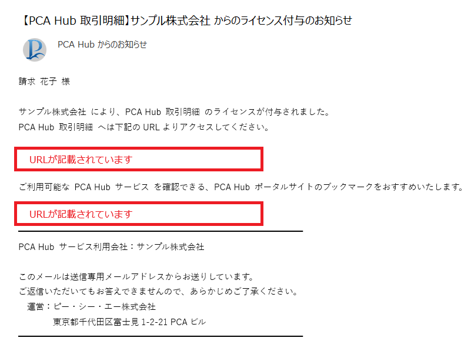
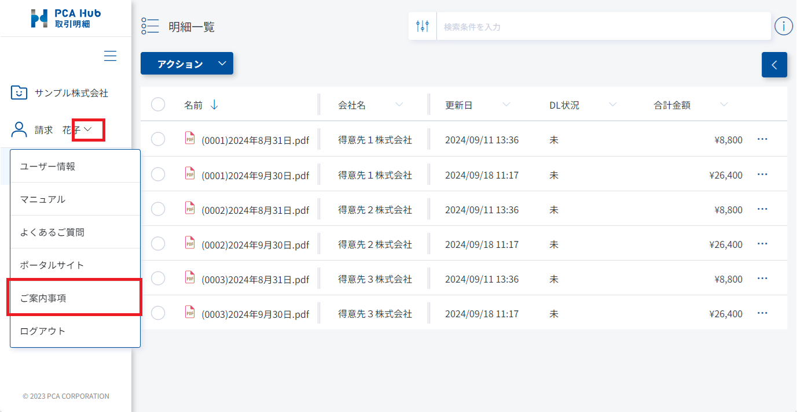
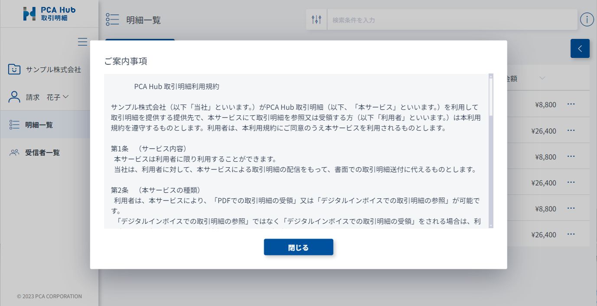

# 取引明細を受信する準備を行う<!-- omit in toc -->

PCA Hub 取引明細で明細を受信するための準備を行います。

## 目次<!-- omit in toc -->

- [制限](#制限)
- [PCA Hub アカウントの初期設定を行う](#pca-hub-アカウントの初期設定を行う)
- [案内事項を確認する](#案内事項を確認する)

## 制限

- 配信元から PCA Hub 取引明細 に招待されている必要があります。 
ログインできない場合は下記の設定が正しくない可能性があります。配信元へお問い合わせください。 
  - PCA Hub アカウントへの招待
  - PCA Hub 取引明細のライセンス付与
  - PCA 商魂・商管シリーズで、配信先ユーザーに登録されている
- スマートフォンには対応していません。 [動作環境](../../startup.md#動作環境) をご確認ください。 

## PCA Hub アカウントの初期設定を行う

PCA Hub アカウントの初期設定を行う必要があります。 
[PCA Hub にログインするための手順](../../startup.md#pca-hub-にログインするための手順) をご覧ください。 

## 案内事項を確認する

PCA Hub 取引明細で明細を配信することに対する案内事項が記載されています。 
免責事項等の記載がありますので、ご一読ください。 

1. PCA Hub からのライセンス付与メールに記載されているURLより、PCA Hub 取引明細のクライアントサイトにアクセスします。 
 

2. ユーザー名横のドロップダウンから、「ご案内事項」をクリックします。 
 
 