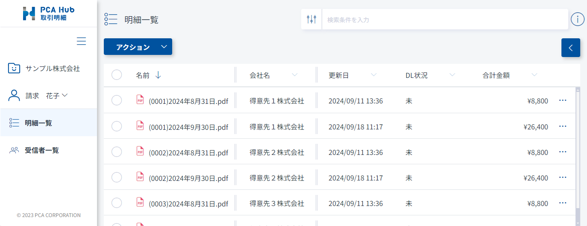
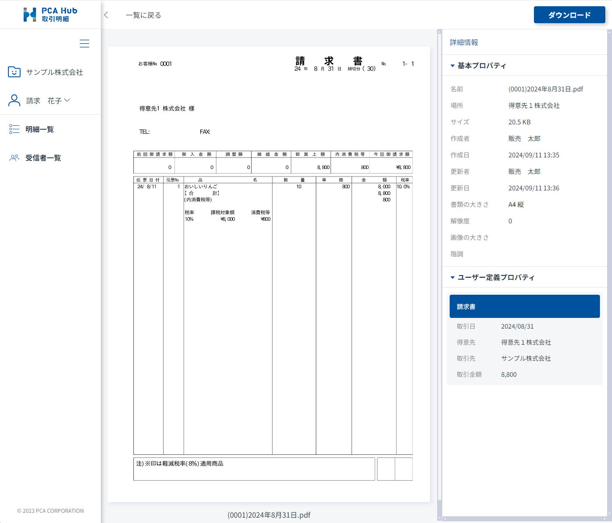
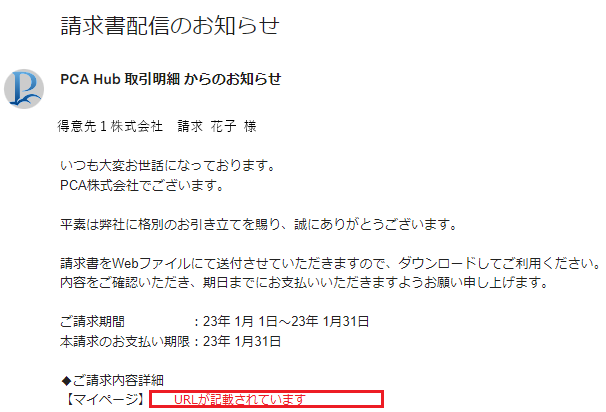
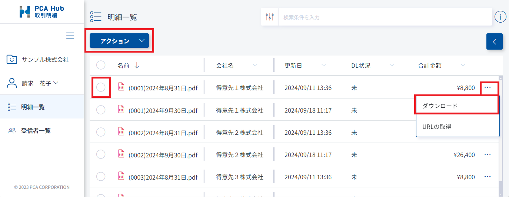
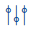
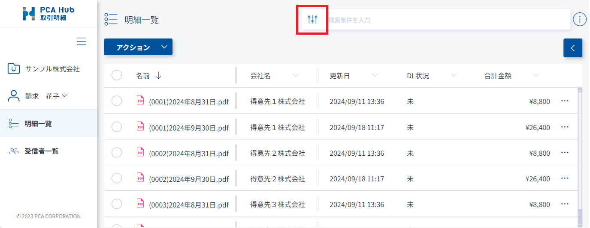
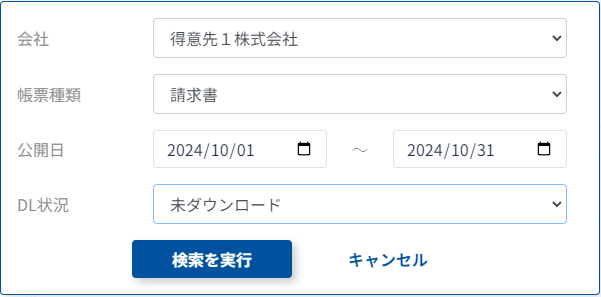
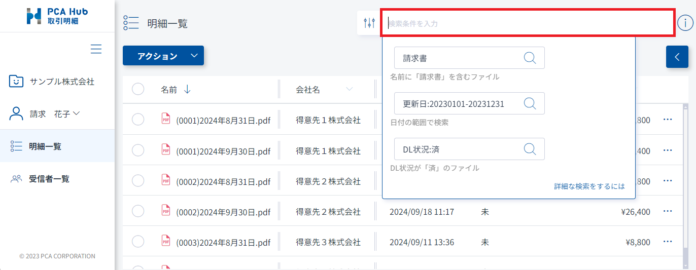
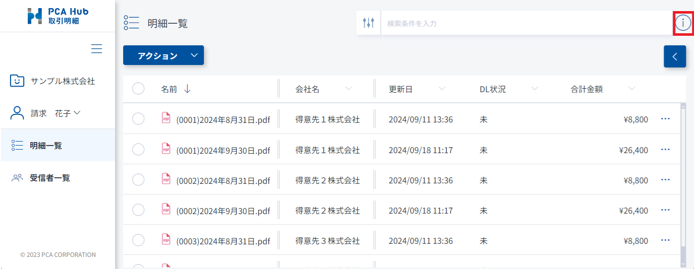

# 配信された明細を確認する<!-- omit in toc -->

ご自身宛に配信された明細を閲覧またはダウンロードすることができます。

## 目次<!-- omit in toc -->

- [制限](#制限)
- [配信された明細を閲覧する](#配信された明細を閲覧する)
- [配信された明細をダウンロードする](#配信された明細をダウンロードする)
- [配信された明細を検索する](#配信された明細を検索する)
  - [検索画面から検索する](#検索画面から検索する)
  - [検索条件を手入力して検索する](#検索条件を手入力して検索する)

## 制限

- PCA Hub 取引明細のライセンスを付与されている必要があります。 
- PCA 商魂・商管シリーズで、配信先ユーザーに登録されている必要があります。 
- 明細が公開されると公開メールが配信されます。
サーバーの状況により、指定された日時よりも遅れてメールが配信される場合があります。 

## 配信された明細を閲覧する

1. PCA Hub 取引明細のクライアントサイトにアクセスします。 
 

2. 表示された明細一覧の中から、任意の明細をクリックするとプレビューが表示されます。 
 

### ポイント<!-- omit in toc -->

- 配信された明細は、公開されたことをメールにてお知らせします。 
メール内にURLが記載されている場合、URLからクライアントサイトにアクセスすることができます。 
メール内容は配信元が設定します。メール内容については配信元へお問い合わせください。 
 
- サーバーの状況により、明細の公開日時よりも遅れてメールが配信される場合があります。
クライアントサイトでは公開日時を過ぎれば公開されるため、メールが届く前であっても閲覧可能です。 

## 配信された明細をダウンロードする

1. PCA Hub 取引明細のクライアントサイトにアクセスします。 
2. 表示された明細一覧の中から、任意の明細を選択してダウンロードを行うことができます。 
 

### ポイント<!-- omit in toc -->
- デジタルインボイスデータは、PCA Hub 取引明細 クライアントサイトからはダウンロードすることができません。 
PCA 会計シリーズなど、デジタルインボイスのダウンロード機能に対応したアプリケーションやサービスからダウンロードを行ってください。 

## 配信された明細を検索する

### 検索画面から検索する
1. 検索画面ボタンをクリックします。 
 

2. 複数の条件をAND条件で組み合わせて検索することができます。 

|検索項目|内容|
|-|-|
|会社|ログインユーザーが閲覧可能な会社を選択して検索することができます。|
|帳票種類|帳票を選択して検索することができます。|
|公開日|明細の公開日を指定して検索することができます。|
|DL状況|ダウンロード状況を選択して検索することができます。|

例）2024年10月に公開された『得意先１株式会社』の未ダウンロード請求書を検索します 
 

### 検索条件を手入力して検索する

1. PCA Hub 取引明細のクライアントサイトにアクセスします。 
2. 「検索条件を入力」欄に検索条件を入力します。 
 

### ポイント<!-- omit in toc -->

- 検索の詳細な使い方は、「検索条件を入力」欄の横のボタンをクリックしてご確認ください。 
 