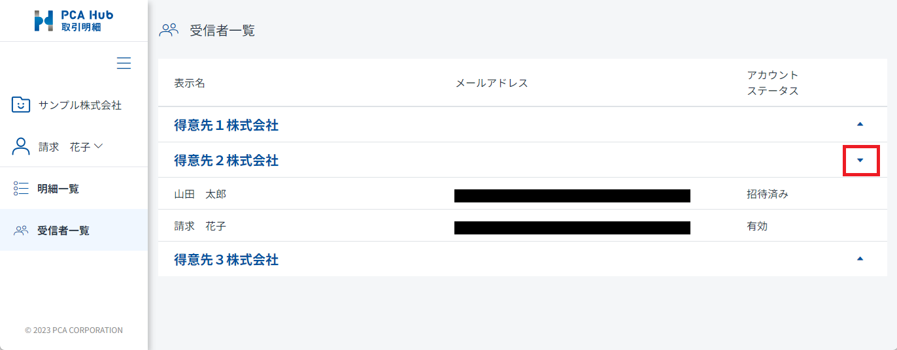

# すべての配信先ユーザーを確認する<!-- omit in toc -->

すべての配信先ユーザーを確認することができます。

## 目次<!-- omit in toc -->

- [制限](#制限)
- [すべての配信先ユーザーを確認する](#すべての配信先ユーザーを確認する)

## 制限

- PCA Hub 取引明細のライセンスを付与されている必要があります。 
- PCA 商魂・商管シリーズで、配信先ユーザーに登録されている必要があります。 

## すべての配信先ユーザーを確認する

1. PCA Hub 取引明細のクライアントサイトにアクセスします。 
2. 「受信者一覧」をクリックします。 
自身が閲覧可能な会社の一覧が表示されます。 
 
右端の「▼」をクリックし、その会社の配信先ユーザーを確認します。 
 

### ポイント<!-- omit in toc -->

- 意図しないユーザーが含まれていた場合は、配信元へお問い合わせください。 