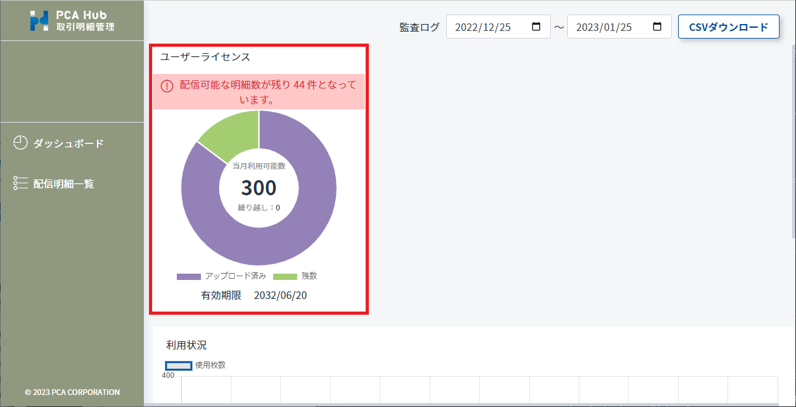
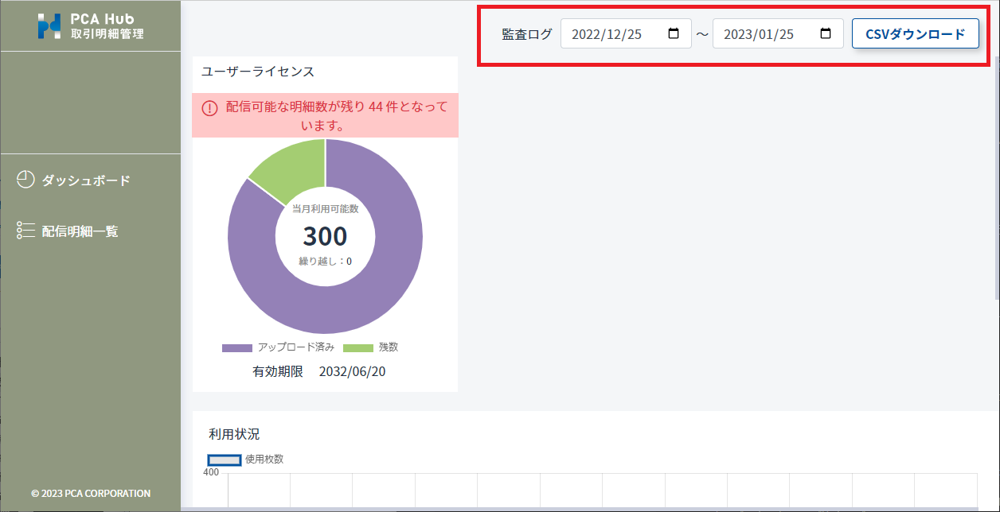

# ダッシュボードを確認する<!-- omit in toc -->

ライセンスの使用状況や監査ログのダウンロードを行うことができます。

## 目次<!-- omit in toc -->

- [制限](#制限)
- [使用可能枚数の状況を確認する](#使用可能枚数の状況を確認する)
- [監査ログを確認する](#監査ログを確認する)

## 制限

- ダッシュボードの機能は PCA Hub 取引明細のシステム管理者のみが行うことができます。

## 使用可能枚数の状況を確認する

1. PCA Hub 取引明細の管理サイトにアクセスします。
2. 「ダッシュボード」ページにて画面上部のグラフから使用可能枚数の状況を確認します。 
 

### ポイント<!-- omit in toc -->

- グラフ上にマウスをホバーすることで詳細な値を確認することができます。

## 監査ログを確認する

1. PCA Hub 取引明細の管理サイトにアクセスします。
2. 任意の期間を指定して [CSV ダウンロード] ボタンをクリックします。 
 

### ポイント<!-- omit in toc -->

- 監査ログは毎日深夜にログの収集作業が行われます。 
当日のログ内容は、翌日の早朝頃になるとダウンロードできるようになります。
- 監査ログは大量の操作が記録されているため、ダウンロードの実行により発生するデータ通信量にご注意ください。
